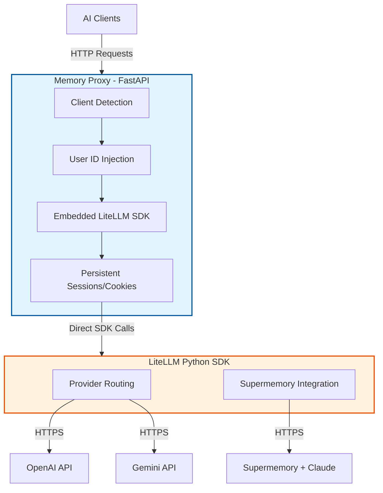

# LiteLLM Memory Proxy

**Last Updated**: 2025-11-21

## Overview

LiteLLM Memory Proxy is a developer-focused proxy service that bridges various AI clients (IDEs, CLI tools, custom apps) with LiteLLM and Supermemory. It solves critical pain points for developers working with multiple AI providers and tools.

**Key Problems Solved**:
- **Authentication Gap**: Adds API authentication for IDEs that lack configuration options for local models
- **Unified Analytics**: Single databank tracking LLM usage metrics (cost, latency, response quality)
- **Dynamic Memory**: Seamless Supermemory integration for inline dynamic RAG and contextual memory
- **Automatic Isolation**: Auto-recognizes users/projects to keep memories separate per scope

**Target Audience**: Developers using multiple AI clients (PyCharm, Claude Code, VS Code, custom apps)

**Architecture Pattern**: Self-Contained SDK Gateway - FastAPI proxy with embedded LiteLLM SDK. This eliminates the need for an external binary process and ensures persistent sessions (cookies) for Supermemory integration.

---


## 🚨 CRITICAL: Version Control with Jujutsu (jj)

**DO NOT USE GIT COMMANDS**. This project uses [Jujutsu (jj)](https://github.com/martinvonz/jj) for version control.

### Essential jj Commands

```bash
# Start new work - create bookmark before making changes
 الاصلاحjj new && jj bookmark create <TOPIC>

# Check status
 الاصلاحjj status

# Stage and commit changes
 الاصلاحjj commit -m "Add feature X"

# Undo last jj operation
 الاصلاحjj undo

# Restore files (discard changes)
 الاصلاحjj restore <file>              # restore specific file
 الاصلاحjj restore --from=@- <file>    # restore from parent change

# Merge into main (prefer merges over rebases)
 الاصلاحjj new @ main && jj bookmark set -r @ <TOPIC> 

# Push to remote (when configured)
 الاصلاحjj git push
```

### jj Workflow Philosophy

1. **Always create bookmarks** before starting work
2. **Prefer merges over rebases** for cleaner history
3. **Use `jj undo`** freely - it's safe and reversible
4. **Commit early, commit often** - jj makes it easy to reorganize later

**Need more jj help?** Use the Context7 MCP server to fetch jj documentation:
```
Ask Claude: "Get me jj documentation about [topic]"
```

---


## 🔧 CRITICAL: Use JetBrains MCP Server

**ALWAYS use the JetBrains MCP server** for file operations and codebase exploration.

### Why JetBrains MCP?

- **Context-aware**: Understands code structure, symbols, dependencies
- **Faster**: Uses IDE's indexes instead of filesystem traversal
- **Intelligent**: Semantic search, refactoring support, real-time diagnostics
- **Integrated**: Direct access to run configurations, terminal, VCS

### Preferred Operations

| Task | JetBrains MCP Tool | ❌ Don't Use |
|------|-------------------|--------------|
| **Search files** | `find_files_by_name_keyword`, `find_files_by_glob` | `find`, `ls` |
| **Read files** | `get_file_text_by_path` | `cat`, `head` |
| **Edit files** | `replace_text_in_file` | `sed`, `awk` |
| **Search content** | `search_in_files_by_text`, `search_in_files_by_regex` | `grep`, `rg` |
| **File structure** | `list_directory_tree` | `ls -R`, `tree` |
| **Symbol info** | `get_symbol_info` | Manual code reading |
| **Refactoring** | `rename_refactoring` | Text search-replace |
| **Run tests** | `execute_run_configuration` | Manual bash commands |
| **File operations** | `create_new_file` | `touch`, `mkdir` |

---


## Requirements

### System Requirements
- **Python**: 3.13+ (required)
- **LiteLLM SDK**: Installed via pip/poetry
  ```bash
  # Install with pip
  pip install 'litellm[proxy]'

  # Or with poetry
  poetry install
  ```
- **Package Manager**: Poetry (preferred)

### API Keys
Set these environment variables:
```bash
export OPENAI_API_KEY="sk-..."
export ANTHROPIC_API_KEY="sk-ant-..."
export SUPERMEMORY_API_KEY="sm_..."  # Optional
```

### Python Dependencies
All managed via Poetry:
```bash
poetry install --all-groups
```

Key dependencies: FastAPI, Uvicorn, httpx, PyYAML, pytest, litellm

---


## Project Structure

```
litellm/
├── config.yaml                          # Main configuration (models, routing, memory)
├── deploy/
│   └── run_unified_proxy.py             # Unified launcher script (SDK & Binary modes)
├── src/
│   ├── proxy/
│   │   ├── litellm_proxy_sdk.py         # Main SDK-based Proxy (FastAPI app)
│   │   ├── session_manager.py           # Persistent Session Manager (Cookies)
│   │   └── memory_router.py             # Client detection & routing logic
│   └── interceptor/
│       └── intercepting_contexter.py    # Edge Interceptor
├── tests/                               # Test suites
├── RUN_TESTS.sh                         # Test runner script
├── verify_setup.sh                      # Setup verification
├── CHANGELOG.md                         # Project history
├── README.md                            # Project overview
├── CLAUDE.md                            # This file - development guide
├── docs/                                # Documentation Hub
│   ├── INDEX.md                         # Documentation hub
│   ├── architecture/
│   │   ├── OVERVIEW.md                  # System design & patterns
│   │   └── DESIGN_DECISIONS.md          # Architectural choices
│   ├── getting-started/
│   │   ├── QUICKSTART.md                # 5-minute quick start
│   │   └── TUTORIAL.md                  # Step-by-step tutorial
│   ├── guides/
│   │   ├── CONFIGURATION.md             # Complete config reference
│   │   └── TESTING.md                   # Comprehensive testing docs
│   └── troubleshooting/
│       └── COMMON_ISSUES.md             # Troubleshooting guide
```

---


## Quick Start

### 1. Install Dependencies
```bash
poetry install
```

### 2. Configure Environment
```bash
# Create .env or export directly
export ANTHROPIC_API_KEY="sk-ant-..."
export OPENAI_API_KEY="sk-..."
export SUPERMEMORY_API_KEY="sm_..."
```

### 3. Verify Setup
```bash
./verify_setup.sh
```

### 4. Start Proxy (SDK Mode)
```bash
# Recommended: Start unified proxy in SDK mode
poetry run python deploy/run_unified_proxy.py --mode sdk

# Or directly via uvicorn (development)
poetry run uvicorn src.proxy.litellm_proxy_sdk:app --port 8764 --reload
```

This starts the **Memory Proxy** on port 8764, which internally loads the LiteLLM SDK.

### 5. Test It Works
```bash
# Check routing info
curl http://localhost:8764/memory-routing/info \
  -H "User-Agent: OpenAIClientImpl/Java"

# Send chat request
curl http://localhost:8764/v1/chat/completions \
  -H "Content-Type: application/json" \
  -H "Authorization: Bearer sk-1234" \
  -d '{"model": "claude-sonnet-4.5", "messages": [{"role": "user", "content": "Hello!"}]}'
```

**For detailed walkthrough**, see: `docs/getting-started/QUICKSTART.md`

---


## Configuration

### config.yaml Structure

```yaml
general_settings:
  master_key: sk-1234

model_list:
  - model_name: claude-sonnet-4.5
    litellm_params:
      api_base: https://api.supermemory.ai/v3/api.anthropic.com
      model: anthropic/claude-sonnet-4-5-20250929
      api_key: os.environ/ANTHROPIC_API_KEY
      custom_llm_provider: anthropic

  - model_name: gpt-4
    litellm_params:
      model: openai/gpt-4
      api_key: os.environ/OPENAI_API_KEY

# Memory routing configuration
user_id_mappings:
  custom_header: "x-memory-user-id"
  header_patterns:
    - header: "user-agent"
      pattern: "OpenAIClientImpl/Java"
      user_id: "pycharm-ai"
    - header: "user-agent"
      pattern: "Claude Code"
      user_id: "claude-cli"
  default_user_id: "default-dev"

litellm_settings:
  set_verbose: true
  json_logs: true
  use_client_cache: true
  drop_params: true
```

**For complete reference**, see: `docs/guides/CONFIGURATION.md`

### Environment Variable Synchronization

LiteLLM proxy supports automatic synchronization of configuration field values to environment variables using the `EnvSyncMixin` pattern. This enables backward compatibility with env-var-based configuration and makes config values available to subprocesses.

See `docs/guides/CONFIGURATION.md` for details on `EnvSyncMixin`.

---


## Development Workflow

### Common Tasks

#### 1. Add New Model
Edit `config.yaml`:
```yaml
model_list:
  - model_name: my-new-model
    litellm_params:
      model: provider/model-name
      api_key: os.environ/MY_API_KEY
```
Test: `poetry run python deploy/run_unified_proxy.py --mode sdk`

#### 2. Add Client Detection Pattern
Edit `config.yaml`:
```yaml
user_id_mappings:
  header_patterns:
    - header: "user-agent"
      pattern: "MyApp/.*"
      user_id: "my-app-user"
```
Test: `curl http://localhost:8764/memory-routing/info -H "User-Agent: MyApp/1.0"`

#### 3. Modify Memory Routing Logic
1. Use JetBrains MCP to search: `search_in_files_by_text("memory_router")`
2. Edit `src/proxy/memory_router.py` using JetBrains MCP.
3. Run tests: `./RUN_TESTS.sh unit`
4. Commit: `jj commit -m "Update memory routing logic"`

#### 4. Test with Different Providers
```bash
# Edit config.yaml to add provider
poetry run python deploy/run_unified_proxy.py --mode sdk

# Test endpoint
curl http://localhost:8764/v1/chat/completions \
  -H "Authorization: Bearer sk-1234" \
  -d '{"model": "your-model", "messages": [...]}'
```

---


## Testing

### Run Tests (Recommended Method)
```bash
# From venv: Run all tests
./RUN_TESTS.sh

# Specific test suites
./RUN_TESTS.sh unit           # Unit tests only
./RUN_TESTS.sh integration    # Integration tests
./RUN_TESTS.sh e2e            # End-to-end tests
./RUN_TESTS.sh coverage       # With coverage report
./RUN_TESTS.sh fast           # Skip slow tests

# Debug mode
./RUN_TESTS.sh debug
```

### Alternative Methods (Discouraged)
```bash
# Direct pytest (if you must)
poetry run pytest tests/src/test_memory_proxy.py -v
```

### Test Structure
- `tests/src/test_memory_proxy.py` - Main test suite (routing, FastAPI, integration)
- `tests/test_schema_env_sync.py` - Configuration sync tests
- `tests/src/test_interceptor.py` - Interceptor tests

---


## Architecture

### High-Level Overview (SDK Approach)



### Benefits of SDK Approach
- **Cookie Persistence**: Solves Cloudflare challenges for Supermemory.
- **Performance**: No local network hop (~10ms faster).
- **Simplicity**: Single process to manage and debug.

**For detailed architecture**, see: `docs/architecture/OVERVIEW.md`

---


## API Documentation

### Memory Proxy Endpoints

#### GET /memory-routing/info
Get routing information for current request.

#### POST /v1/chat/completions
OpenAI-compatible chat completions endpoint with automatic memory routing.

#### GET /health
Health check endpoint.

**Response**: `{"status": "healthy"}`

---


## Troubleshooting

### LiteLLM package not found
```bash
# Install with poetry
poetry install
```

### Memory Proxy can't connect
```bash
# Check ports in use
lsof -i :8764

# Check logs in terminal
```

### Client not detected correctly
```bash
# Debug routing
curl http://localhost:8764/memory-routing/info \
  -H "User-Agent: YourClient/1.0"
```

---


## Documentation Hub

This project has extensive documentation organized by topic:

- **📚 [Documentation Index](docs/INDEX.md)** - Start here for all docs
- **🏗️ [Architecture Overview](docs/architecture/OVERVIEW.md)** - System design & patterns
- **🎯 [Design Decisions](docs/architecture/DESIGN_DECISIONS.md)** - Architectural choices & migration plans
- **🚀 [Quick Start](docs/getting-started/QUICKSTART.md)** - 5-minute setup guide
- **📖 [Tutorial](docs/getting-started/TUTORIAL.md)** - Step-by-step walkthrough
- **⚙️ [Configuration Guide](docs/guides/CONFIGURATION.md)** - Complete config reference
- **🧪 [Testing Guide](docs/guides/TESTING.md)** - Comprehensive testing strategies
- **🔧 [Troubleshooting](docs/troubleshooting/COMMON_ISSUES.md)** - Common issues and fixes
- **📜 [CHANGELOG](docs/CHANGELOG.md)** - Project history

---


## Important Notes

### Development Philosophy
1. **Use JetBrains MCP** for all file/code operations
2. **Use jj** for version control (no git)
3. **Test with RUN_TESTS.sh** from venv
4. **Maintain backward compatibility** for existing clients
5. **Document as you go** - update relevant docs/ files

---

**Happy coding! 🚀**