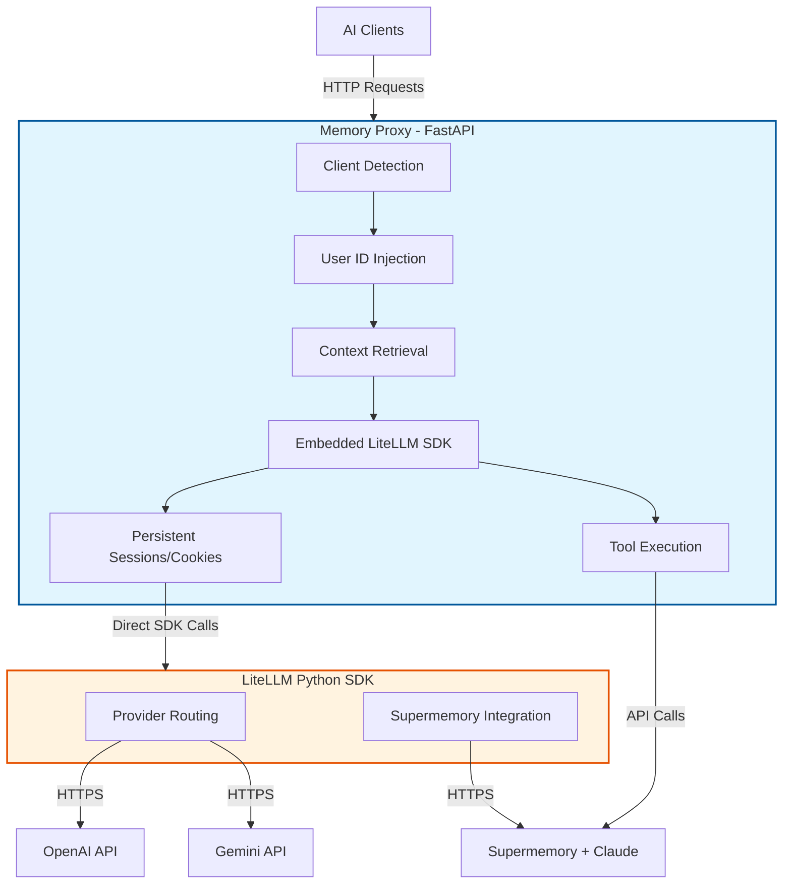

# LiteLLM Memory Proxy

**Last Updated**: 2025-11-26

## Overview

LiteLLM Memory Proxy is a developer-focused proxy service that bridges various AI clients (IDEs, CLI tools, custom apps) with LiteLLM and Supermemory. It solves critical pain points for developers working with multiple AI providers and tools.

**Key Problems Solved**:
- **Authentication Gap**: Adds API authentication for IDEs that lack configuration options for local models
- **Unified Analytics**: Single databank tracking LLM usage metrics (cost, latency, response quality)
- **Dynamic Memory**: Seamless Supermemory integration for inline dynamic RAG and contextual memory
- **Automatic Isolation**: Auto-recognizes users/projects to keep memories separate per scope

**Target Audience**: Developers using multiple AI clients (PyCharm, Claude Code, VS Code, custom apps)

**Architecture Pattern**: Self-Contained SDK Gateway - FastAPI proxy with embedded LiteLLM SDK. This eliminates the need for an external binary process and ensures persistent sessions (cookies) for Supermemory integration.

---

## 🚨 CRITICAL: Version Control with Jujutsu (jj)

**DO NOT USE GIT COMMANDS**. This project uses [Jujutsu (jj)](https://github.com/martinvonz/jj) for version control.

### Essential jj Commands

```bash
# Start new work - create bookmark before making changes
jj new && jj bookmark create <TOPIC>

# Check status
jj status

# Stage and commit changes
jj commit -m "Add feature X"

# Undo last jj operation
jj undo

# Restore files (discard changes)
jj restore <file>              # restore specific file
jj restore --from=@- <file>    # restore from parent change

# View diff output to stdout (IMPORTANT: use --tool=std)
jj diff --tool=std -r <commit-id>

# Merge into main (prefer merges over rebases)
jj new @ main && jj bookmark set -r @ <TOPIC>

# Push to remote (when configured)
jj git push
```

### jj Workflow Philosophy

1. **Always create bookmarks** before starting work
2. **Prefer merges over rebases** for cleaner history
3. **Use `jj undo`** freely - it's safe and reversible
4. **Commit early, commit often** - jj makes it easy to reorganize later
5. **Always use `--tool=std`** with `jj diff` to get output in stdout (plain `jj diff` opens GUI)

**Need more jj help?** Use the Context7 MCP server to fetch jj documentation:
```
Ask Claude: "Get me jj documentation about [topic]"
```

---

## 🔧 CRITICAL: Use JetBrains MCP Server

**ALWAYS use the JetBrains MCP server** for file operations and codebase exploration.

### Why JetBrains MCP?

- **Context-aware**: Understands code structure, symbols, dependencies
- **Faster**: Uses IDE's indexes instead of filesystem traversal
- **Intelligent**: Semantic search, refactoring support, real-time diagnostics
- **Integrated**: Direct access to run configurations, terminal, VCS

### Preferred Operations

| Task | JetBrains MCP Tool | ❌ Don't Use |
|------|-------------------|--------------|
| **Search files** | `find_files_by_name_keyword`, `find_files_by_glob` | `find`, `ls` |
| **Read files** | `get_file_text_by_path` | `cat`, `head` |
| **Edit files** | `replace_text_in_file` | `sed`, `awk` |
| **Search content** | `search_in_files_by_text`, `search_in_files_by_regex` | `grep`, `rg` |
| **File structure** | `list_directory_tree` | `ls -R`, `tree` |
| **Symbol info** | `get_symbol_info` | Manual code reading |
| **Refactoring** | `rename_refactoring` | Text search-replace |
| **Run tests** | `execute_run_configuration` | Manual bash commands |
| **File operations** | `create_new_file` | `touch`, `mkdir` |

---

## Requirements

### System Requirements
- **Python**: 3.13.8 (exact version required via pyproject.toml)
- **LiteLLM SDK**: Installed via pip/poetry
  ```bash
  # Install with pip
  pip install 'litellm[proxy]'

  # Or with poetry
  poetry install
  ```
- **Package Manager**: Poetry (preferred)

### API Keys
Set these environment variables:
```bash
export OPENAI_API_KEY="sk-..."
export ANTHROPIC_API_KEY="sk-ant-..."
export SUPERMEMORY_API_KEY="sm_..."  # Optional but recommended
```

### Python Dependencies
All managed via Poetry:
```bash
poetry install --all-groups
```

**Core dependencies**: FastAPI, Uvicorn, httpx, PyYAML, pytest, litellm, supermemory, prisma

**Observability**: opentelemetry-api, opentelemetry-sdk, opentelemetry-exporter-otlp, opentelemetry-instrumentation-fastapi

---

## Project Structure

```
litellm/
├── config/                              # Configuration files
│   ├── config.yaml                      # Main configuration (models, routing, memory)
│   ├── config-mvp.yaml                  # MVP configuration
│   └── config_old.yaml                  # Legacy backup
├── deploy/
│   ├── run_unified_proxy.py             # Unified launcher (SDK & Binary modes)
│   ├── schema.prisma                    # Prisma database schema
│   └── otel.yaml                        # OpenTelemetry configuration
├── src/
│   ├── proxy/
│   │   ├── litellm_proxy_sdk.py         # Main SDK-based Proxy (2172 lines) ⭐
│   │   ├── schema.py                    # Pydantic models (1306 lines)
│   │   ├── config_parser.py             # Config loading with EnvSync
│   │   ├── session_manager.py           # Persistent Session Manager (Cookies)
│   │   ├── memory_router.py             # Client detection & routing logic
│   │   ├── context_retriever.py         # Supermemory context retrieval ⭐
│   │   ├── tool_executor.py             # Automatic tool execution ⭐
│   │   ├── tool_debug_logger.py         # Tool debugging callback
│   │   ├── error_handlers.py            # Exception mapping
│   │   └── streaming_utils.py           # SSE streaming
│   ├── interceptor/                     # Client-side proxy
│   │   ├── intercepting_contexter.py    # Edge Interceptor
│   │   ├── cli.py                       # CLI interface
│   │   ├── port_manager.py              # Port allocation
│   │   └── port_registry.py             # Port registry
│   ├── integrations/                    # External integrations
│   │   └── prisma_proxy.py              # Database logging callback
│   └── telemetry/                       # Observability
│       └── setup.py                     # OpenTelemetry instrumentation
├── tests/                               # Test suite (28 files, 250+ tests)
│   ├── fixtures/                        # Shared test fixtures
│   ├── helpers/                         # Test utilities
│   └── src/                             # Source tests
│       └── conftest.py                  # Pytest config (1000+ lines, 71+ fixtures)
├── scripts/                             # Organized utilities
│   ├── testing/                         # Test runners
│   │   └── RUN_TESTS.sh                 # Main test runner (13 modes)
│   ├── monitoring/                      # Diagnostic tools
│   │   ├── diagnose_503.py
│   │   └── validate_sdk_migration.py
│   ├── setup/                           # Setup automation
│   │   └── verify_setup.sh              # Environment verification
│   └── utils/                           # Helper utilities
├── docs/                                # Documentation hub (40+ files)
│   ├── INDEX.md                         # Documentation navigation
│   ├── CHANGELOG.md                     # Project history
│   ├── architecture/
│   │   ├── OVERVIEW.md                  # System design & patterns
│   │   ├── DESIGN_DECISIONS.md          # Architectural choices
│   │   └── OTEL_LOGGING_PLAN.md         # Observability strategy
│   ├── getting-started/
│   │   ├── QUICKSTART.md                # 5-minute setup
│   │   └── TUTORIAL.md                  # Step-by-step tutorial
│   ├── guides/
│   │   ├── CONFIGURATION.md             # Complete config reference
│   │   └── TESTING.md                   # Comprehensive testing docs
│   ├── testing/                         # Testing documentation
│   │   └── TEST_FAILURE_FIX_STRATEGY.md
│   └── troubleshooting/
│       ├── COMMON_ISSUES.md             # Troubleshooting guide
│       ├── TOOL_DEBUGGING.md            # Tool execution debugging
│       └── CONTENT_LENGTH_MISMATCH.md   # Content-Length issues
├── archive/                             # Historical artifacts
│   └── agent-reports/                   # Agent-generated analysis
├── notebooks/                           # Analysis notebooks
│   └── Proxy_Batch_Users.ipynb
├── CLAUDE.md                            # This file - development guide ⭐
├── README.md                            # Project overview
├── GEMINI.md                            # AI assistant guide
└── pyproject.toml                       # Project metadata
```

---

## Quick Start

### 1. Install Dependencies
```bash
poetry install
```

### 2. Configure Environment
```bash
# Create .env or export directly
export ANTHROPIC_API_KEY="sk-ant-..."
export OPENAI_API_KEY="sk-..."
export SUPERMEMORY_API_KEY="sm_..."
```

### 3. Verify Setup
```bash
./scripts/setup/verify_setup.sh
```

### 4. Start Proxy (SDK Mode)
```bash
# Recommended: Start unified proxy in SDK mode
poetry run python deploy/run_unified_proxy.py --mode sdk

# Or directly via uvicorn (development)
poetry run uvicorn src.proxy.litellm_proxy_sdk:app --port 8764 --reload
```

This starts the **Memory Proxy** on port 8764, which internally loads the LiteLLM SDK.

### 5. Test It Works
```bash
# Check routing info
curl http://localhost:8764/memory-routing/info \
  -H "User-Agent: OpenAIClientImpl/Java"

# Send chat request
curl http://localhost:8764/v1/chat/completions \
  -H "Content-Type: application/json" \
  -H "Authorization: Bearer sk-1234" \
  -d '{"model": "claude-sonnet-4.5", "messages": [{"role": "user", "content": "Hello!"}]}'
```

**For detailed walkthrough**, see: `docs/getting-started/QUICKSTART.md`

---

## Configuration

### config.yaml Structure

```yaml
general_settings:
  master_key: sk-1234
  database_url: os.environ/DATABASE_URL           # Auto-syncs to env var

model_list:
  - model_name: claude-sonnet-4.5
    litellm_params:
      api_base: https://api.supermemory.ai/v3/api.anthropic.com
      model: anthropic/claude-sonnet-4-5-20250929
      api_key: os.environ/ANTHROPIC_API_KEY
      custom_llm_provider: anthropic

  - model_name: gpt-4
    litellm_params:
      model: openai/gpt-4
      api_key: os.environ/OPENAI_API_KEY

# Memory routing configuration
user_id_mappings:
  custom_header: "x-memory-user-id"
  header_patterns:
    - header: "user-agent"
      pattern: "^OpenAIClientImpl/Java"
      user_id: "secretary-dev"
    - header: "user-agent"
      pattern: "^Claude Code"
      user_id: "claude-code-cli"
  default_user_id: "default-dev"

# Context retrieval (Supermemory)
context_retrieval:
  enabled: true
  api_key: os.environ/SUPERMEMORY_API_KEY
  query_strategy: last_user                      # last_user, first_user, all_user, last_assistant
  injection_strategy: system                     # system, user_prefix, user_suffix
  max_context_length: 4000
  max_results: 5
  enabled_for_models:
    - claude-sonnet-4.5

# Tool execution
tool_execution:
  enabled: true
  max_iterations: 10
  timeout_per_tool: 30.0
  supermemory_api_key: os.environ/SUPERMEMORY_API_KEY

litellm_settings:
  set_verbose: true
  json_logs: true
  use_client_cache: true
  drop_params: true
  success_callback: ["postgres", "otel"]
  failure_callback: ["postgres", "otel"]
```

**For complete reference**, see: `docs/guides/CONFIGURATION.md`

### Environment Variable Synchronization

LiteLLM proxy supports automatic synchronization of configuration field values to environment variables using the `EnvSyncMixin` pattern. This enables backward compatibility with env-var-based configuration and makes config values available to subprocesses.

**Auto-synced environment variables**:
- `DATABASE_URL` - From `general_settings.database_url`
- `REDIS_HOST`, `REDIS_PORT`, `REDIS_PASSWORD` - From `cache_params`
- `OTEL_EXPORTER`, `OTEL_ENDPOINT`, `OTEL_SERVICE`, `OTEL_HEADERS` - From `litellm_settings`

See `docs/guides/CONFIGURATION.md` for details on `EnvSyncMixin`.

---

## Development Workflow

### Common Tasks

#### 1. Add New Model
Edit `config/config.yaml`:
```yaml
model_list:
  - model_name: my-new-model
    litellm_params:
      model: provider/model-name
      api_key: os.environ/MY_API_KEY
```
Test: `poetry run python deploy/run_unified_proxy.py --mode sdk`

#### 2. Add Client Detection Pattern
Edit `config/config.yaml`:
```yaml
user_id_mappings:
  header_patterns:
    - header: "user-agent"
      pattern: "MyApp/.*"
      user_id: "my-app-user"
```
Test: `curl http://localhost:8764/memory-routing/info -H "User-Agent: MyApp/1.0"`

#### 3. Modify Memory Routing Logic
1. Use JetBrains MCP to search: `search_in_files_by_text("memory_router")`
2. Edit `src/proxy/memory_router.py` using JetBrains MCP.
3. Run tests: `./scripts/testing/RUN_TESTS.sh unit`
4. Commit: `jj commit -m "Update memory routing logic"`

#### 4. Test with Different Providers
```bash
# Edit config/config.yaml to add provider
poetry run python deploy/run_unified_proxy.py --mode sdk

# Test endpoint
curl http://localhost:8764/v1/chat/completions \
  -H "Authorization: Bearer sk-1234" \
  -d '{"model": "your-model", "messages": [...]}'
```

---

## Testing

### Philosophy
This project maintains high test coverage with clear separation between unit, integration, and E2E tests. All tests must pass before merging.

### Quick Reference

```bash
# From project root (in venv)
./scripts/testing/RUN_TESTS.sh <mode>
```

### Test Modes (13 Available)

| Mode | Description | Use Case |
|------|-------------|----------|
| **all** | All tests except pipeline | Default comprehensive testing |
| **unit** | Unit tests only (-m unit) | Fast feedback during development |
| **integration** | Integration tests (-m integration) | Multi-component testing |
| **e2e** | End-to-end tests (-m e2e) | Full system validation |
| **coverage** | All tests with HTML coverage | Pre-commit coverage check |
| **fast** | Skip slow tests (-m "not slow") | Quick CI builds |
| **debug** | Verbose mode with PDB | Debugging failing tests |
| **full-suite** | All tests including pipeline | Complete validation |
| **interceptor** | Interceptor tests only | Client proxy testing |
| **pipeline** | Full pipeline E2E | Real API integration |
| **interceptor-integration** | Interceptor integration | Combined interceptor tests |
| **known-issues** | Tests with known issues | Track pending fixes |
| **parallel** | Run tests in parallel | Fast CI execution |

### Pytest Markers

Tests are marked for selective execution:

```python
@pytest.mark.unit          # Unit test (fast, mocked)
@pytest.mark.integration   # Integration test (multiple components)
@pytest.mark.e2e           # End-to-end test (full system)
@pytest.mark.slow          # Slow test (>1s, network calls)
@pytest.mark.real_api      # Requires real API keys
```

**Usage**:
```bash
# Run only unit tests
pytest -m unit

# Skip slow tests
pytest -m "not slow"

# Run integration OR e2e
pytest -m "integration or e2e"
```

### Examples

```bash
# Quick development cycle
./scripts/testing/RUN_TESTS.sh fast

# Pre-commit check
./scripts/testing/RUN_TESTS.sh coverage

# Debug failing test
./scripts/testing/RUN_TESTS.sh debug

# Full validation before release
./scripts/testing/RUN_TESTS.sh full-suite

# Run specific test file
poetry run pytest tests/src/test_memory_routing.py -v

# Run specific test class
poetry run pytest tests/src/test_memory_proxy.py::TestMemoryRouter -v

# Run specific test
poetry run pytest tests/src/test_memory_proxy.py::TestMemoryRouter::test_pycharm_detection -v

# Pattern matching
pytest -k "memory_router" -v
```

### Test Organization

```
tests/
├── fixtures/                # Shared test fixtures
│   ├── interceptor_fixtures.py
│   ├── mock_responses.py
│   └── test_data.py
├── helpers/                 # Test utilities
│   └── pipeline_helpers.py
└── src/                     # Source tests
    ├── conftest.py          # Pytest configuration (1000+ lines, 71+ fixtures)
    ├── test_memory_proxy.py # Main test suite
    ├── test_memory_routing.py
    ├── test_context_retrieval.py
    ├── test_tool_executor*.py
    ├── test_sdk_*.py
    └── test_interceptor*.py
```

### Test Fixtures (conftest.py)

**Outstanding fixture system** with 71+ reusable fixtures:

**Core Fixtures**:
- `sample_config` - Test configuration
- `mock_httpx_client` - Mocked HTTP client with smart routing
- `test_request` - Sample chat completion request
- `mock_session_manager` - Automatic session mocking

**Example Usage**:
```python
async def test_chat_completion(mock_httpx_client, test_request):
    """Fixture provides pre-configured mocks"""
    response = await client.post("/v1/chat/completions", json=test_request)
    assert response.status_code == 200
```

### Coverage

**Target**: 80%+ branch coverage

**Check Coverage**:
```bash
./scripts/testing/RUN_TESTS.sh coverage
open htmlcov/index.html
```

### Comprehensive Testing Guide

For detailed testing strategies, see: **`docs/guides/TESTING.md`**

---

## Architecture

### High-Level Overview (SDK Approach)



### Benefits of SDK Approach
- **Cookie Persistence**: Solves Cloudflare challenges for Supermemory
- **Performance**: No local network hop (~10ms faster)
- **Simplicity**: Single process to manage and debug
- **Session Isolation**: Per-user httpx.AsyncClient instances

**For detailed architecture**, see: `docs/architecture/OVERVIEW.md`

---

## Features

### Context Retrieval (Supermemory Integration)

Automatic retrieval and injection of relevant user memories into prompts before sending to LLM.

**Location**: `src/proxy/context_retriever.py` (477 lines)

**Configuration**:
```yaml
context_retrieval:
  enabled: true
  api_key: os.environ/SUPERMEMORY_API_KEY
  query_strategy: last_user                      # last_user, first_user, all_user, last_assistant
  injection_strategy: system                     # system, user_prefix, user_suffix
  max_context_length: 4000
  max_results: 5
  enabled_for_models:
    - claude-sonnet-4.5
```

**Query Strategies**:
- **last_user**: Extract from last user message (default)
- **first_user**: Extract from first user message
- **all_user**: Concatenate all user messages
- **last_assistant**: Extract from last assistant message

**Injection Strategies**:
- **system**: Prepend to system message
- **user_prefix**: Prepend to user message
- **user_suffix**: Append to user message

### Tool Execution

Automatic execution of tool calls from LLMs with multi-round support and structured error handling.

**Location**: `src/proxy/tool_executor.py` (943 lines)

**Supported Tools**:
- **supermemoryToolSearch**: Search user's memory bank
  - Parameters: `query` (string, required), `containerTag` (string, optional)
- **supermemoryToolGetDocument**: Retrieve full document details by ID
  - Parameters: `id` (string, required)
  - Aliases: `document_id`, `doc_id`

**Configuration**:
```yaml
tool_execution:
  enabled: true
  max_iterations: 10                             # Prevent infinite loops
  timeout_per_tool: 30.0                         # Per-tool timeout (seconds)
  supermemory_api_key: os.environ/SUPERMEMORY_API_KEY
```

**Multi-Round Execution**:
1. LLM returns tool calls
2. Proxy executes tools automatically
3. Proxy sends tool results back to LLM
4. LLM generates response or makes more tool calls
5. Repeat up to `max_iterations`

**Error Handling**:
- Max retries per tool: 2
- Structured error responses with retry hints
- Error history tracked per tool call

**Debugging**: See `docs/troubleshooting/TOOL_DEBUGGING.md` for ToolDebugLogger usage

### Database Persistence (Prisma)

**Location**: `src/integrations/prisma_proxy.py`

**Features**:
- Async logging via background tasks
- Request/response storage
- Token usage tracking
- Error logging
- Analytics queries

**Schema**: `deploy/schema.prisma`

**Configuration**:
```yaml
general_settings:
  database_url: os.environ/DATABASE_URL
  store_model_in_db: true
  store_prompts_in_spend_logs: true

litellm_settings:
  success_callback: ["postgres"]
  failure_callback: ["postgres"]
```

### OpenTelemetry Observability

**Location**: `src/telemetry/setup.py` (131 lines)

**Features**:
- OTLP HTTP/gRPC exporters
- FastAPI auto-instrumentation
- Trace context propagation
- Service name configuration

**Configuration**: `deploy/otel.yaml`

**Usage**: Automatic setup in `litellm_proxy_sdk.py`

---

## API Documentation

### Memory Proxy Endpoints

#### GET /memory-routing/info
Get routing information for current request.

**Example**:
```bash
curl http://localhost:8764/memory-routing/info \
  -H "User-Agent: OpenAIClientImpl/Java"
```

#### POST /v1/chat/completions
OpenAI-compatible chat completions endpoint with automatic memory routing, context retrieval, and tool execution.

**Example**:
```bash
curl http://localhost:8764/v1/chat/completions \
  -H "Content-Type: application/json" \
  -H "Authorization: Bearer sk-1234" \
  -d '{
    "model": "claude-sonnet-4.5",
    "messages": [{"role": "user", "content": "Hello!"}]
  }'
```

#### GET /v1/models
List available models (OpenAI-compatible).

#### GET /health
Health check endpoint with session information.

**Response**: `{"status": "healthy", "sessions": {...}}`

---

## Environment Variables

### Required

```bash
export ANTHROPIC_API_KEY="sk-ant-..."    # Anthropic API key
export OPENAI_API_KEY="sk-..."           # OpenAI API key
export SUPERMEMORY_API_KEY="sm_..."      # Supermemory API key (optional but recommended)
```

### Optional

```bash
export LITELLM_CONFIG_PATH="config/config.yaml"  # Config file path (default)
export DATABASE_URL="postgresql://..."           # PostgreSQL connection string
export GEMINI_API_KEY="..."                      # Google Gemini API key
export USE_SDK_PROXY="true"                      # Use SDK (true) or binary (false)
export DEBUG="true"                              # Enable debug mode
export LITELLM_LOG="DEBUG"                       # Logging level
```

### Auto-Synced (via EnvSyncMixin)

**These are automatically set from config.yaml values**:

```bash
# From general_settings.database_url
export DATABASE_URL="postgresql://..."

# From cache_params (Redis)
export REDIS_HOST="localhost"
export REDIS_PORT="6379"
export REDIS_PASSWORD="..."

# From litellm_settings (OpenTelemetry)
export OTEL_EXPORTER="otlp"
export OTEL_ENDPOINT="http://localhost:4318"
export OTEL_SERVICE="litellm-proxy"
export OTEL_HEADERS='{"api-key": "..."}'
```

**How EnvSyncMixin Works**: The proxy automatically syncs Pydantic config fields to environment variables after validation. This enables backward compatibility with env-var-based configuration and makes config values available to subprocesses.

**Implementation**: `src/proxy/schema.py` (lines 179-228)

---

## Troubleshooting

### LiteLLM package not found
```bash
# Install with poetry
poetry install
```

### Memory Proxy can't connect
```bash
# Check ports in use
lsof -i :8764

# Check logs in terminal
```

### Client not detected correctly
```bash
# Debug routing
curl http://localhost:8764/memory-routing/info \
  -H "User-Agent: YourClient/1.0"
```

### Tool Execution Issues
See: `docs/troubleshooting/TOOL_DEBUGGING.md`
- Use ToolDebugLogger to debug tool loops
- Check logs for `[ToolDebug]` markers
- Verify parameter types match tool schema

### Content-Length Mismatch
See: `docs/troubleshooting/CONTENT_LENGTH_MISMATCH.md`
- Proxy validates Content-Length header against actual body size
- Returns 400 error on mismatch

---

## Documentation Hub

This project has extensive documentation organized by topic:

- **📚 [Documentation Index](docs/INDEX.md)** - Start here for all docs
- **🏗️ [Architecture Overview](docs/architecture/OVERVIEW.md)** - System design & patterns
- **🎯 [Design Decisions](docs/architecture/DESIGN_DECISIONS.md)** - Architectural choices & migration plans
- **🔭 [OpenTelemetry Plan](docs/architecture/OTEL_LOGGING_PLAN.md)** - Observability strategy
- **🚀 [Quick Start](docs/getting-started/QUICKSTART.md)** - 5-minute setup guide
- **📖 [Tutorial](docs/getting-started/TUTORIAL.md)** - Step-by-step walkthrough
- **⚙️ [Configuration Guide](docs/guides/CONFIGURATION.md)** - Complete config reference
- **🧪 [Testing Guide](docs/guides/TESTING.md)** - Comprehensive testing strategies
- **🔧 [Troubleshooting](docs/troubleshooting/COMMON_ISSUES.md)** - Common issues and fixes
- **🛠️ [Tool Debugging](docs/troubleshooting/TOOL_DEBUGGING.md)** - Tool execution debugging
- **📜 [CHANGELOG](docs/CHANGELOG.md)** - Project history

---

## Recent Updates (Updated: 2025-11-26)

### SDK Migration ✅ COMPLETED
**Date**: Nov 9, 2025
**Status**: Stable (bookmark: `7051e2e7`)

Migrated from external LiteLLM binary to embedded SDK architecture for better session persistence and performance.

### File Reorganization (Nov 24, 2025)
**Commit**: `b9474bd0`

Scripts moved to organized subdirectories:
- `scripts/testing/` - Test runners (RUN_TESTS.sh with 13 modes)
- `scripts/monitoring/` - Diagnostic tools (diagnose_503.py, validate_sdk_migration.py)
- `scripts/setup/` - Installation scripts (verify_setup.sh)
- `scripts/utils/` - Helper utilities

Root directory now has only 3 .md files: README.md, CLAUDE.md, GEMINI.md

### New Features (Nov 2025)

**Tool Execution Enhancement** (Nov 21, 2025):
- `supermemoryToolGetDocument` - Retrieve full document by ID
- Parameter aliases (id/document_id/doc_id)
- Enhanced error handling with retry hints
- ToolDebugLogger callback for debugging tool loops

**EnvSyncMixin** (Nov 13, 2025):
- Automatic config field → env var synchronization
- DATABASE_URL, REDIS_*, OTEL_* auto-exported
- Declarative environment variable management

**OpenTelemetry Integration** (Nov 24, 2025):
- Added `src/telemetry/setup.py` module
- OTLP exporters for distributed tracing
- FastAPI auto-instrumentation

**Tool Debugging** (Nov 20, 2025):
- ToolDebugLogger callback for debugging tool loops
- Logs "Tool Error → LLM Reaction" cycles
- See: `docs/troubleshooting/TOOL_DEBUGGING.md`

### Documentation Updates (Nov 2025)

**Major Consolidation** (Nov 9, 2025):
- Consolidated 30+ files → 11 organized files
- Created comprehensive CHANGELOG.md
- Flattened directory structure

**New Documentation**:
- `docs/troubleshooting/TOOL_DEBUGGING.md` - Tool execution debugging
- `docs/troubleshooting/CONTENT_LENGTH_MISMATCH.md` - Content-Length validation
- `docs/architecture/OTEL_LOGGING_PLAN.md` - Observability strategy
- `docs/testing/TESTING_INFRASTRUCTURE_VALIDATION_REPORT.md` - Test system analysis

**Mermaid Diagrams** (Nov 23, 2025):
- Converted ASCII diagrams to Mermaid in all architecture docs
- Better rendering and maintainability

---

## Important Notes

### Development Philosophy
1. **Use JetBrains MCP** for all file/code operations
2. **Use jj** for version control (no git)
3. **Test with `./scripts/testing/RUN_TESTS.sh`** from venv
4. **Maintain backward compatibility** for existing clients
5. **Document as you go** - update relevant docs/ files

### Project Status (Nov 2025)

- ✅ **SDK Migration**: COMPLETED (Nov 9, 2025)
- ✅ **Cookie Persistence**: Working via persistent httpx.AsyncClient
- ✅ **Tool Execution**: Full support (search + document retrieval)
- ✅ **Context Retrieval**: Automatic Supermemory integration
- ✅ **Database Persistence**: Prisma callback implementation
- ✅ **OpenTelemetry**: Distributed tracing enabled

---

**Happy coding! 🚀**
