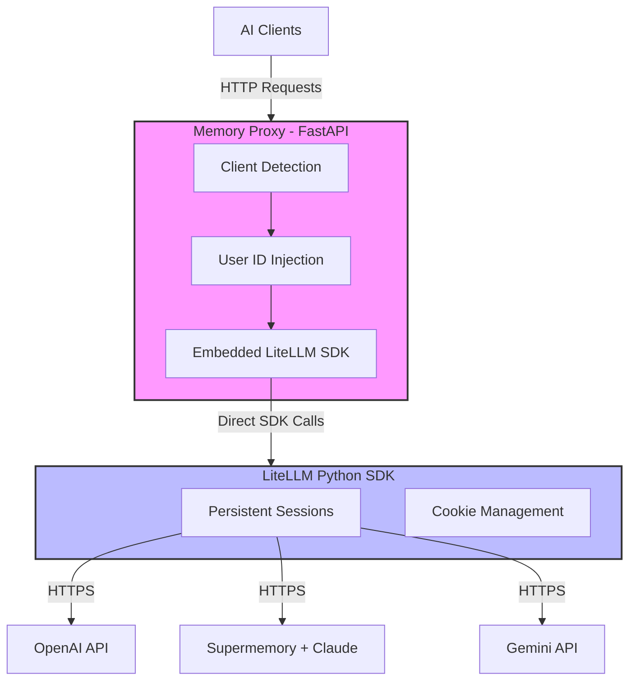

# LiteLLM Memory Proxy

**A developer-focused proxy that bridges AI clients with LiteLLM and Supermemory for unified analytics and dynamic memory.**

[](https://www.python.org/downloads/)
[](https://opensource.org/licenses/MIT)

---

## What is LiteLLM Memory Proxy?

LiteLLM Memory Proxy solves critical pain points for developers working with multiple AI clients (PyCharm, Claude Code, VS Code, custom apps) and LLM providers:

- **🔐 Authentication**: Adds API authentication for IDEs lacking configuration options
- **📊 Unified Analytics**: Single databank for LLM usage metrics (cost, latency, response quality)
- **🧠 Dynamic Memory**: Seamless Supermemory integration for inline RAG and contextual memory
- **🔒 Automatic Isolation**: Auto-recognizes users/projects to keep memories separate

---

## Quick Start

### 1. Install Dependencies

```bash
# Install project dependencies
poetry install

# Install LiteLLM (required for SDK usage)
pip install 'litellm[proxy]'
```

### 2. Configure Environment

```bash
export ANTHROPIC_API_KEY="sk-ant-..."
export OPENAI_API_KEY="sk-..."
export SUPERMEMORY_API_KEY="sm_..."  # Optional
```

### 3. Start the Proxy

We recommend using the SDK-based mode for best performance and memory persistence.

```bash
# Start the unified proxy in SDK mode
poetry run python deploy/run_unified_proxy.py --mode sdk
```

### 4. Test It Works

```bash
# Check routing info (Port 8764 by default)
curl http://localhost:8764/memory-routing/info \
  -H "User-Agent: PyCharm/2024.1"

# Send chat request
curl http://localhost:8764/v1/chat/completions \
  -H "Content-Type: application/json" \
  -H "Authorization: Bearer sk-1234" \
  -d '{ 
    "model": "claude-sonnet-4.5",
    "messages": [{"role": "user", "content": "Hello!"}]
  }'
```

---

## Usage Examples

### Example 1: PyCharm AI Assistant

Configure PyCharm to use the Memory Proxy:

1. **Settings** → **AI Assistant** → **OpenAI Service**
2. **URL**: `http://localhost:8764/v1`
3. **API Key**: `sk-1234` (from `config.yaml` master_key)
4. **Model**: `claude-sonnet-4.5`

PyCharm will be auto-detected as `pycharm-ai` user.

### Example 2: Custom Application

```python
from openai import OpenAI

client = OpenAI(
    base_url="http://localhost:8764/v1",
    api_key="sk-1234"
)

# Option 1: Auto-detection via User-Agent
# (configure your HTTP client to send custom User-Agent)

# Option 2: Explicit user ID
response = client.chat.completions.create(
    model="claude-sonnet-4.5",
    messages=[{"role": "user", "content": "Explain async/await"}],
    extra_headers={"x-memory-user-id": "my-project"}
)

print(response.choices[0].message.content)
```

---

## Architecture



**SDK Approach Benefits**:

---

## Documentation

**📚 Complete documentation is available in [`docs/INDEX.md`](docs/INDEX.md)**

### Quick Links

| Document | Description |
|----------|-------------|
| **[Getting Started](docs/getting-started/QUICKSTART.md)** | 5-minute setup guide |
| **[Tutorial](docs/getting-started/TUTORIAL.md)** | Step-by-step learning path |
| **[Architecture](docs/architecture/OVERVIEW.md)** | System design and patterns |
| **[Design Decisions](docs/architecture/DESIGN_DECISIONS.md)** | Architectural choices |
| **[Configuration](docs/guides/CONFIGURATION.md)** | Complete config reference |
| **[Testing](docs/guides/TESTING.md)** | Test suite and strategies |
| **[Troubleshooting](docs/troubleshooting/COMMON_ISSUES.md)** | Common issues and fixes |
| **[CHANGELOG](docs/CHANGELOG.md)** | Project history and evolution |

---

## Configuration

Edit `config.yaml` to configure models, client detection, and routing:

```yaml
general_settings:
  master_key: sk-1234

model_list:
  - model_name: claude-sonnet-4.5
    litellm_params:
      api_base: https://api.supermemory.ai/v3/api.anthropic.com
      model: anthropic/claude-sonnet-4-5-20250929
      api_key: os.environ/ANTHROPIC_API_KEY

  - model_name: gpt-4
    litellm_params:
      model: openai/gpt-4
      api_key: os.environ/OPENAI_API_KEY

user_id_mappings:
  custom_header: "x-memory-user-id"
  header_patterns:
    - header: "user-agent"
      pattern: "OpenAIClientImpl/Java"
      user_id: "pycharm-ai"
    - header: "user-agent"
      pattern: "Claude Code"
      user_id: "claude-cli"
  default_user_id: "default-dev"
```

**See [Configuration Guide](docs/guides/CONFIGURATION.md) for complete reference.**

---

## Testing

```bash
# Run all tests
./scripts/testing/RUN_TESTS.sh

# Run specific test suites
./scripts/testing/RUN_TESTS.sh unit          # Unit tests only
./scripts/testing/RUN_TESTS.sh integration   # Integration tests
./scripts/testing/RUN_TESTS.sh coverage      # With coverage report
```

**See [Testing Guide](docs/guides/TESTING.md) for detailed testing strategies.**

---

## Requirements

- **Python**: 3.13+ (required)
- **LiteLLM**: Installed via `pip install 'litellm[proxy]'`
- **Package Manager**: Poetry (preferred)

### API Keys

```bash
export OPENAI_API_KEY="sk-..."
export ANTHROPIC_API_KEY="sk-ant-..."
export SUPERMEMORY_API_KEY="sm_..."  # Optional
```

---

## Development

### Version Control

This project uses [Jujutsu (jj)](https://github.com/martinvonz/jj) for version control:

```bash
jj status                    # Check status
jj commit -m "message"      # Commit changes
jj log                       # View history
```

### Common Tasks

```bash
# Add a new model
# Edit config.yaml, then:
poetry run python deploy/run_unified_proxy.py --mode sdk

# Run tests
./scripts/testing/RUN_TESTS.sh

# Add client detection pattern
# Edit config.yaml user_id_mappings, then test:
curl http://localhost:8764/memory-routing/info \
  -H "User-Agent: MyApp/1.0"
```

**See [CLAUDE.md](CLAUDE.md) for complete development guide.**

---

## Project Status

- **Phase**: Early development (v0.x)
- **Stability**: Development only
- **Documentation**: Comprehensive (11 files, ~4,000 lines)
- **Test Coverage**: 98+ scenarios, 80-95% code coverage

---

## Troubleshooting

### LiteLLM package not found

```bash
pip install 'litellm[proxy]'
```

### Memory Proxy can't connect

```bash
# Check if port is in use
lsof -i :8764
```

### Client not detected

```bash
# Debug routing
curl http://localhost:8764/memory-routing/info \
  -H "User-Agent: YourClient/1.0"
```

**See [Common Issues](docs/troubleshooting/COMMON_ISSUES.md) for complete troubleshooting guide.**

---

## License

MIT License - see LICENSE file for details.

---

## Links

- **Documentation**: [`docs/INDEX.md`](docs/INDEX.md)
- **Quick Start**: [`docs/getting-started/QUICKSTART.md`](docs/getting-started/QUICKSTART.md)
- **Architecture**: [`docs/architecture/OVERVIEW.md`](docs/architecture/OVERVIEW.md)
- **CHANGELOG**: [`docs/CHANGELOG.md`](docs/CHANGELOG.md)

---

**Welcome to LiteLLM Memory Proxy!** 🚀

Get started in 5 minutes with the [Quick Start Guide](docs/getting-started/QUICKSTART.md).

---

**Created**: 2025-10-24
**Updated**: 2025-11-21
**Documentation**: v2.1.0 (SDK Architecture Update)