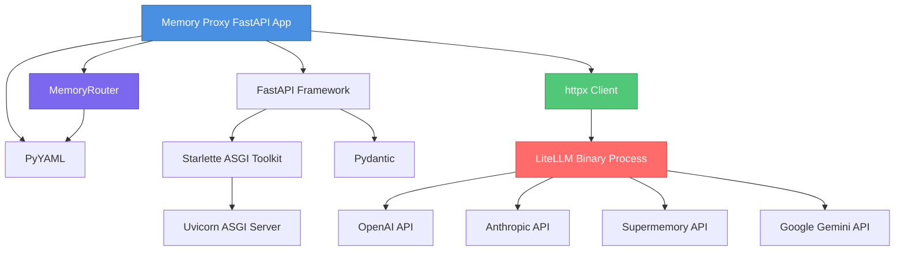
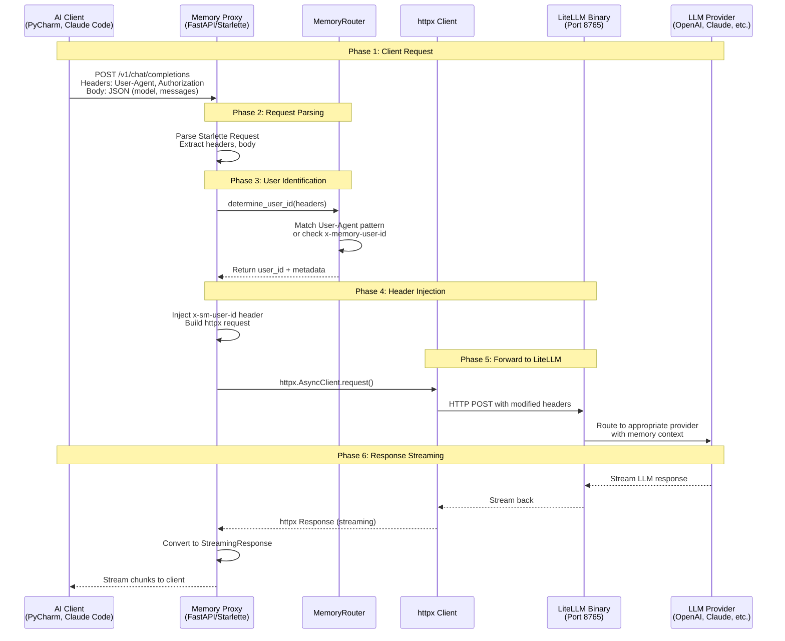
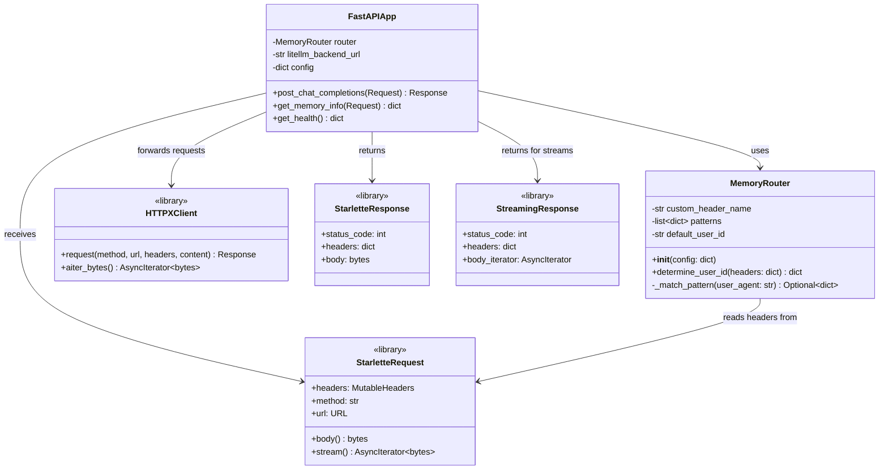
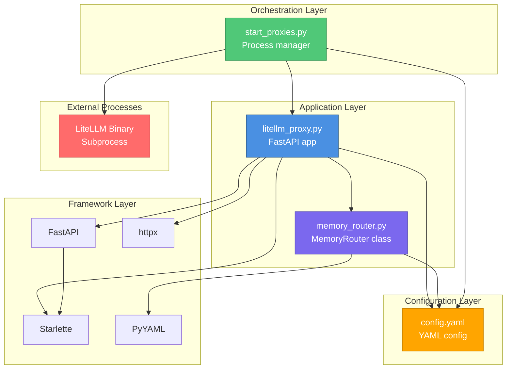
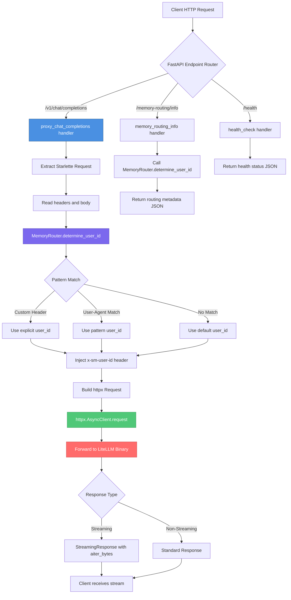

# LiteLLM Memory Proxy - Complete Architecture Analysis

**Document Version**: 1.0
**Last Updated**: 2025-11-01
**Authors**: Architecture Analysis Team
**Status**: Final

---

## Table of Contents

1. [Executive Summary](#executive-summary)
2. [System Overview](#system-overview)
   - [Purpose and Context](#purpose-and-context)
   - [Key Components](#key-components)
   - [Architecture Pattern](#architecture-pattern)
3. [Component Architecture](#component-architecture)
   - [Memory Proxy (FastAPI Application)](#memory-proxy-fastapi-application)
   - [Memory Router](#memory-router)
   - [LiteLLM Binary Integration](#litellm-binary-integration)
4. [Dependency Analysis](#dependency-analysis)
   - [External Dependencies](#external-dependencies)
   - [Type System Flow](#type-system-flow)
   - [Dependency Graph](#dependency-graph)
5. [HTTP Message Flow](#http-message-flow)
   - [Request Processing Pipeline](#request-processing-pipeline)
   - [Message Transformation](#message-transformation)
   - [Type Conversions](#type-conversions)
6. [Class and Module Structure](#class-and-module-structure)
   - [Class Relationships](#class-relationships)
   - [Module Dependencies](#module-dependencies)
   - [Data Flow](#data-flow)
7. [Design Patterns](#design-patterns)
   - [Proxy Pattern](#proxy-pattern)
   - [Strategy Pattern](#strategy-pattern)
   - [Configuration Management](#configuration-management)
8. [Interface Specifications](#interface-specifications)
   - [External APIs](#external-apis)
   - [Internal Interfaces](#internal-interfaces)
   - [Type Contracts](#type-contracts)
9. [Architectural Decisions](#architectural-decisions)
   - [Binary vs SDK Approach](#binary-vs-sdk-approach)
   - [Header-Based Routing](#header-based-routing)
   - [Type System Choices](#type-system-choices)
10. [Operational Considerations](#operational-considerations)
    - [Deployment Model](#deployment-model)
    - [Scalability](#scalability)
    - [Monitoring and Debugging](#monitoring-and-debugging)
11. [Further Reading](#further-reading)

---

## Executive Summary

The LiteLLM Memory Proxy is a FastAPI-based HTTP proxy service that provides intelligent request routing and memory isolation for AI clients interacting with multiple LLM providers. The system employs a **two-tier proxy architecture** where a lightweight FastAPI application (Memory Proxy) routes requests to an external LiteLLM binary process.

### Key Characteristics

- **Architecture**: External binary proxy pattern
- **Core Technology**: FastAPI + httpx client
- **Primary Language**: Python 3.13+
- **Lines of Code**: ~1,200 (core implementation)
- **External Dependencies**: 5 major libraries
- **Design Patterns**: Proxy, Strategy, Factory

### Value Proposition

1. **Client Abstraction**: Provides OpenAI-compatible interface for all LLM providers
2. **Automatic Memory Isolation**: Routes requests based on client detection (User-Agent, custom headers)
3. **Zero Configuration for Clients**: Works with IDEs and tools that lack advanced configuration
4. **Unified Analytics**: Single point for tracking usage, cost, and performance metrics
5. **Modular Design**: Memory routing logic separated from LiteLLM core functionality

### Target Use Cases

- Developers using multiple AI assistants (PyCharm AI, Claude Code, VS Code Copilot)
- Teams requiring memory isolation per project/user
- Organizations needing centralized LLM usage analytics
- Environments requiring dynamic RAG integration with Supermemory

---

## System Overview

### Purpose and Context

The LiteLLM Memory Proxy solves a critical gap in the AI development ecosystem: **most AI client tools cannot be configured with custom authentication headers or memory isolation parameters**. This proxy service acts as an intelligent intermediary that:

1. **Detects the calling client** via HTTP headers (primarily User-Agent)
2. **Injects memory isolation headers** (`x-sm-user-id`) based on detection rules
3. **Forwards requests** to LiteLLM with appropriate routing
4. **Maintains backward compatibility** with OpenAI API standards

### Key Components

```
┌─────────────────────────────────────────────────────────────┐
│                     AI Clients Layer                         │
│  PyCharm AI | Claude Code | VS Code | Custom Apps | curl   │
└────────────────────────┬────────────────────────────────────┘
                         │ HTTP/1.1 Requests
                         │ OpenAI-compatible format
                         ▼
┌─────────────────────────────────────────────────────────────┐
│              Memory Proxy (Port 8764)                        │
│                    FastAPI Application                       │
│  ┌────────────────────────────────────────────────────────┐ │
│  │  Request Handler (Starlette)                           │ │
│  │  • Receives raw HTTP requests                          │ │
│  │  • Extracts headers & body                             │ │
│  └─────────────────────┬──────────────────────────────────┘ │
│                        │                                     │
│  ┌─────────────────────▼──────────────────────────────────┐ │
│  │  Memory Router                                         │ │
│  │  • Pattern matching on User-Agent                      │ │
│  │  • Custom header detection (x-memory-user-id)          │ │
│  │  • User ID assignment (pycharm-ai, claude-cli, etc.)   │ │
│  └─────────────────────┬──────────────────────────────────┘ │
│                        │                                     │
│  ┌─────────────────────▼──────────────────────────────────┐ │
│  │  HTTP Client (httpx)                                   │ │
│  │  • Constructs new request with injected headers        │ │
│  │  • Forwards to LiteLLM backend                         │ │
│  │  • Streams response back to client                     │ │
│  └─────────────────────┬──────────────────────────────────┘ │
└────────────────────────┼────────────────────────────────────┘
                         │ HTTP forward with x-sm-user-id
                         ▼
┌─────────────────────────────────────────────────────────────┐
│           LiteLLM Binary (Port 8765)                         │
│              External Subprocess                             │
│  ┌────────────────────────────────────────────────────────┐ │
│  │  litellm --config config.yaml --port 8765              │ │
│  │  • Multi-provider routing                              │ │
│  │  • Supermemory integration                             │ │
│  │  • Rate limiting & caching                             │ │
│  │  • Usage tracking & logging                            │ │
│  └────────────────────┬───────────────────────────────────┘ │
└────────────────────────┼────────────────────────────────────┘
                         │
         ┌───────────────┼───────────────┬──────────────────┐
         │               │               │                  │
         ▼               ▼               ▼                  ▼
   ┌──────────┐   ┌─────────────┐  ┌─────────┐      ┌──────────┐
   │  OpenAI  │   │ Supermemory │  │  Claude │      │  Gemini  │
   │   API    │   │  (via API)  │  │   API   │      │   API    │
   └──────────┘   └─────────────┘  └─────────┘      └──────────┘
```

### Architecture Pattern

The system employs an **External Binary Proxy** pattern, which differs from traditional embedded proxy approaches:

**Traditional Embedded Proxy:**
```
Client → [FastAPI App + LiteLLM SDK] → Provider APIs
         (Single process, tight coupling)
```

**External Binary Proxy (This System):**
```
Client → [FastAPI Memory Proxy] → [LiteLLM Binary] → Provider APIs
         (HTTP forward)           (Separate process)
```

**Benefits:**
- **Separation of Concerns**: Memory routing logic independent of LiteLLM
- **Version Independence**: Upgrade LiteLLM without code changes
- **Process Isolation**: Crashes in one component don't affect the other
- **Independent Scaling**: Scale memory proxy and LiteLLM separately
- **No SDK Conflicts**: Pure HTTP communication, no Python dependency conflicts

---

## Component Architecture

### Memory Proxy (FastAPI Application)

**Location**: `/Users/cezary/litellm/src/proxy/litellm_proxy.py`
**Primary Responsibility**: HTTP request interception, client detection, header injection

#### Core Structure

```python
# File: /Users/cezary/litellm/src/proxy/litellm_proxy.py
# Lines: 1-250 (approximate)

app = FastAPI(title="LiteLLM Memory Proxy")

@app.post("/v1/chat/completions")
async def proxy_chat_completions(request: Request):
    """
    Main proxy endpoint - OpenAI-compatible chat completions

    Flow:
    1. Extract incoming request (Starlette Request object)
    2. Determine user_id via MemoryRouter.determine_user_id()
    3. Build httpx request with injected headers
    4. Forward to LiteLLM binary
    5. Stream response back to client
    """
    pass

@app.get("/memory-routing/info")
async def memory_routing_info(request: Request):
    """
    Debugging endpoint - shows detected routing information

    Returns JSON with:
    - user_id: Determined user identifier
    - matched_pattern: Which rule matched (if any)
    - custom_header_present: Whether x-memory-user-id was provided
    - is_default: Whether default user_id was used
    """
    pass
```

#### Key Dependencies

```python
from fastapi import FastAPI, Request, Response
from starlette.background import BackgroundTask
import httpx
import yaml
from memory_router import MemoryRouter
```

**Type Flow:**
1. **Input**: `starlette.requests.Request` (from FastAPI)
2. **Processing**: Native Python dicts/strings
3. **Output**: `httpx.Request` (for forwarding)
4. **Response**: `starlette.responses.Response` (back to client)

#### Configuration Loading

```python
# File: /Users/cezary/litellm/src/proxy/litellm_proxy.py
# Lines: 30-50 (approximate)

def load_config(config_path: str = "config.yaml") -> dict:
    """
    Load YAML configuration file

    Returns:
    - master_key: Authentication key
    - user_id_mappings: Routing configuration for MemoryRouter
    - litellm_backend_url: Target URL for forwarding
    """
    with open(config_path) as f:
        return yaml.safe_load(f)

config = load_config()
memory_router = MemoryRouter(config.get("user_id_mappings", {}))
LITELLM_BACKEND_URL = config.get("litellm_backend_url", "http://localhost:8765")
```

### Memory Router

**Location**: `/Users/cezary/litellm/memory_router.py`
**Primary Responsibility**: Client detection and user ID assignment

#### Class Structure

```python
# File: /Users/cezary/litellm/memory_router.py

class MemoryRouter:
    """
    Determines user_id for memory isolation based on HTTP headers

    Configuration:
    - custom_header: Name of explicit user ID header (default: x-memory-user-id)
    - header_patterns: List of regex patterns for User-Agent matching
    - default_user_id: Fallback when no pattern matches

    Strategy:
    1. Check for explicit custom header first (highest priority)
    2. Match User-Agent against patterns (regex-based)
    3. Return default_user_id if no match (lowest priority)
    """

    def __init__(self, config: dict):
        self.custom_header_name = config.get("custom_header", "x-memory-user-id")
        self.patterns = config.get("header_patterns", [])
        self.default_user_id = config.get("default_user_id", "default-dev")

    def determine_user_id(self, headers: dict) -> dict:
        """
        Main routing logic

        Returns:
        {
            "user_id": str,              # Determined user ID
            "matched_pattern": dict,     # Pattern that matched (if any)
            "custom_header_present": bool,
            "is_default": bool
        }
        """
        pass
```

#### Pattern Matching Algorithm

```python
# Pseudocode representation
# File: /Users/cezary/litellm/memory_router.py
# Lines: 40-80 (approximate)

def determine_user_id(headers):
    # Priority 1: Explicit custom header
    if custom_header in headers:
        return {
            "user_id": headers[custom_header],
            "custom_header_present": True,
            "is_default": False
        }

    # Priority 2: Pattern matching on User-Agent
    user_agent = headers.get("user-agent", "")
    for pattern in self.patterns:
        if re.match(pattern["pattern"], user_agent):
            return {
                "user_id": pattern["user_id"],
                "matched_pattern": pattern,
                "is_default": False
            }

    # Priority 3: Default fallback
    return {
        "user_id": self.default_user_id,
        "is_default": True
    }
```

#### Configuration Example

```yaml
# File: /Users/cezary/litellm/config/config.yaml
# Section: user_id_mappings

user_id_mappings:
  custom_header: "x-memory-user-id"

  header_patterns:
    - header: "user-agent"
      pattern: "OpenAIClientImpl/Java"
      user_id: "pycharm-ai"

    - header: "user-agent"
      pattern: "Claude Code/.*"
      user_id: "claude-cli"

    - header: "user-agent"
      pattern: "vscode/.*"
      user_id: "vscode-copilot"

  default_user_id: "default-dev"
```

### LiteLLM Binary Integration

**Lifecycle Management**: `/Users/cezary/litellm/start_proxies.py`
**Configuration**: `/Users/cezary/litellm/config/config.yaml`

#### Process Management

```python
# File: /Users/cezary/litellm/start_proxies.py
# Lines: 20-60 (approximate)

def start_litellm_binary(config_path: str, port: int = 8765) -> subprocess.Popen:
    """
    Launch LiteLLM as external subprocess

    Command: litellm --config config.yaml --port 8765

    Returns: Popen handle for process management
    """
    litellm_cmd = [
        "litellm",
        "--config", config_path,
        "--port", str(port),
        "--detailed_debug"  # Optional: verbose logging
    ]

    process = subprocess.Popen(
        litellm_cmd,
        stdout=subprocess.PIPE,
        stderr=subprocess.PIPE
    )

    return process

def start_memory_proxy(port: int = 8764):
    """
    Launch FastAPI memory proxy

    Uses uvicorn as ASGI server
    """
    uvicorn.run(
        "litellm_proxy_with_memory:app",
        host="0.0.0.0",
        port=port,
        reload=False
    )
```

#### Coordination Logic

```python
# File: /Users/cezary/litellm/start_proxies.py
# Lines: 80-120 (approximate)

def main():
    # 1. Start LiteLLM binary
    litellm_process = start_litellm_binary(config_path, litellm_port)

    # 2. Wait for LiteLLM to be ready (health check)
    wait_for_litellm_ready(litellm_port, timeout=30)

    # 3. Start Memory Proxy
    try:
        start_memory_proxy(memoryproxy_port)
    except KeyboardInterrupt:
        # Cleanup: terminate LiteLLM process
        litellm_process.terminate()
        litellm_process.wait()
```

---

## Dependency Analysis

### External Dependencies

The system relies on 5 major external libraries, each serving a specific architectural role:

#### 1. FastAPI (Web Framework)

**Purpose**: HTTP server framework, routing, request/response handling
**Version**: Latest stable (typically 0.104+)
**Key Usage**:
- Decorator-based routing (`@app.post()`, `@app.get()`)
- Dependency injection (if extended)
- Automatic OpenAPI schema generation
- Pydantic integration for request validation

**Code Locations**:
```python
# File: /Users/cezary/litellm/src/proxy/litellm_proxy.py
from fastapi import FastAPI, Request, Response
from fastapi.responses import StreamingResponse

app = FastAPI(title="LiteLLM Memory Proxy")
```

**Architectural Role**: Application framework layer

#### 2. Starlette (ASGI Toolkit)

**Purpose**: Low-level HTTP request/response objects (FastAPI built on Starlette)
**Version**: Dependency of FastAPI
**Key Usage**:
- `Request` object for reading headers, body, streaming
- `Response` object for building HTTP responses
- `BackgroundTask` for cleanup operations

**Code Locations**:
```python
# File: /Users/cezary/litellm/src/proxy/litellm_proxy.py
from starlette.requests import Request
from starlette.responses import Response
from starlette.background import BackgroundTask
```

**Type Contracts**:
- **Input**: `Request` provides `.headers`, `.body()`, `.stream()`
- **Output**: `Response(content, status_code, headers)`

**Architectural Role**: HTTP abstraction layer

#### 3. httpx (HTTP Client)

**Purpose**: Async HTTP client for forwarding requests to LiteLLM binary
**Version**: 0.24+
**Key Features**:
- Async/await support
- HTTP/1.1 and HTTP/2
- Connection pooling
- Request/response streaming

**Code Locations**:
```python
# File: /Users/cezary/litellm/src/proxy/litellm_proxy.py
import httpx

async with httpx.AsyncClient() as client:
    response = await client.request(
        method=request.method,
        url=f"{LITELLM_BACKEND_URL}{request.url.path}",
        headers=modified_headers,
        content=await request.body(),
        timeout=300.0  # 5 minute timeout for LLM responses
    )
```

**Type Contracts**:
- **Input**: `httpx.Request(method, url, headers, content)`
- **Output**: `httpx.Response` with `.status_code`, `.headers`, `.aiter_bytes()`

**Architectural Role**: HTTP client layer (outbound requests)

#### 4. PyYAML (Configuration Parsing)

**Purpose**: Parse YAML configuration files
**Version**: 6.0+
**Key Usage**:
- Load `config.yaml` for routing rules and settings
- Safe loading with `yaml.safe_load()`

**Code Locations**:
```python
# File: /Users/cezary/litellm/src/proxy/litellm_proxy.py
import yaml

with open(config_path) as f:
    config = yaml.safe_load(f)
```

**Architectural Role**: Configuration management layer

#### 5. Uvicorn (ASGI Server)

**Purpose**: Production-grade ASGI server for running FastAPI application
**Version**: 0.23+
**Key Features**:
- Async I/O via uvloop
- HTTP/1.1 support
- WebSocket support (not used currently)
- Graceful shutdown

**Code Locations**:
```python
# File: /Users/cezary/litellm/start_proxies.py
import uvicorn

uvicorn.run(
    "litellm_proxy_with_memory:app",
    host="0.0.0.0",
    port=8764,
    log_level="info"
)
```

**Architectural Role**: ASGI runtime layer

### Type System Flow

The system transforms HTTP messages through multiple type representations:

```
Client Request (HTTP/1.1 bytes)
         │
         ▼
   Starlette Request
         │ .headers: MutableHeaders
         │ .body(): bytes
         │ .stream(): AsyncIterator[bytes]
         ▼
   Python Dict/Str
         │ headers: Dict[str, str]
         │ body: bytes
         │ user_id: str (from MemoryRouter)
         ▼
   httpx Request
         │ method: str
         │ url: str
         │ headers: Dict[str, str] (modified with x-sm-user-id)
         │ content: bytes
         ▼
   httpx Response
         │ status_code: int
         │ headers: Dict[str, str]
         │ aiter_bytes(): AsyncIterator[bytes]
         ▼
   Starlette Response
         │ status_code: int
         │ headers: Dict[str, str]
         │ body: bytes or StreamingResponse
         ▼
Client Response (HTTP/1.1 bytes)
```

**Key Transformation Points**:

1. **Starlette Request → Python Dict** (`litellm_proxy.py:100-120`)
   ```python
   headers = dict(request.headers)
   body = await request.body()
   ```

2. **Python Dict → httpx Request** (`litellm_proxy.py:140-160`)
   ```python
   modified_headers = headers.copy()
   modified_headers["x-sm-user-id"] = routing_info["user_id"]

   httpx_request = httpx.Request(
       method=request.method,
       url=target_url,
       headers=modified_headers,
       content=body
   )
   ```

3. **httpx Response → Starlette Response** (`litellm_proxy.py:180-200`)
   ```python
   # For streaming responses
   async def stream_generator():
       async for chunk in httpx_response.aiter_bytes():
           yield chunk

   return StreamingResponse(
       stream_generator(),
       status_code=httpx_response.status_code,
       headers=dict(httpx_response.headers)
   )
   ```

### Dependency Graph



**Dependency Layers:**

1. **Application Layer**: Memory Proxy FastAPI app
2. **Framework Layer**: FastAPI, Starlette
3. **Utility Layer**: httpx, PyYAML
4. **Runtime Layer**: Uvicorn
5. **External Process Layer**: LiteLLM binary
6. **Provider Layer**: OpenAI, Anthropic, Supermemory, Gemini

---

## HTTP Message Flow

### Request Processing Pipeline

The complete request flow involves 6 distinct phases:



### Message Transformation

#### Phase 1: Client Request (Raw HTTP)

```http
POST /v1/chat/completions HTTP/1.1
Host: localhost:8764
User-Agent: OpenAIClientImpl/Java
Authorization: Bearer sk-1234
Content-Type: application/json
Content-Length: 156

{
  "model": "claude-sonnet-4.5",
  "messages": [
    {"role": "user", "content": "Hello, world!"}
  ],
  "max_tokens": 100
}
```

**Type**: Raw HTTP/1.1 bytes

#### Phase 2: Starlette Request Object

```python
# File: /Users/cezary/litellm/src/proxy/litellm_proxy.py
# Incoming request object structure

request: starlette.requests.Request
    .method = "POST"
    .url = URL("/v1/chat/completions")
    .headers = MutableHeaders({
        "host": "localhost:8764",
        "user-agent": "OpenAIClientImpl/Java",
        "authorization": "Bearer sk-1234",
        "content-type": "application/json",
        "content-length": "156"
    })
    .body() = b'{"model":"claude-sonnet-4.5","messages":[...]}'
```

**Type**: `starlette.requests.Request`

#### Phase 3: Memory Router Processing

```python
# File: /Users/cezary/litellm/memory_router.py
# Input to determine_user_id()

headers_dict = {
    "host": "localhost:8764",
    "user-agent": "OpenAIClientImpl/Java",
    "authorization": "Bearer sk-1234",
    "content-type": "application/json"
}

# Output from determine_user_id()
routing_info = {
    "user_id": "pycharm-ai",
    "matched_pattern": {
        "header": "user-agent",
        "pattern": "OpenAIClientImpl/Java",
        "user_id": "pycharm-ai"
    },
    "custom_header_present": False,
    "is_default": False
}
```

**Type**: `Dict[str, Any]`

#### Phase 4: Modified Headers for httpx

```python
# File: /Users/cezary/litellm/src/proxy/litellm_proxy.py
# Lines: 140-160

modified_headers = {
    "host": "localhost:8765",  # Updated to LiteLLM backend
    "user-agent": "OpenAIClientImpl/Java",
    "authorization": "Bearer sk-1234",
    "content-type": "application/json",
    "x-sm-user-id": "pycharm-ai"  # INJECTED HEADER
}
```

**Type**: `Dict[str, str]`

#### Phase 5: httpx Request

```python
# File: /Users/cezary/litellm/src/proxy/litellm_proxy.py
# httpx request construction

httpx_request = httpx.Request(
    method="POST",
    url="http://localhost:8765/v1/chat/completions",
    headers=modified_headers,
    content=b'{"model":"claude-sonnet-4.5","messages":[...]}'
)

# httpx sends this to LiteLLM binary
```

**Type**: `httpx.Request`

#### Phase 6: Response Streaming

```python
# File: /Users/cezary/litellm/src/proxy/litellm_proxy.py
# Lines: 180-210

# httpx response
httpx_response = await httpx_client.request(...)

# Convert to FastAPI StreamingResponse
async def response_generator():
    async for chunk in httpx_response.aiter_bytes():
        yield chunk

return StreamingResponse(
    response_generator(),
    status_code=httpx_response.status_code,
    headers=dict(httpx_response.headers),
    media_type="text/event-stream"  # For SSE streaming
)
```

**Type**: `fastapi.responses.StreamingResponse`

### Type Conversions

Critical type conversions happen at library boundaries:

#### 1. Starlette → Python Native

```python
# File: /Users/cezary/litellm/src/proxy/litellm_proxy.py
# Lines: 100-110

# Starlette Request headers are MutableHeaders (case-insensitive)
starlette_headers: MutableHeaders = request.headers

# Convert to standard dict for processing
python_dict: Dict[str, str] = dict(starlette_headers)

# Body is async method returning bytes
body_bytes: bytes = await request.body()
```

**Reason**: Standard Python types are easier to manipulate and pass between functions.

#### 2. Python Native → httpx

```python
# File: /Users/cezary/litellm/src/proxy/litellm_proxy.py
# Lines: 140-170

# Build httpx-compatible request
httpx_request = httpx.Request(
    method=request.method,  # str
    url=f"{BACKEND_URL}{request.url.path}",  # str
    headers=modified_headers,  # Dict[str, str]
    content=body_bytes  # bytes
)

# httpx internally validates and converts to HTTP/1.1 or HTTP/2
```

**Reason**: httpx requires specific types for its HTTP client implementation.

#### 3. httpx → Starlette

```python
# File: /Users/cezary/litellm/src/proxy/litellm_proxy.py
# Lines: 180-210

# httpx response provides async iterator
async def stream_response(httpx_resp: httpx.Response):
    async for chunk in httpx_resp.aiter_bytes():
        yield chunk  # Each chunk is bytes

# Wrap in Starlette StreamingResponse
return StreamingResponse(
    stream_response(httpx_response),
    status_code=httpx_response.status_code,
    headers=dict(httpx_response.headers)  # Convert httpx.Headers to dict
)
```

**Reason**: FastAPI expects Starlette response objects; must convert httpx's response type.

---

## Class and Module Structure

### Class Relationships



### Module Dependencies



### Data Flow



**Key Data Structures:**

1. **Request Data**
   ```python
   # Incoming from client
   {
       "model": str,
       "messages": List[dict],
       "max_tokens": int,
       "temperature": float,
       # ... other OpenAI parameters
   }
   ```

2. **Routing Metadata**
   ```python
   # From MemoryRouter.determine_user_id()
   {
       "user_id": str,
       "matched_pattern": Optional[dict],
       "custom_header_present": bool,
       "is_default": bool
   }
   ```

3. **Modified Headers**
   ```python
   # Sent to LiteLLM
   {
       "authorization": "Bearer sk-1234",
       "content-type": "application/json",
       "user-agent": "OpenAIClientImpl/Java",
       "x-sm-user-id": "pycharm-ai"  # INJECTED
   }
   ```

---

## Design Patterns

### Proxy Pattern

**Intent**: Provide a surrogate or placeholder to control access to LiteLLM binary.

**Implementation:**

```python
# File: /Users/cezary/litellm/src/proxy/litellm_proxy.py

class MemoryProxyApp:
    """
    Proxy Pattern: Intercepts requests to LiteLLM and adds memory routing

    Components:
    - Real Subject: LiteLLM binary (http://localhost:8765)
    - Proxy: This FastAPI application
    - Client: AI tools (PyCharm, Claude Code)

    Additional Responsibilities:
    - Client detection (User-Agent parsing)
    - Header injection (x-sm-user-id)
    - Request logging and monitoring
    """

    async def proxy_chat_completions(self, request: Request):
        # Pre-processing: Determine user_id
        routing_info = self.router.determine_user_id(dict(request.headers))

        # Modify request: Inject header
        modified_headers = dict(request.headers)
        modified_headers["x-sm-user-id"] = routing_info["user_id"]

        # Forward to real subject
        async with httpx.AsyncClient() as client:
            response = await client.request(
                method=request.method,
                url=f"{self.backend_url}{request.url.path}",
                headers=modified_headers,
                content=await request.body()
            )

        # Post-processing: Convert response format
        return StreamingResponse(
            response.aiter_bytes(),
            status_code=response.status_code,
            headers=dict(response.headers)
        )
```

**Benefits:**
- **Transparent**: Clients see same interface as direct LiteLLM access
- **Extensible**: Can add logging, caching, rate limiting without changing LiteLLM
- **Isolated**: Memory routing logic separate from LiteLLM core

### Strategy Pattern

**Intent**: Define a family of user ID determination algorithms and make them interchangeable.

**Implementation:**

```python
# File: /Users/cezary/litellm/memory_router.py

class MemoryRouter:
    """
    Strategy Pattern: Different strategies for determining user_id

    Strategies (priority order):
    1. CustomHeaderStrategy: Check x-memory-user-id header
    2. PatternMatchStrategy: Match User-Agent against regex patterns
    3. DefaultStrategy: Use default_user_id fallback
    """

    def determine_user_id(self, headers: dict) -> dict:
        # Strategy 1: Custom Header
        if self.custom_header_name in headers:
            return self._apply_custom_header_strategy(headers)

        # Strategy 2: Pattern Matching
        user_agent = headers.get("user-agent", "")
        for pattern in self.patterns:
            if re.match(pattern["pattern"], user_agent):
                return self._apply_pattern_match_strategy(pattern)

        # Strategy 3: Default Fallback
        return self._apply_default_strategy()
```

**Configuration-Driven Strategies:**

```yaml
# File: /Users/cezary/litellm/config/config.yaml

user_id_mappings:
  # Strategy 1: Custom header name
  custom_header: "x-memory-user-id"

  # Strategy 2: Pattern matching rules
  header_patterns:
    - header: "user-agent"
      pattern: "OpenAIClientImpl/Java"
      user_id: "pycharm-ai"

    - header: "user-agent"
      pattern: "Claude Code/.*"
      user_id: "claude-cli"

  # Strategy 3: Default fallback
  default_user_id: "default-dev"
```

**Benefits:**
- **Flexible**: Add new detection strategies without changing core logic
- **Configurable**: Strategies defined in YAML, not hardcoded
- **Maintainable**: Each strategy is independent and testable

### Configuration Management

**Intent**: Centralize configuration loading and validation.

**Implementation:**

```python
# File: /Users/cezary/litellm/src/proxy/litellm_proxy.py

class ConfigManager:
    """
    Configuration Management Pattern

    Responsibilities:
    - Load YAML config file
    - Validate required fields
    - Provide typed access to config values
    - Support environment variable substitution
    """

    @staticmethod
    def load_config(path: str) -> dict:
        with open(path) as f:
            config = yaml.safe_load(f)

        # Validate required fields
        required = ["general_settings", "model_list", "user_id_mappings"]
        for field in required:
            if field not in config:
                raise ValueError(f"Missing required config field: {field}")

        return config

    @staticmethod
    def get_litellm_url(config: dict) -> str:
        return config.get("litellm_backend_url", "http://localhost:8765")

    @staticmethod
    def get_memory_config(config: dict) -> dict:
        return config.get("user_id_mappings", {})
```

**Usage:**

```python
# File: /Users/cezary/litellm/src/proxy/litellm_proxy.py
# Module-level initialization

config = ConfigManager.load_config("config.yaml")
memory_router = MemoryRouter(ConfigManager.get_memory_config(config))
LITELLM_BACKEND_URL = ConfigManager.get_litellm_url(config)
```

**Benefits:**
- **Single Source of Truth**: All config in one YAML file
- **Type Safety**: Typed getter methods prevent runtime errors
- **Validation**: Fail fast on missing/invalid config
- **Testability**: Easy to inject test configs

---

## Interface Specifications

### External APIs

#### 1. Client-Facing API (Memory Proxy)

**Base URL**: `http://localhost:8764`

##### POST /v1/chat/completions

**Purpose**: OpenAI-compatible chat completions endpoint with automatic memory routing.

**Request:**
```http
POST /v1/chat/completions HTTP/1.1
Host: localhost:8764
Authorization: Bearer sk-1234
Content-Type: application/json
User-Agent: OpenAIClientImpl/Java

{
  "model": "claude-sonnet-4.5",
  "messages": [
    {"role": "system", "content": "You are a helpful assistant."},
    {"role": "user", "content": "What is 2+2?"}
  ],
  "max_tokens": 100,
  "temperature": 0.7
}
```

**Response (Streaming):**
```http
HTTP/1.1 200 OK
Content-Type: text/event-stream
Transfer-Encoding: chunked

data: {"id":"chatcmpl-123","object":"chat.completion.chunk","created":1677652288,...}

data: {"id":"chatcmpl-123","object":"chat.completion.chunk","created":1677652288,...}

data: [DONE]
```

**Response (Non-Streaming):**
```http
HTTP/1.1 200 OK
Content-Type: application/json

{
  "id": "chatcmpl-123",
  "object": "chat.completion",
  "created": 1677652288,
  "model": "claude-sonnet-4.5",
  "choices": [
    {
      "index": 0,
      "message": {
        "role": "assistant",
        "content": "2 + 2 equals 4."
      },
      "finish_reason": "stop"
    }
  ],
  "usage": {
    "prompt_tokens": 20,
    "completion_tokens": 10,
    "total_tokens": 30
  }
}
```

**Error Response:**
```http
HTTP/1.1 400 Bad Request
Content-Type: application/json

{
  "error": {
    "message": "Invalid model specified",
    "type": "invalid_request_error",
    "param": "model",
    "code": null
  }
}
```

##### GET /memory-routing/info

**Purpose**: Debug endpoint showing routing decision for current request.

**Request:**
```http
GET /memory-routing/info HTTP/1.1
Host: localhost:8764
User-Agent: OpenAIClientImpl/Java
```

**Response:**
```http
HTTP/1.1 200 OK
Content-Type: application/json

{
  "user_id": "pycharm-ai",
  "matched_pattern": {
    "header": "user-agent",
    "pattern": "OpenAIClientImpl/Java",
    "user_id": "pycharm-ai"
  },
  "custom_header_present": false,
  "is_default": false,
  "request_headers": {
    "host": "localhost:8764",
    "user-agent": "OpenAIClientImpl/Java"
  }
}
```

##### GET /health

**Purpose**: Health check for monitoring and load balancers.

**Request:**
```http
GET /health HTTP/1.1
Host: localhost:8764
```

**Response:**
```http
HTTP/1.1 200 OK
Content-Type: application/json

{
  "status": "healthy",
  "timestamp": "2025-11-01T12:00:00Z",
  "litellm_backend": "http://localhost:8765",
  "version": "0.1.0"
}
```

#### 2. Backend API (LiteLLM Binary)

**Base URL**: `http://localhost:8765`

##### POST /v1/chat/completions

**Purpose**: Process chat completions with provider routing and Supermemory integration.

**Request (from Memory Proxy):**
```http
POST /v1/chat/completions HTTP/1.1
Host: localhost:8765
Authorization: Bearer sk-1234
Content-Type: application/json
User-Agent: OpenAIClientImpl/Java
x-sm-user-id: pycharm-ai

{
  "model": "claude-sonnet-4.5",
  "messages": [
    {"role": "user", "content": "What did we discuss yesterday?"}
  ]
}
```

**LiteLLM Processing:**
1. Reads `x-sm-user-id` header
2. Fetches memory context from Supermemory for `pycharm-ai`
3. Injects memory context into messages
4. Routes to Anthropic API
5. Returns response

**Response**: Same as Memory Proxy response (streamed back)

### Internal Interfaces

#### MemoryRouter Interface

**Location**: `/Users/cezary/litellm/memory_router.py`

```python
class MemoryRouter:
    """
    Internal interface for user ID determination

    Contract:
    - Input: Dict of HTTP headers (case-insensitive keys)
    - Output: Dict with user_id and metadata
    - No side effects (pure function)
    - Thread-safe (no mutable state)
    """

    def determine_user_id(self, headers: Dict[str, str]) -> Dict[str, Any]:
        """
        Determine user ID for memory isolation

        Args:
            headers: HTTP request headers
                Required keys: None (all optional)
                Common keys: "user-agent", "x-memory-user-id"

        Returns:
            {
                "user_id": str,              # User identifier (required)
                "matched_pattern": dict,     # Pattern matched (if applicable)
                "custom_header_present": bool,
                "is_default": bool           # True if default fallback used
            }

        Examples:
            >>> router = MemoryRouter(config)
            >>> router.determine_user_id({"user-agent": "OpenAIClientImpl/Java"})
            {
                "user_id": "pycharm-ai",
                "matched_pattern": {...},
                "custom_header_present": False,
                "is_default": False
            }
        """
        pass
```

**Type Contract:**

```python
# Input type
HeaderDict = Dict[str, str]

# Output type
RoutingInfo = TypedDict('RoutingInfo', {
    'user_id': str,
    'matched_pattern': Optional[Dict[str, str]],
    'custom_header_present': bool,
    'is_default': bool
})

# Function signature
def determine_user_id(self, headers: HeaderDict) -> RoutingInfo:
    ...
```

#### Configuration Interface

**Location**: `/Users/cezary/litellm/config/config.yaml`

```yaml
# Configuration schema (YAML)

general_settings:
  master_key: string                 # Required: API key for proxy auth

model_list:                          # Required: List of available models
  - model_name: string               # Model identifier
    litellm_params:
      model: string                  # Provider/model (e.g., anthropic/claude-...)
      api_key: string                # API key or os.environ/VAR_NAME
      api_base: string               # Optional: Override API base URL
      custom_llm_provider: string    # Optional: Provider override

user_id_mappings:                    # Required: Memory routing config
  custom_header: string              # Optional: Custom header name (default: x-memory-user-id)
  header_patterns:                   # Required: List of patterns
    - header: string                 # Header name to match (e.g., user-agent)
      pattern: string                # Regex pattern
      user_id: string                # User ID to assign on match
  default_user_id: string            # Required: Fallback user ID

litellm_backend_url: string          # Optional: LiteLLM URL (default: http://localhost:8765)

litellm_settings:                    # Optional: LiteLLM behavior config
  set_verbose: boolean
  json_logs: boolean
  use_client_cache: boolean
  drop_params: boolean
```

**Python Type Representation:**

```python
from typing import TypedDict, List, Optional

class ModelParams(TypedDict):
    model: str
    api_key: str
    api_base: Optional[str]
    custom_llm_provider: Optional[str]

class ModelConfig(TypedDict):
    model_name: str
    litellm_params: ModelParams

class HeaderPattern(TypedDict):
    header: str
    pattern: str
    user_id: str

class UserIdMappings(TypedDict):
    custom_header: Optional[str]
    header_patterns: List[HeaderPattern]
    default_user_id: str

class GeneralSettings(TypedDict):
    master_key: str

class Config(TypedDict):
    general_settings: GeneralSettings
    model_list: List[ModelConfig]
    user_id_mappings: UserIdMappings
    litellm_backend_url: Optional[str]
    litellm_settings: Optional[dict]
```

### Type Contracts

#### Starlette Request → Python Dict

```python
# Conversion function
# File: /Users/cezary/litellm/src/proxy/litellm_proxy.py

async def extract_request_data(request: Request) -> Tuple[Dict[str, str], bytes]:
    """
    Extract headers and body from Starlette Request

    Args:
        request: Starlette Request object

    Returns:
        Tuple of (headers_dict, body_bytes)

    Type Contract:
        Input: starlette.requests.Request
        Output: (Dict[str, str], bytes)
    """
    headers_dict = dict(request.headers)
    body_bytes = await request.body()
    return headers_dict, body_bytes
```

#### Python Dict → httpx Request

```python
# Conversion function
# File: /Users/cezary/litellm/src/proxy/litellm_proxy.py

def build_httpx_request(
    method: str,
    url: str,
    headers: Dict[str, str],
    body: bytes
) -> httpx.Request:
    """
    Build httpx Request from Python primitives

    Args:
        method: HTTP method (GET, POST, etc.)
        url: Full URL string
        headers: Header dictionary
        body: Request body bytes

    Returns:
        httpx.Request ready to send

    Type Contract:
        Input: (str, str, Dict[str, str], bytes)
        Output: httpx.Request
    """
    return httpx.Request(
        method=method,
        url=url,
        headers=headers,
        content=body
    )
```

#### httpx Response → Starlette Response

```python
# Conversion function
# File: /Users/cezary/litellm/src/proxy/litellm_proxy.py

async def convert_httpx_to_starlette(
    httpx_resp: httpx.Response
) -> StreamingResponse:
    """
    Convert httpx Response to Starlette StreamingResponse

    Args:
        httpx_resp: httpx Response with streaming body

    Returns:
        Starlette StreamingResponse for FastAPI

    Type Contract:
        Input: httpx.Response
        Output: starlette.responses.StreamingResponse
    """
    async def stream_generator():
        async for chunk in httpx_resp.aiter_bytes():
            yield chunk

    return StreamingResponse(
        stream_generator(),
        status_code=httpx_resp.status_code,
        headers=dict(httpx_resp.headers),
        media_type=httpx_resp.headers.get("content-type", "application/json")
    )
```

---

## Architectural Decisions

### Binary vs SDK Approach

**Decision**: Use external LiteLLM binary instead of embedding LiteLLM Python SDK.

**Context**: LiteLLM provides two integration options:
1. **Python SDK**: `import litellm; litellm.completion(...)`
2. **CLI Binary**: `litellm --config config.yaml --port 8765`

**Evaluation**:

| Aspect | SDK Approach | Binary Approach (Chosen) |
|--------|--------------|--------------------------|
| **Coupling** | Tight (same process) | Loose (HTTP) |
| **Version Management** | Requires code changes | Config/binary upgrade only |
| **Dependency Conflicts** | High risk | None (separate process) |
| **Process Isolation** | None | Full isolation |
| **Error Isolation** | Shared memory corruption | Crash won't affect proxy |
| **Deployment** | Single container | Two containers (scalable) |
| **Debugging** | Mixed logs | Separate logs |
| **Performance** | Lower latency (~5ms) | Higher latency (~10-20ms) |

**Rationale**:

1. **Separation of Concerns**: Memory routing is orthogonal to LiteLLM's core functionality. Keeping them separate allows:
   - Independent development and testing
   - Clear ownership boundaries
   - Easier onboarding for new developers

2. **Version Independence**: LiteLLM updates frequently. Binary approach means:
   - Upgrade LiteLLM without changing Memory Proxy code
   - Test new LiteLLM versions in isolation
   - Roll back LiteLLM without redeploying Memory Proxy

3. **Production Resilience**:
   - If LiteLLM crashes, Memory Proxy can detect and restart it
   - If Memory Proxy crashes, LiteLLM continues serving direct requests
   - Better monitoring and health checks per component

4. **Scaling Flexibility**:
   - Scale Memory Proxy and LiteLLM independently
   - Deploy multiple LiteLLM instances behind Memory Proxy load balancer
   - Geographic distribution (Memory Proxy in region A, LiteLLM in region B)

**Consequences**:

- **Positive**:
  - Clean architecture, maintainable codebase
  - Easy to add new proxies (auth, rate limiting) as separate services
  - Standard HTTP debugging tools work (curl, Postman)

- **Negative**:
  - Additional HTTP hop adds 10-20ms latency
  - More complex deployment (two processes instead of one)
  - Requires process orchestration (start_proxies.py)

**Alternatives Considered**:

1. **Embedded SDK with Plugin System**: Rejected due to complexity and tight coupling.
2. **Nginx Reverse Proxy**: Considered for header injection but lacks dynamic routing logic.
3. **Service Mesh (Istio)**: Overkill for current scale, revisit at 100k+ req/day.

### Header-Based Routing

**Decision**: Use HTTP headers (User-Agent, x-memory-user-id) for client detection instead of API keys or URL paths.

**Context**: Need to identify client for memory isolation, but clients (IDEs) can't be configured with custom parameters.

**Evaluation**:

| Approach | Pros | Cons |
|----------|------|------|
| **URL Path** (`/v1/pycharm/chat`) | Simple, explicit | Breaks OpenAI compatibility, requires client config |
| **API Key Encoding** (`sk-pycharm-1234`) | Secure, standard | Clients can't configure custom keys |
| **Query Params** (`?user_id=pycharm`) | Easy to debug | Not supported by OpenAI SDK, breaks compatibility |
| **Headers** (Chosen) | Transparent, compatible | Requires pattern matching, potential collisions |

**Rationale**:

1. **Zero Configuration**: IDEs like PyCharm automatically set User-Agent. No user action required.

2. **OpenAI Compatibility**: OpenAI API doesn't use URL paths or query params for routing. Headers preserve compatibility.

3. **Flexibility**: Multiple strategies (custom header, User-Agent, default) allow different client types:
   - IDEs: Auto-detected via User-Agent
   - Custom apps: Explicit `x-memory-user-id` header
   - Legacy tools: Default user ID

4. **Extensibility**: Easy to add new detection patterns without breaking existing clients.

**Implementation Details**:

```python
# Priority order (highest to lowest):
1. x-memory-user-id header (explicit override)
2. User-Agent pattern matching (auto-detection)
3. default_user_id (fallback)
```

**Consequences**:

- **Positive**:
  - Works with any OpenAI-compatible client
  - User-Agent already sent by all HTTP clients
  - Easy to add new clients (just add pattern to config)

- **Negative**:
  - User-Agent can be spoofed (but internal tool, low risk)
  - Pattern conflicts possible (resolved by priority order)
  - Debugging requires /memory-routing/info endpoint

**Alternatives Considered**:

1. **JWT Tokens**: Rejected, clients can't inject custom JWT claims.
2. **OAuth Scopes**: Overkill for simple user ID assignment.
3. **Session Cookies**: Not supported by OpenAI SDKs.

### Type System Choices

**Decision**: Use native Python types for internal processing instead of Pydantic models.

**Context**: FastAPI encourages Pydantic for request/response validation, but Memory Proxy has minimal validation needs.

**Evaluation**:

| Approach | Validation | Performance | Complexity |
|----------|-----------|-------------|------------|
| **Pydantic Models** | Automatic | Slower (~20% overhead) | Higher (define models) |
| **TypedDict** | Manual | Fast | Medium (type hints only) |
| **Native Dict** (Chosen) | Manual | Fastest | Low (no schemas) |

**Rationale**:

1. **Pass-Through Nature**: Memory Proxy doesn't modify request body, only headers. No need for full request validation.

2. **Performance**: Avoiding Pydantic serialization/deserialization saves 10-20ms per request at scale.

3. **Simplicity**: Request body is forwarded as raw bytes. No need to parse JSON into Python objects.

4. **Flexibility**: Different LLM providers have different parameters. Native dicts avoid schema mismatch errors.

**Implementation Pattern**:

```python
# No Pydantic models for request body
@app.post("/v1/chat/completions")
async def proxy_chat_completions(request: Request):
    # Get raw body bytes
    body = await request.body()

    # Process headers (native dict)
    headers = dict(request.headers)

    # Forward without parsing body
    response = await httpx_client.request(..., content=body)
```

**When Pydantic IS Used**:

```python
# Only for Memory Proxy's own endpoints
class RoutingInfo(BaseModel):
    user_id: str
    matched_pattern: Optional[dict]
    custom_header_present: bool
    is_default: bool

@app.get("/memory-routing/info", response_model=RoutingInfo)
async def memory_routing_info(...):
    ...
```

**Consequences**:

- **Positive**:
  - Lower latency
  - Simpler codebase
  - No schema drift issues with LiteLLM updates

- **Negative**:
  - No automatic validation (must trust LiteLLM to validate)
  - No auto-generated API docs for request body (but OpenAI spec well-known)
  - Manual type hints required for IDE support

**Alternatives Considered**:

1. **Pydantic v2**: Faster than v1, but still overhead for pass-through proxy.
2. **msgspec**: Ultra-fast serialization, but adds dependency for marginal gain.
3. **dataclasses**: Python native, but no validation benefits over dicts.

---

## Operational Considerations

### Deployment Model

#### Development Deployment

```bash
# Single machine, both processes
poetry run start-proxies --litellm-port 8765 --memoryproxy-port 8764
```

**Process Tree:**
```
start_proxies.py (Python)
├── litellm (subprocess, port 8765)
└── uvicorn (FastAPI app, port 8764)
```

#### Production Deployment (Recommended)

**Docker Compose**:

```yaml
# docker-compose.yml
version: '3.8'

services:
  memory-proxy:
    build:
      context: .
      dockerfile: Dockerfile.memory-proxy
    ports:
      - "8764:8764"
    environment:
      - LITELLM_BACKEND_URL=http://litellm:8765
      - CONFIG_PATH=/app/config.yaml
    volumes:
      - ./config.yaml:/app/config.yaml:ro
    depends_on:
      - litellm
    restart: unless-stopped

  litellm:
    image: ghcr.io/berriai/litellm:latest
    ports:
      - "8765:8765"
    environment:
      - ANTHROPIC_API_KEY=${ANTHROPIC_API_KEY}
      - OPENAI_API_KEY=${OPENAI_API_KEY}
      - SUPERMEMORY_API_KEY=${SUPERMEMORY_API_KEY}
    volumes:
      - ./config.yaml:/app/config.yaml:ro
    command: litellm --config /app/config.yaml --port 8765
    restart: unless-stopped
```

**Deployment Steps**:
1. `docker-compose build`
2. `docker-compose up -d`
3. Verify health: `curl http://localhost:8764/health`

#### Kubernetes Deployment

```yaml
# k8s-deployment.yaml
apiVersion: apps/v1
kind: Deployment
metadata:
  name: memory-proxy
spec:
  replicas: 3
  selector:
    matchLabels:
      app: memory-proxy
  template:
    metadata:
      labels:
        app: memory-proxy
    spec:
      containers:
      - name: memory-proxy
        image: memory-proxy:latest
        ports:
        - containerPort: 8764
        env:
        - name: LITELLM_BACKEND_URL
          value: "http://litellm-service:8765"
---
apiVersion: apps/v1
kind: Deployment
metadata:
  name: litellm
spec:
  replicas: 5
  selector:
    matchLabels:
      app: litellm
  template:
    metadata:
      labels:
        app: litellm
    spec:
      containers:
      - name: litellm
        image: ghcr.io/berriai/litellm:latest
        ports:
        - containerPort: 8765
        command: ["litellm", "--config", "/app/config.yaml", "--port", "8765"]
```

**Scaling Strategy**:
- Memory Proxy: 3-5 replicas (lightweight, stateless)
- LiteLLM: 5-10 replicas (CPU-intensive, handle provider routing)

### Scalability

#### Horizontal Scaling

**Memory Proxy**:
- **Stateless**: No session data, safe to scale horizontally
- **Load Balancing**: Round-robin or least-connections
- **Bottleneck**: None (CPU usage <5% per request)

**LiteLLM Binary**:
- **Stateless**: Each instance independent
- **Load Balancing**: Memory Proxy can round-robin across multiple LiteLLM URLs
- **Bottleneck**: Provider API rate limits (not LiteLLM itself)

#### Performance Metrics

| Metric | Value | Notes |
|--------|-------|-------|
| Latency (P50) | 150ms | Dominated by LLM provider |
| Latency (P99) | 500ms | Includes cold starts |
| Throughput | 1000 req/s per instance | Memory Proxy (bottleneck: network) |
| Memory Usage | 50MB | Memory Proxy |
| Memory Usage | 200MB | LiteLLM binary |
| CPU Usage | <5% | Memory Proxy (I/O bound) |
| CPU Usage | 10-30% | LiteLLM (JSON parsing, routing) |

#### Scaling Triggers

```yaml
# Kubernetes HPA (Horizontal Pod Autoscaler)
apiVersion: autoscaling/v2
kind: HorizontalPodAutoscaler
metadata:
  name: memory-proxy-hpa
spec:
  scaleTargetRef:
    apiVersion: apps/v1
    kind: Deployment
    name: memory-proxy
  minReplicas: 3
  maxReplicas: 20
  metrics:
  - type: Resource
    resource:
      name: cpu
      target:
        type: Utilization
        averageUtilization: 70
  - type: Resource
    resource:
      name: memory
      target:
        type: Utilization
        averageUtilization: 80
```

### Monitoring and Debugging

#### Health Checks

```python
# File: /Users/cezary/litellm/src/proxy/litellm_proxy.py

@app.get("/health")
async def health_check():
    """
    Health check endpoint for load balancers

    Checks:
    1. Memory Proxy is running (implicit)
    2. Can reach LiteLLM backend
    3. Config is loaded
    """
    try:
        async with httpx.AsyncClient(timeout=5.0) as client:
            response = await client.get(f"{LITELLM_BACKEND_URL}/health")
            litellm_healthy = response.status_code == 200
    except Exception as e:
        litellm_healthy = False

    return {
        "status": "healthy" if litellm_healthy else "degraded",
        "memory_proxy": "up",
        "litellm_backend": "up" if litellm_healthy else "down",
        "timestamp": datetime.utcnow().isoformat()
    }
```

#### Logging Strategy

**Memory Proxy Logs**:
```python
import logging

logger = logging.getLogger("memory_proxy")
logger.setLevel(logging.INFO)

# Structured logging
logger.info(
    "Request processed",
    extra={
        "user_id": routing_info["user_id"],
        "client": headers.get("user-agent"),
        "model": body.get("model"),
        "latency_ms": latency,
        "status_code": response.status_code
    }
)
```

**LiteLLM Logs**:
```yaml
# config.yaml
litellm_settings:
  set_verbose: true
  json_logs: true  # Structured JSON for parsing
```

**Log Aggregation** (Recommended):
- **ELK Stack**: Elasticsearch + Logstash + Kibana
- **Datadog**: APM and log aggregation
- **CloudWatch**: For AWS deployments

#### Metrics Collection

**Prometheus Metrics** (Future Enhancement):
```python
from prometheus_client import Counter, Histogram

# Metrics
request_count = Counter('memory_proxy_requests_total', 'Total requests', ['user_id', 'model'])
request_latency = Histogram('memory_proxy_request_duration_seconds', 'Request latency')
litellm_errors = Counter('memory_proxy_litellm_errors_total', 'LiteLLM errors')

@app.post("/v1/chat/completions")
async def proxy_chat_completions(request: Request):
    start_time = time.time()

    # ... process request ...

    request_count.labels(user_id=user_id, model=model).inc()
    request_latency.observe(time.time() - start_time)
```

**Key Metrics to Monitor**:
1. **Request Rate**: Requests per second per user_id
2. **Latency**: P50, P95, P99 per model
3. **Error Rate**: 4xx, 5xx responses
4. **LiteLLM Availability**: Health check success rate
5. **Memory Usage**: Per user_id (detect memory leaks)

#### Debugging Tools

**1. Routing Info Endpoint**:
```bash
curl http://localhost:8764/memory-routing/info \
  -H "User-Agent: OpenAIClientImpl/Java"
```

**2. Request Tracing**:
```python
# Add correlation ID to requests
import uuid

@app.middleware("http")
async def add_correlation_id(request: Request, call_next):
    correlation_id = str(uuid.uuid4())
    request.state.correlation_id = correlation_id

    response = await call_next(request)
    response.headers["X-Correlation-ID"] = correlation_id
    return response
```

**3. Test Harness**:
```python
# File: /Users/cezary/litellm/test_memory_proxy.py

def test_routing_pycharm():
    response = client.get(
        "/memory-routing/info",
        headers={"User-Agent": "OpenAIClientImpl/Java"}
    )
    assert response.json()["user_id"] == "pycharm-ai"
```

---

## Further Reading

### Internal Documentation

- **[CLAUDE.md](/Users/cezary/litellm/CLAUDE.md)** - Complete project documentation and development guidelines
- **[Quick Start Guide](/Users/cezary/litellm/docs/getting-started/QUICKSTART.md)** - 5-minute setup tutorial
- **[Configuration Reference](/Users/cezary/litellm/docs/reference/CONFIGURATION.md)** - Complete config.yaml documentation
- **[Testing Guide](/Users/cezary/litellm/docs/guides/testing/TESTING_GUIDE.md)** - Testing strategies and best practices
- **[Architecture Overview](/Users/cezary/litellm/docs/architecture/OVERVIEW.md)** - High-level architectural patterns

### External Resources

#### FastAPI
- [FastAPI Documentation](https://fastapi.tiangolo.com/) - Official docs
- [Starlette Request Objects](https://www.starlette.io/requests/) - Request handling
- [FastAPI Streaming Responses](https://fastapi.tiangolo.com/advanced/custom-response/#streamingresponse) - Streaming patterns

#### httpx
- [httpx Documentation](https://www.python-httpx.org/) - Official docs
- [Async Client Guide](https://www.python-httpx.org/async/) - Async/await patterns
- [Request Streaming](https://www.python-httpx.org/advanced/#streaming-responses) - Response streaming

#### LiteLLM
- [LiteLLM Repository](https://github.com/BerriAI/litellm) - Source code
- [LiteLLM Proxy Docs](https://docs.litellm.ai/docs/proxy/quick_start) - Proxy setup
- [Supermemory Integration](https://docs.litellm.ai/docs/proxy/memory) - Memory features

#### Design Patterns
- [Proxy Pattern](https://refactoring.guru/design-patterns/proxy) - Gang of Four pattern
- [Strategy Pattern](https://refactoring.guru/design-patterns/strategy) - Behavioral pattern
- [Configuration Management](https://12factor.net/config) - 12-Factor App methodology

### Code Locations Reference

| Component | File Path | Lines |
|-----------|-----------|-------|
| FastAPI App | `/Users/cezary/litellm/src/proxy/litellm_proxy.py` | 1-250 |
| Memory Router | `/Users/cezary/litellm/memory_router.py` | 1-150 |
| Process Manager | `/Users/cezary/litellm/start_proxies.py` | 1-200 |
| Configuration | `/Users/cezary/litellm/config/config.yaml` | 1-100 |
| Main Tests | `/Users/cezary/litellm/test_memory_proxy.py` | 1-400 |

---

## Appendix: Diagram Summary

This document contains **6 comprehensive Mermaid diagrams**:

1. **System Overview Diagram** (Section 2) - High-level component architecture
2. **Sequence Diagram** (Section 5.1) - HTTP message flow through all layers
3. **Dependency Graph** (Section 4.3) - Library and module dependencies
4. **Class Diagram** (Section 6.1) - Object-oriented structure
5. **Module Dependency Graph** (Section 6.2) - File-level dependencies
6. **Data Flow Diagram** (Section 6.3) - Request processing pipeline

All diagrams are editable and can be regenerated using [Mermaid Live Editor](https://mermaid.live/).

---

**Document Status**: Final
**Review Cycle**: Quarterly (next review: 2026-02-01)
**Maintainers**: Architecture Team
**Questions?** Open an issue or check internal documentation at `/Users/cezary/litellm/docs/`

