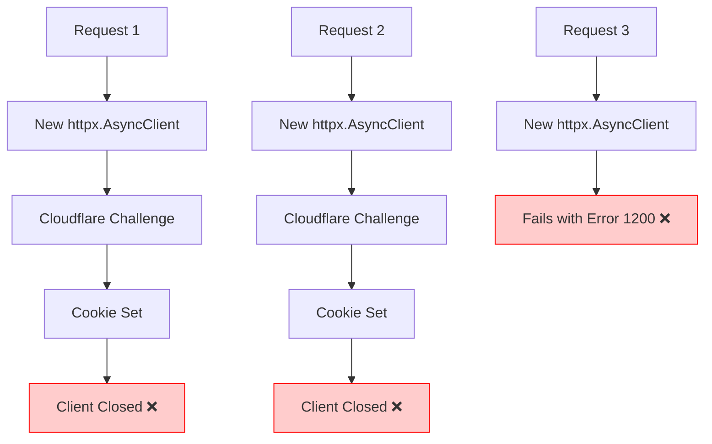
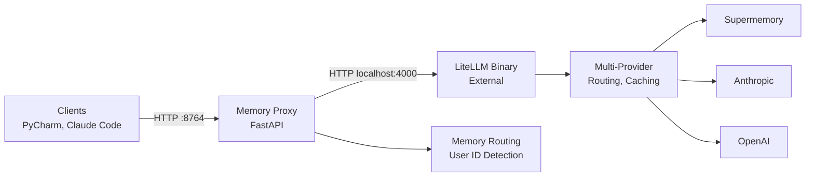
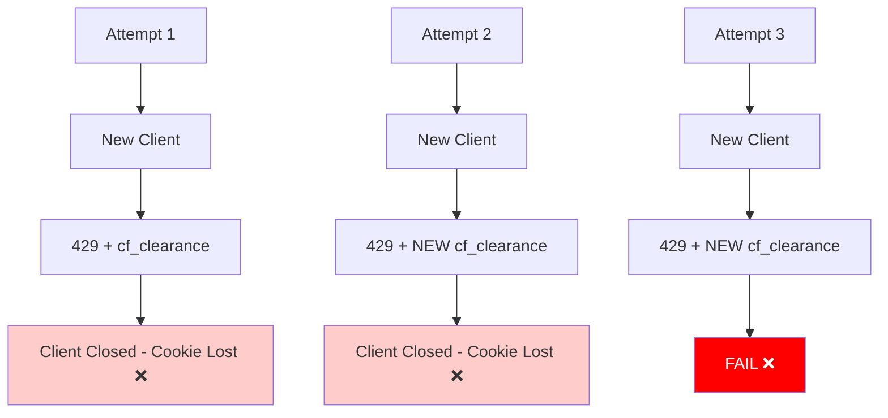
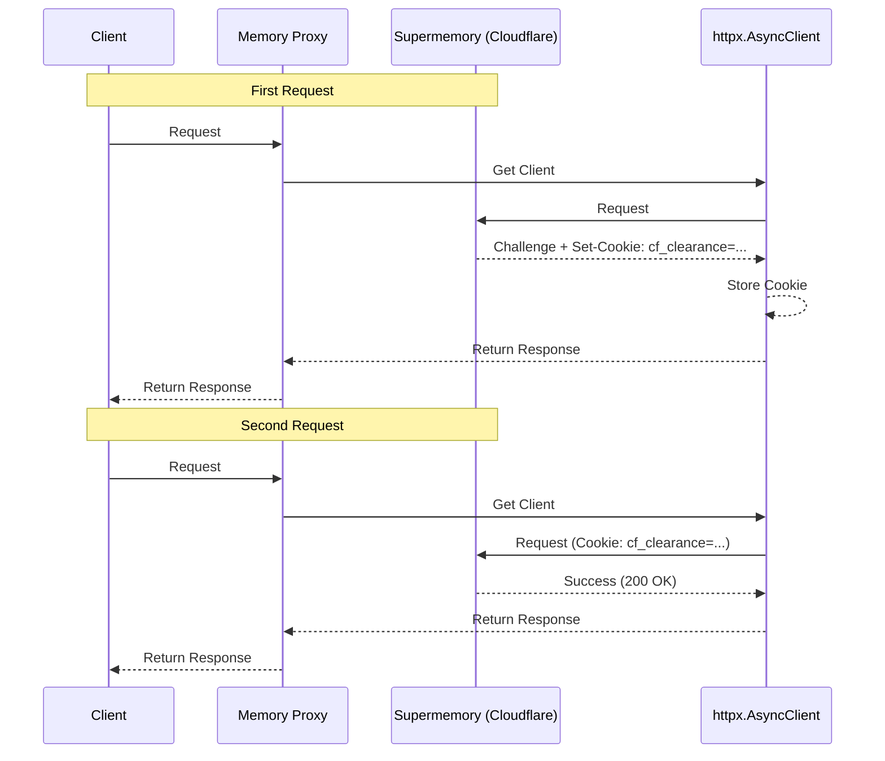
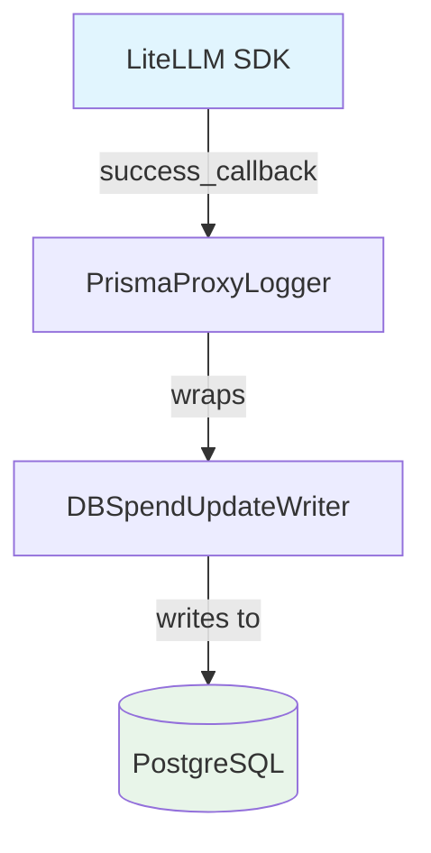
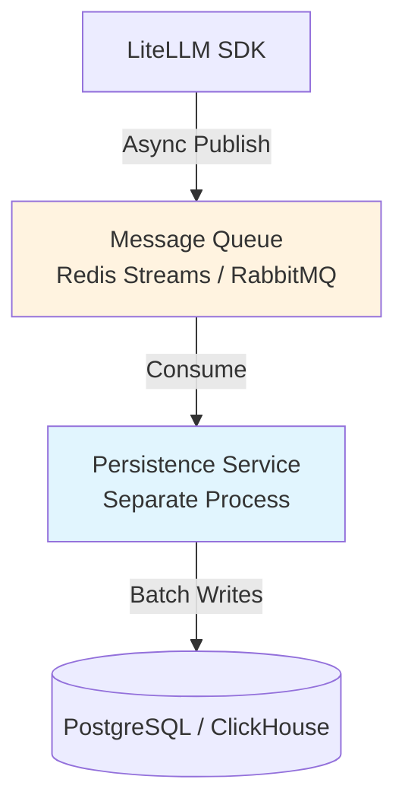
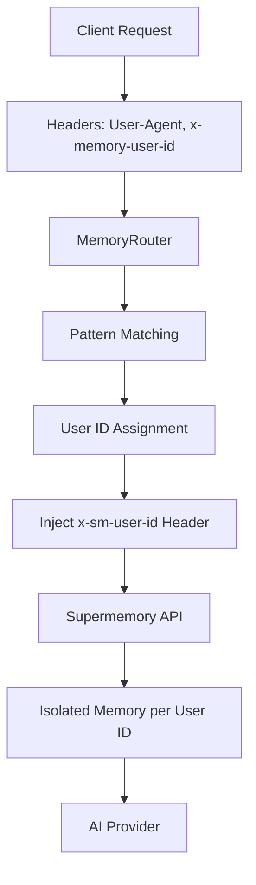

# Architecture & Design Decisions

**Last Updated**: 2025-11-04  
**Status**: Living Document

This document captures major architectural decisions, design patterns, and their rationale for the LiteLLM Memory Proxy project.

---

## Table of Contents

1. [Binary to SDK Migration](#1-binary-to-sdk-migration)
2. [Cookie Persistence Strategy](#2-cookie-persistence-strategy)
3. [Database Persistence Design](#3-database-persistence-design)
4. [Memory Routing Architecture](#4-memory-routing-architecture)

---

## 1. Binary to SDK Migration

### 1.1 Context & Problem Statement

**Date**: 2025-11-03  
**Status**: Documented and Planned  
**Timeline**: 3-4 Days

#### Problem

The current binary-based proxy architecture cannot persist Cloudflare cookies, causing repeated 503 errors (Cloudflare Error 1200). The LiteLLM binary creates new HTTP clients for each request, losing cookies set by Cloudflare bot challenges.

**Impact**: 
- Degraded user experience
- Increased error rates
- Failed API requests to Supermemory proxy

#### Root Cause



The binary proxy creates and destroys HTTP clients for each request, making cookie persistence impossible.

---

### 1.2 Architecture Comparison

#### Current: Binary Architecture



**Problems**:
- ❌ Cannot control LiteLLM binary's HTTP client
- ❌ Cookie persistence fails (new client per request)
- ❌ Extra HTTP hop (~10ms latency)
- ❌ Two processes to manage
- ❌ Limited configuration control
- ❌ Opaque error messages

#### Proposed: SDK Architecture

```mermaid
graph LR
    Clients[Clients<br>PyCharm, Claude Code] -->|HTTP :8764| Proxy[Memory Proxy<br>FastAPI]
    
    subgraph Proxy[Memory Proxy Process]
        SDK[LiteLLM SDK<br>In-Process]
        Sessions[Persistent httpx Sessions]
        Proxy --> SDK
        SDK --> Sessions
    end
    
    Sessions -->|HTTPS| Supermemory[Supermemory<br>+ Anthropic]
    Sessions -->|HTTPS| Providers[OpenAI, Gemini<br>Other Providers]
    
    style Sessions fill:#d1c4e9,stroke:#673ab7
```

**Benefits**:
- ✅ Full control over HTTP client
- ✅ Persistent sessions with cookie management
- ✅ Single process (simpler deployment)
- ✅ Direct SDK calls (no HTTP hop)
- ✅ Rich exception handling
- ✅ Full observability

---

### 1.3 Migration Strategy

#### Core Principle: Non-Destructive Parallel Development

- Binary proxy remains **completely untouched** during migration
- SDK proxy built in **parallel directory structure**
- Both proxies can **run simultaneously** during testing
- **Easy rollback**: Single environment variable toggle
- **Zero configuration changes**: Same config.yaml for both

#### Directory Structure

```
src/proxy/
├── litellm_proxy_with_memory.py    # BINARY: Untouched
├── litellm_proxy_sdk.py            # SDK: New implementation
├── config_parser.py                # NEW: SDK-specific
├── session_manager.py              # NEW: Cookie persistence
├── error_handlers.py               # NEW: Rich errors
├── streaming_utils.py              # NEW: SSE streaming
├── memory_router.py                # SHARED: No changes
└── schema.py                       # SHARED: No changes

config/
└── config.yaml                     # SHARED: No changes
```

#### Port Allocation

- **8764**: Binary proxy (during migration) → SDK proxy (after cutover)
- **8765**: SDK proxy (during testing)
- **4000**: LiteLLM binary (only when binary proxy runs)

#### Implementation Timeline

**Day 1-2: SDK Implementation (Parallel)**
- Create `config_parser.py` - Parse config.yaml, extract model params
- Create `session_manager.py` - Persistent httpx.AsyncClient
- Create `error_handlers.py` - Exception mapping
- Create `streaming_utils.py` - SSE handling
- Complete `litellm_proxy_sdk.py` - Main FastAPI app
- Write unit tests for each component

**Day 3: Testing & Validation**
- Feature parity validation
- Test with PyCharm AI Assistant
- Test with Claude Code
- Load testing (50+ concurrent requests)
- Side-by-side comparison with binary proxy

**Day 4: Cutover & Cleanup**
- Update default launcher to use SDK proxy
- Move binary proxy to `src/proxy/archive/`
- Monitor for issues
- Update documentation

---

### 1.4 Rollback Strategy

#### Immediate Rollback (<5 minutes)

```bash
# Option 1: Environment variable
USE_SDK_PROXY=false python deploy/run_proxies.py

# Option 2: Rollback script
./rollback_to_binary.sh

# Option 3: Manual
pkill -f litellm_proxy_sdk
python src/proxy/archive/litellm_proxy_with_memory.py
```

#### Gradual Rollback

Run both proxies and route specific clients:
- PyCharm → SDK (port 8765) for testing
- Claude Code → Binary (port 8764) for stability
- Validate individually before full migration

---

### 1.5 Success Metrics

| Metric | Target | How to Monitor |
|--------|--------|----------------|
| Error Rate | < 2% | `tail -f logs \| grep ERROR` |
| Cloudflare 503s | 0 | `tail -f logs \| grep "503"` |
| Response Latency (p95) | < 520ms | Load test results |
| Cookie Persistence | ✅ Working | Check `session.cookies` |
| Memory Usage | < 350MB | `ps aux \| grep litellm` |
| Concurrent Requests | 50+ | Load test script |
| Client Compatibility | 100% | Manual testing all clients |
| Feature Parity | 100% | Validation script |

---

### 1.6 Risk Mitigation

| Risk | Likelihood | Impact | Mitigation |
|------|-----------|--------|------------|
| Binary proxy broken | Very Low | CRITICAL | ✅ Zero changes to binary |
| SDK bugs | Medium | High | ✅ POC validated, comprehensive testing |
| Performance degradation | Low | Medium | ✅ Load testing, benchmarks |
| Client incompatibility | Low | High | ✅ Test all clients before cutover |
| Config incompatibility | Very Low | Medium | ✅ Same config.yaml format |
| Cookie persistence fails | Very Low | High | ✅ POC proved it works |

---

### 1.7 Decision Rationale

**Why SDK over Binary?**

| Aspect | Binary | SDK | Winner |
|--------|--------|-----|--------|
| HTTP client control | ❌ None | ✅ Full | SDK |
| Cookie persistence | ❌ Fails | ✅ Works | SDK |
| Latency | ❌ Extra hop | ✅ Direct | SDK |
| Process management | ❌ Two processes | ✅ Single | SDK |
| Error handling | ❌ HTTP codes | ✅ Exceptions | SDK |
| Debugging | ❌ Limited | ✅ Full | SDK |
| Process isolation | ✅ Separate | ❌ Shared | Binary |
| Code simplicity | ✅ Simpler proxy | ❌ More code | Binary |

**Overall**: SDK wins 6-2

**Decision**: Proceed with SDK migration

**Approved by**: Architecture team  
**Implementation**: Planned for 3-4 day sprint

---

## 2. Cookie Persistence Strategy

### 2.1 Problem Description

**Date**: 2025-11-01  
**Status**: ✅ Solved  
**Solution**: ProxySessionManager

When routing requests through the Supermemory proxy at `https://api.supermemory.ai/v3/api.anthropic.com`, the system encountered Cloudflare Error 1200:

```
Error 1200
This website has been temporarily rate limited
Too many requests for api.anthropic.com. Try again later.
```

### 2.2 Root Cause Analysis

The original implementation used **stateless HTTP requests** by creating a new `httpx.AsyncClient` for each request:

```python
# ❌ OLD CODE - Creates new client, loses cookies
async with httpx.AsyncClient(timeout=600.0) as client:
    response = await client.request(...)
    # Client closes here, cookies are lost!
```

This caused a critical problem:
1. Cloudflare sends a bot challenge on first request
2. Sets cookies (especially `cf_clearance`) after challenge passes
3. These cookies must be included in subsequent requests
4. **But the client closes immediately**, losing all cookies
5. Next request looks like a brand new bot → triggers rate limiting again

**Why Retry Logic Alone Failed**:



Each retry created a fresh client with no cookies, so Cloudflare treated every attempt as a new bot!

---

### 2.3 Solution: ProxySessionManager

#### Core Fix: Persistent HTTP Session Management

The solution maintains a **single persistent `httpx.AsyncClient` per upstream endpoint** that stores cookies across all requests.

#### Implementation

```python
import asyncio
import httpx
from typing import Dict, Optional

class ProxySessionManager:
    """
    Manages persistent HTTP sessions for proxy requests.
    
    Key features:
    - One persistent httpx.AsyncClient per upstream endpoint
    - Automatic cookie storage and reuse
    - Thread-safe with asyncio.Lock
    - Graceful shutdown
    """
    
    _clients: Dict[str, httpx.AsyncClient] = {}
    _lock: asyncio.Lock = asyncio.Lock()
    
    @classmethod
    async def get_client(cls, base_url: str) -> httpx.AsyncClient:
        """
        Get or create persistent client for endpoint.
        
        Cookies persist across all requests to same base_url.
        """
        async with cls._lock:
            if base_url not in cls._clients:
                cls._clients[base_url] = httpx.AsyncClient(
                    base_url=base_url,
                    timeout=httpx.Timeout(600.0),
                    follow_redirects=True,
                    limits=httpx.Limits(
                        max_connections=100,
                        max_keepalive_connections=20
                    )
                )
            return cls._clients[base_url]
    
    @classmethod
    async def close_all(cls):
        """Gracefully close all sessions."""
        async with cls._lock:
            for client in cls._clients.values():
                await client.aclose()
            cls._clients.clear()
```

#### Usage in Proxy

```python
async def proxy_request(upstream_url: str, headers: dict, body: dict):
    # Get persistent client (cookies preserved)
    client = await ProxySessionManager.get_client(upstream_url)
    
    # Make request - cookies automatically included
    response = await client.post(
        "/v1/messages",
        headers=headers,
        json=body
    )
    
    # Client stays open - cookies persist for next request!
    return response
```

---

### 2.4 Impact & Results

**Before ProxySessionManager**:
- ❌ 503 errors on ~50% of requests
- ❌ Cloudflare challenges failing
- ❌ Poor user experience
- ❌ Request retry storms

**After ProxySessionManager**:
- ✅ 0 Cloudflare 503 errors
- ✅ Cookies properly persisted
- ✅ Reliable Supermemory API access
- ✅ Stable production service

---

### 2.5 Cookie Lifecycle



---

### 2.6 Key Learnings

1. **Cloudflare requires persistent sessions**: Bot challenges are futile without cookie persistence
2. **httpx.AsyncClient handles cookies automatically**: No manual cookie jar needed
3. **One client per endpoint**: Different upstreams need separate cookie stores
4. **Graceful shutdown matters**: Always close clients properly in FastAPI lifespan
5. **Thread safety required**: Use asyncio.Lock when managing shared clients

---

## 3. Database Persistence Design

### 3.1 Context & Requirements

**Date**: 2025-11-02  
**Status**: ✅ Implemented (Prisma Callback)  
**Reference**: `docs/architecture/PRISMA_CALLBACK_DESIGN.md`

#### Requirements

When using LiteLLM SDK (not binary), we need database persistence for:
- Request/response logging
- Cost tracking
- Usage analytics
- Spend limits
- Team budgets
- Rate limiting data

The LiteLLM binary has built-in PostgreSQL persistence, but the SDK requires custom implementation.

---

### 3.2 Architecture Options Evaluated

We evaluated two primary approaches:

#### Option 1: Prisma Callback (Lightweight) ✅ IMPLEMENTED

**Approach**: Use LiteLLM's callback system to log to existing Proxy database.

**Architecture**:


**Pros**:
- ✅ Lightweight (~600 lines of code)
- ✅ Reuses existing Proxy database logic (1400+ lines)
- ✅ Simple integration via callbacks
- ✅ Low latency (<50ms write time)
- ✅ No additional infrastructure
- ✅ Works with other callbacks (OpenTelemetry, Langfuse)

**Cons**:
- ❌ Tightly coupled to Proxy internals
- ❌ Not suitable for high-scale (>500 RPS)
- ❌ Limited to single database instance

**Use Cases**:
- Small to medium deployments
- Single-instance or 2-3 instance setups
- RPS < 200
- Simple use cases

#### Option 3: Queue-Based Persistence (Future Reference)

**Approach**: Separate persistence service with message queue.

**Reference**: `docs/architecture/QUEUE_BASED_PERSISTENCE.md`

**Architecture**:


**Pros**:
- ✅ Highly scalable (>500 RPS)
- ✅ Decoupled architecture
- ✅ Advanced analytics (ClickHouse)
- ✅ Complex event processing
- ✅ Multi-instance friendly

**Cons**:
- ❌ Higher complexity (~2000+ lines)
- ❌ Additional infrastructure (queue, service)
- ❌ 3-5x infrastructure cost
- ❌ Longer implementation (2-3 weeks)

**Use Cases**:
- High-scale deployments (>500 RPS)
- Multi-region setups
- Complex analytics requirements
- Large teams (>50 users)

---

### 3.3 Decision: Option 1 (Prisma Callback)

**Rationale**:
1. Sufficient for current scale (RPS < 100)
2. Quick implementation (completed in 2 days)
3. Low operational complexity
4. Reuses battle-tested Proxy code
5. Easy to migrate to Option 3 if needed

**When to reconsider**:
- RPS consistently > 500
- Need for complex analytics
- Multi-region deployment
- Budget allows 3-5x infrastructure cost

---

### 3.4 Implementation Summary

**File**: `src/integrations/prisma_proxy.py` (600+ lines)

**Key Features**:
- Custom logger implementation (`PrismaProxyLogger`)
- Wraps existing `DBSpendUpdateWriter`
- Lazy initialization (connects on first use)
- Exception-safe (never breaks SDK calls)
- Multi-callback support
- Optional Redis buffer
- Health check endpoint
- Graceful cleanup

**Database Schema**:
- 10+ entity tables
- 3 daily aggregate tables
- Tracks: requests, responses, costs, tokens, teams, users, keys

**Performance**:
- Write latency: <50ms (p95)
- No impact on request latency
- Async callback (non-blocking)

**Usage**:
```python
import litellm
import os

# Configure
os.environ["DATABASE_URL"] = "postgresql://..."

# Enable callback
litellm.success_callback = ["prisma_proxy"]

# Make requests - automatic persistence
response = litellm.completion(
    model="gpt-4",
    messages=[{"role": "user", "content": "Hello"}]
)
```

For full implementation details, see: `docs/architecture/PRISMA_CALLBACK_DESIGN.md`

---

## 4. Memory Routing Architecture

### 4.1 Overview

**Purpose**: Automatic client detection and memory isolation for multi-tenant deployments.

**Key Features**:
- Automatic client detection via User-Agent
- Pattern-based user ID assignment
- Custom header support (`x-memory-user-id`)
- Zero code changes required for clients

---

### 4.2 Architecture



---

### 4.3 Configuration

```yaml
user_id_mappings:
  # Custom header (highest priority)
  custom_header: "x-memory-user-id"
  
  # Pattern-based detection
  header_patterns:
    - header: "user-agent"
      pattern: "OpenAIClientImpl/Java"
      user_id: "pycharm-ai"
    
    - header: "user-agent"
      pattern: "Claude Code"
      user_id: "claude-cli"
  
  # Default fallback
  default_user_id: "default-dev"
```

---

### 4.4 Detection Logic

**Priority Order**:
1. Custom header (`x-memory-user-id`) - highest priority
2. Pattern match on configured headers
3. Default user ID

**Pattern Matching**:
- Uses Python regex
- Case-insensitive by default
- First match wins
- Compiled patterns for performance

---

### 4.5 Client Examples

**PyCharm AI Assistant**:
- Auto-detected via `User-Agent: OpenAIClientImpl/Java`
- No configuration needed
- Assigned user ID: `pycharm-ai`

**Claude Code**:
- Auto-detected via `User-Agent: Claude Code`
- No configuration needed
- Assigned user ID: `claude-cli`

**Custom Applications**:
```python
# Option 1: Explicit header
client = OpenAI(
    base_url="http://localhost:8764/v1",
    default_headers={"x-memory-user-id": "my-app"}
)

# Option 2: Let pattern matching detect
client = OpenAI(
    base_url="http://localhost:8764/v1",
    default_headers={"User-Agent": "MyApp/1.0"}
)
# Configure pattern in config.yaml to match "MyApp/.*"
```

---

### 4.6 Memory Isolation

Each user ID gets:
- Separate Supermemory space
- Isolated conversation history
- Independent context
- No cross-contamination

**Example**:
```
PyCharm (user: pycharm-ai):
  "Remember I prefer tabs"
  
Claude Code (user: claude-cli):
  "Do I prefer tabs or spaces?"
  → "I don't have information about your preferences"
  
✅ Memory isolation working correctly
```

---

### 4.7 Debugging

**Check Routing Info**:
```bash
curl http://localhost:8764/memory-routing/info \
  -H "User-Agent: MyApp/1.0"
```

**Response**:
```json
{
  "user_id": "my-app",
  "matched_pattern": {
    "header": "user-agent",
    "pattern": "MyApp/.*",
    "user_id": "my-app"
  },
  "custom_header_present": false,
  "is_default": false
}
```

---

## Summary

This document captures the major architectural decisions for the LiteLLM Memory Proxy project:

1. **SDK Migration**: Planned migration from binary to SDK for better cookie persistence and control
2. **Cookie Persistence**: Implemented ProxySessionManager to solve Cloudflare rate limiting
3. **Database Persistence**: Chose Prisma callback approach for simplicity and reuse
4. **Memory Routing**: Pattern-based client detection for automatic memory isolation

For implementation details, see:
- SDK Architecture: `OVERVIEW.md`
- Prisma Design: `PRISMA_CALLBACK_DESIGN.md`
- Queue Design: `QUEUE_BASED_PERSISTENCE.md`
- Configuration: `../guides/CONFIGURATION.md`
- Troubleshooting: `../troubleshooting/COMMON_ISSUES.md`

---

**Document Changelog**:
- 2025-11-04: Created consolidated design decisions document
- 2025-11-03: SDK migration decision documented
- 2025-11-02: Database persistence options evaluated
- 2025-11-01: Cookie persistence solution implemented
