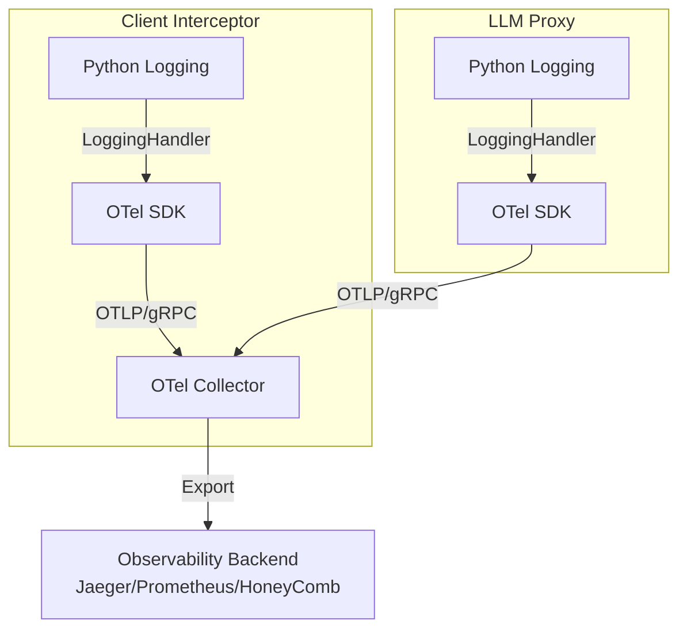

# OpenTelemetry Logging Instrumentation Plan

This document outlines the detailed plan to instrument logging with OpenTelemetry (OTel) for both the **Client Interceptor** and **LLM Proxy** components.

## 1. Objective

To unify logging across the LiteLLM Memory Proxy ecosystem by ingesting Python `logging` records into the OpenTelemetry pipeline. This ensures that application logs are correlated with distributed traces (`trace_id`, `span_id`), enabling comprehensive observability.

## 2. Architecture & Data Flow



## 3. Prerequisites

The following Python packages are required. `opentelemetry-instrumentation-logging` specifically provides the hook to capture standard Python logs.

*   `opentelemetry-api`
*   `opentelemetry-sdk`
*   `opentelemetry-exporter-otlp`
*   `opentelemetry-instrumentation-logging`

## 4. Implementation Plan

### Step 1: Dependency Management

Update `pyproject.toml` to include the logging instrumentation package.

```bash
poetry add opentelemetry-instrumentation-logging
```

### Step 2: Centralized Telemetry Module

Create a shared telemetry module to avoid code duplication.
**Target File:** `src/telemetry/setup.py` (New Module)

This module will:
1.  Configure the OTel `Resource` (Service Name, Version).
2.  Set up the `LoggerProvider`.
3.  Configure the `OTLPLogExporter` (sending logs to the collector).
4.  Attach the `LoggingHandler` to the root python logger.

**Draft Implementation:**

```python
import logging
from opentelemetry import trace
from opentelemetry.sdk.resources import Resource
from opentelemetry.sdk.trace import TracerProvider
from opentelemetry.sdk.trace.export import BatchSpanProcessor, ConsoleSpanExporter
from opentelemetry._logs import set_logger_provider
from opentelemetry.sdk._logs import LoggerProvider, LoggingHandler
from opentelemetry.sdk._logs.export import BatchLogRecordProcessor, ConsoleLogExporter
from opentelemetry.exporter.otlp.proto.grpc._log_exporter import OTLPLogExporter

def setup_telemetry(service_name: str, otlp_endpoint: str = None):
    # 1. Resource Configuration
    resource = Resource.create({"service.name": service_name})

    # 2. Trace Provider Setup (Existing)
    # ... (Trace setup logic if not already present)

    # 3. Logger Provider Setup
    logger_provider = LoggerProvider(resource=resource)
    set_logger_provider(logger_provider)

    # 4. Exporter Configuration
    if otlp_endpoint:
        exporter = OTLPLogExporter(endpoint=otlp_endpoint, insecure=True)
        processor = BatchLogRecordProcessor(exporter)
        logger_provider.add_log_record_processor(processor)
    else:
        # Fallback to console for dev
        logger_provider.add_log_record_processor(
            BatchLogRecordProcessor(ConsoleLogExporter())
        )

    # 5. Attach OTel Handler to Root Logger
    handler = LoggingHandler(level=logging.NOTSET, logger_provider=logger_provider)
    logging.getLogger().addHandler(handler)
```

### Step 3: Interceptor Instrumentation

**Target File:** `src/interceptor/intercepting_contexter.py` (and `cli.py`)

1.  **Import Setup:** Import `setup_telemetry` from the new shared module.
2.  **Initialization:** Call `setup_telemetry` at the very beginning of the `main` execution block or `__init__` of the Interceptor class.
3.  **Service Name:** Use `litellm-interceptor`.
4.  **Context Propagation:** Ensure that when the interceptor receives a request (if acting as a server) or makes a request, the trace context is active so logs generated during that operation inherit the `trace_id`.

```python
# src/interceptor/cli.py
from src.telemetry.setup import setup_telemetry

def main():
    setup_telemetry(service_name="litellm-interceptor")
    # ... start interceptor
```

### Step 4: LLM Proxy Instrumentation

**Target File:** `src/proxy/litellm_proxy_sdk.py`

1.  **Import Setup:** Import `setup_telemetry`.
2.  **Lifespan Integration:** The best place to initialize this is within the FastAPI `lifespan` handler (or `@app.on_event("startup")` if using older FastAPI versions).
3.  **Service Name:** Use `litellm-proxy`.
4.  **Trace Context:** Since this is a FastAPI app, ensure `opentelemetry-instrumentation-fastapi` is active (separate task, but required for trace context). The logging instrumentation will automatically pick up the current trace ID from the request context managed by the FastAPI instrumentation.

```python
# src/proxy/litellm_proxy_sdk.py

@asynccontextmanager
async def lifespan(app: FastAPI):
    # Startup
    setup_telemetry(service_name="litellm-proxy")
    yield
    # Shutdown logic
```

## 5. Configuration

Use environment variables to control behavior without code changes.

| Variable | Description | Default |
| :--- | :--- | :--- |
| `OTEL_SDK_DISABLED` | If `true`, disable all OTel setup. | `false` |
| `OTEL_EXPORTER_OTLP_ENDPOINT` | OTLP Collector endpoint (e.g., `http://localhost:4317`). | `None` (Console) |
| `OTEL_SERVICE_NAME` | Overrides the hardcoded service name. | - |
| `OTEL_LOG_LEVEL` | Minimum log level to capture. | `INFO` |

## 6. Verification

### Manual Verification
1.  Start a local OTel collector (or use a SaaS provider endpoint).
2.  Run the Unified Proxy:
    ```bash
    export OTEL_EXPORTER_OTLP_ENDPOINT="http://localhost:4317"
    poetry run python deploy/run_unified_proxy.py --mode sdk
    ```
3.  Trigger a completion request via `curl`.
4.  Check the OTel backend for:
    *   Traces showing the flow from `interceptor` (if involved) -> `proxy`.
    *   Logs associated with those spans (e.g., "Received request", "Forwarding to LiteLLM").
    *   Log records should contain `trace_id` and `span_id`.

### Automated Testing
*   Add a test case in `tests/` that mocks the `OTLPLogExporter` and verifies that `logger.info(...)` calls result in exported log records with valid trace IDs.

## 7. Next Steps

1.  Execute Step 1 (Dependencies).
2.  Create `src/telemetry/` directory.
3.  Implement the shared setup module.
4.  Integrate into Interceptor and Proxy.
