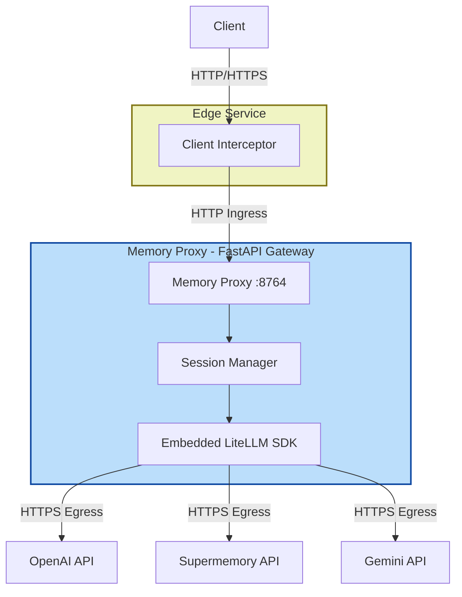
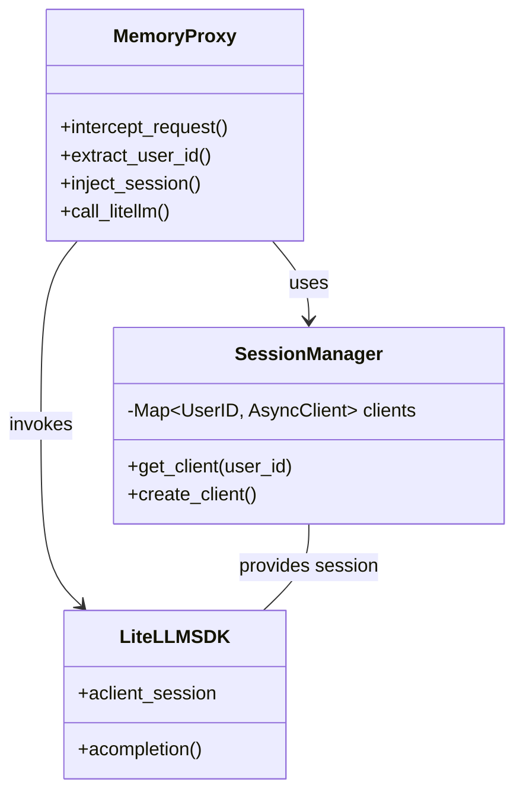
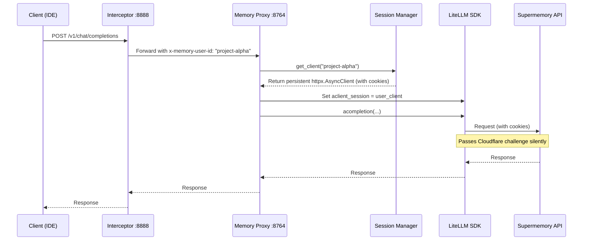

# LiteLLM Memory Proxy - Architecture Overview

Comprehensive architectural documentation for LiteLLM Memory Proxy including design evolution and implementation details.

---

## High-Level Architecture

The project uses a **Self-Contained SDK** approach where the LiteLLM Python library is embedded directly within the Memory Proxy process. This enables persistent HTTP sessions critical for Supermemory integration (Cloudflare cookie handling).



---

## Detailed Component Architecture

### Memory-Enabled Proxy Layer (SDK-Based)



---

## Microservices & API Gateway Strategy

### Decomposition Criteria
The system follows a domain-driven decomposition strategy, separating concerns based on volatility and scalability requirements.

1.  **Client Interceptor (Edge Service)**
    *   **Responsibility:** Environment integration (IDE ports, OS signals), identity tagging.
    *   **Boundary Criteria:** Code that *must* run on the client machine or within a specific process namespace.
    *   **Volatility:** High (IDE updates, OS changes).
2.  **Memory Gateway (Core Service)**
    *   **Responsibility:** Context aggregation, user identity resolution, routing policy enforcement.
    *   **Boundary Criteria:** Business logic that applies across *all* clients.
    *   **Volatility:** Medium (Feature additions like new memory retrieval strategies).
3.  **LLM Provider (Downstream Service)**
    *   **Responsibility:** Protocol translation, connection pooling, error handling for upstream APIs.
    *   **Boundary Criteria:** Generic infrastructure provided by LiteLLM SDK.
    *   **Volatility:** Low (Stable OpenAI-compatible interface).

### API Gateway Implementation
The **Memory Proxy** functions as a specialized **API Gateway** using the **Gateway Aggregation** pattern.

*   **Pattern:** Centralized Gateway for AI traffic.
*   **Technology:** FastAPI (Async Python) with embedded LiteLLM SDK.
*   **Communication Protocol:**
    *   **External:** REST (HTTP/1.1) over JSON.
    *   **Streaming:** Server-Sent Events (SSE) for chat completions.
    *   **Internal:** In-process function calls to LiteLLM SDK.

#### Data Consistency Mechanisms
*   **Memory Context:** Eventual consistency. Writes to the memory store (Post-Completion) are fire-and-forget non-blocking tasks.
*   **Configuration:** Strong consistency. Changes to `config.yaml` require a service restart/reload to ensure atomic updates across the cluster.
*   **Session Persistence:** Stateful consistency. Each `user_id` maps to a specific `httpx.Client` instance in memory to preserve Cloudflare cookies.

#### Security & Auth Flow
1.  **Authentication:** Pass-through Bearer Token validation. The Gateway validates the structure but delegates signature verification to the Downstream Service or configured Identity Provider.
2.  **Authorization:** Context-aware RBAC. The Gateway checks if the `user_id` (resolved from headers) has access to the requested `model`.
3.  **Network:** Internal traffic between Gateway and LiteLLM is in-process (zero network overhead).

#### Observability Strategy
*   **Distributed Tracing:** OpenTelemetry. A generic `trace-id` is generated at the Interceptor (or Gateway ingress) and propagated via HTTP headers to all downstream services.
*   **Logging:** Structured JSON logs. All services output to stdout/stderr, aggregated by a collector (e.g., Fluentd).
*   **KPIs:**
    *   **Gateway Overhead:** < 5ms (due to in-process SDK calls).
    *   **Availability:** 99.9%.
    *   **Throughput:** Linear scaling with CPU cores.

### API Boundaries & Contract Evolution
Strict adherence to the **OpenAI Chat Completions API** schema defines the inter-service contracts.

| Interface | Source | Target | Protocol | Contract Definition | Evolution Strategy |
|-----------|--------|--------|----------|---------------------|--------------------|
| **Ingress** | Interceptor/Client | Memory Proxy | HTTP/1.1 | OpenAI OpenAPI Spec + Custom Headers (`x-memory-user-id`) | **Additive Only**. New headers/params are optional. Versioning via URL (`/v1/`, `/v2/`). |
| **Core** | Memory Proxy | LiteLLM SDK | Python API | LiteLLM Library Interface | **Dependency Management**. Pinned version in `pyproject.toml`. |
| **Egress** | LiteLLM SDK | Upstream API | HTTPS | Provider Specific | **Adapter Pattern**. LiteLLM handles provider schema changes internally. |

---

## Architecture Evolution: Binary to SDK

### Historical Context (Why we switched)

The initial binary-based approach used an external `litellm` process. This failed for Supermemory integration because:
1.  **Statelessness:** The binary process created a new HTTP client for every request.
2.  **Cookie Loss:** Cloudflare `cf_clearance` cookies returned by Supermemory were lost between requests.
3.  **Result:** Infinite Cloudflare challenges and 403/503 errors.

### Current State (SDK-based)

The system now uses the `LiteLLMSessionManager` in `src/proxy/session_manager.py`:
*   **Singleton Pattern:** Ensures one `httpx.AsyncClient` per user ID.
*   **Cookie Persistence:** The `httpx.AsyncClient` automatically manages the cookie jar.
*   **Performance:** Removes the local HTTP hop to an external binary (~10ms savings).

---

## Project Structure

```
litellm/
├── config/                          # Configuration
├── src/
│   ├── interceptor/                 # Client-side Port Management
│   │   ├── cli.py                   # Interceptor CLI
│   │   ├── intercepting_contexter.py # Interceptor Proxy
│   │   └── port_registry.py         # Port persistence
│   └── proxy/                       # Server-side Memory Proxy
│       ├── litellm_proxy_sdk.py     # MAIN ENTRY POINT (FastAPI + SDK)
│       ├── session_manager.py       # Persistent HTTP Client Manager
│       └── memory_router.py         # User Routing Logic
└── docs/                            # Documentation
```

---

## Key Components

### 1. Session Manager (`session_manager.py`)

**Responsibilities:**
- Manages lifecycle of `httpx.AsyncClient` instances.
- Maps `user_id` to specific client instances.
- Ensures thread-safety when accessing clients.
- **CRITICAL:** Preserves cookies for Supermemory/Cloudflare compatibility.

### 2. Memory Proxy (`litellm_proxy_sdk.py`)

**Responsibilities:**
- FastAPI application host.
- Integrates `session_manager` with `litellm` SDK.
- Sets `litellm.aclient_session` dynamically per request.

### 3. Interceptor (`src/interceptor/`)

**Responsibilities:**
- Binds to a unique local port (e.g., 8888) for a specific project context.
- Tags outgoing requests with `x-memory-user-id`.
- Ensures IDEs (PyCharm, etc.) have a stable target URL.

---

## Data Flow

### Request Flow with SDK & Persistent Sessions


