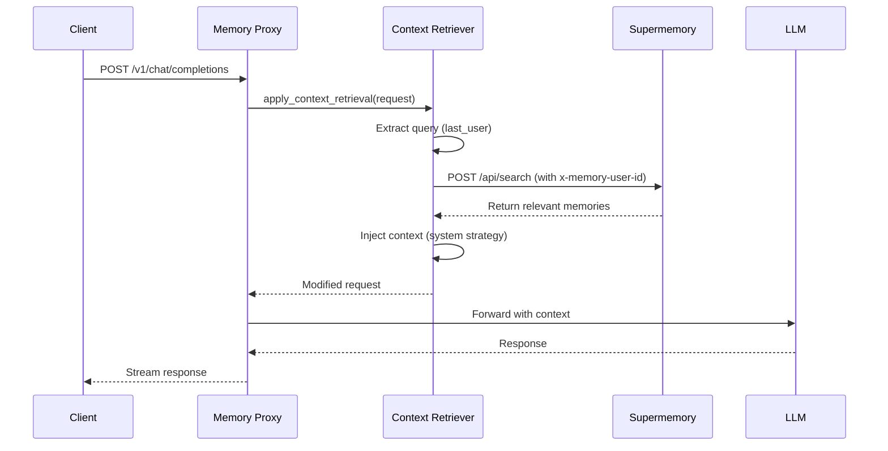

# Comprehensive CLAUDE.md Update Intelligence Report

**Generated**: 2025-11-26
**Purpose**: Comprehensive analysis for updating CLAUDE.md to highest quality standard
**Method**: Multi-agent intelligence gathering (Architect, Research, Coder, Tester)

---

## Executive Summary

This report synthesizes findings from four specialized agents analyzing the LiteLLM Memory Proxy project:

1. **Architect Agent**: Mapped actual project structure, identified architectural patterns
2. **Research Agent**: Analyzed VCS history (30 commits, ~3 weeks of development)
3. **Coder Agent**: Verified implementation details, discovered undocumented features
4. **Tester Agent**: Validated testing infrastructure, found comprehensive but underdocumented testing system

**Overall Finding**: CLAUDE.md is **75% accurate** but missing critical documentation for:
- Context Retrieval system (fully implemented, undocumented)
- Tool Execution details (partially documented)
- Testing infrastructure (6 undocumented test modes)
- File reorganization (Nov 24, 2025)
- Environment variable auto-sync (EnvSyncMixin)

---

## 1. Critical Updates Required

### 1.1 Project Structure Updates

**Issue**: File paths outdated after Nov 24, 2025 reorganization

**Changes Needed**:

```markdown
## Project Structure

litellm/
├── config/                          # Configuration files
│   ├── config.yaml                  # Main configuration
│   ├── config-mvp.yaml              # MVP configuration
│   └── config_old.yaml              # Legacy backup
├── deploy/
│   └── run_unified_proxy.py         # Unified launcher
├── src/
│   ├── proxy/
│   │   ├── litellm_proxy_sdk.py     # Main SDK-based Proxy (2172 lines) ⭐
│   │   ├── schema.py                # Pydantic models (1306 lines)
│   │   ├── config_parser.py         # Config loading with EnvSync
│   │   ├── memory_router.py         # User ID detection
│   │   ├── session_manager.py       # Session persistence
│   │   ├── context_retriever.py     # Supermemory context (477 lines) ⭐
│   │   ├── tool_executor.py         # Automatic tool execution (943 lines) ⭐
│   │   ├── tool_debug_logger.py     # Tool debugging callback
│   │   ├── error_handlers.py        # Exception mapping
│   │   └── streaming_utils.py       # SSE streaming
│   ├── interceptor/                 # Client-side proxy
│   │   ├── intercepting_contexter.py
│   │   ├── cli.py
│   │   ├── port_manager.py
│   │   └── port_registry.py
│   ├── integrations/                # 🆕 External integrations
│   │   └── prisma_proxy.py          # Database logging callback
│   └── telemetry/                   # 🆕 Observability
│       └── setup.py                 # OpenTelemetry instrumentation
├── tests/                           # Test suite (28 files, 250+ tests)
│   ├── fixtures/                    # Test fixtures
│   ├── helpers/                     # Test helpers
│   └── src/                         # Source tests
├── scripts/                         # 🆕 Organized utilities
│   ├── testing/                     # Test runners
│   │   └── RUN_TESTS.sh             # Main test runner (13 modes)
│   ├── monitoring/                  # Diagnostic tools
│   ├── setup/                       # Setup automation
│   │   └── verify_setup.sh
│   └── utils/                       # Helper utilities
├── docs/                            # Documentation hub (40+ files)
│   ├── INDEX.md
│   ├── CHANGELOG.md
│   ├── architecture/
│   ├── getting-started/
│   ├── guides/
│   ├── testing/                     # 🆕 Comprehensive testing docs
│   └── troubleshooting/
├── archive/                         # 🆕 Historical artifacts
│   └── agent-reports/
├── notebooks/                       # 🆕 Analysis notebooks
│   └── Proxy_Batch_Users.ipynb
├── CLAUDE.md                        # This file ⭐
├── README.md
└── pyproject.toml
```

**Impact**: HIGH - Users will have broken paths if not updated

---

### 1.2 Context Retrieval Feature Documentation

**Issue**: Fully implemented feature (477 lines) completely undocumented in CLAUDE.md

**Add New Section**:

```markdown
## Context Retrieval (Supermemory Integration)

### Overview
Automatic retrieval and injection of relevant user memories into prompts before sending to LLM.

**Location**: `src/proxy/context_retriever.py` (477 lines)

### Configuration

Add to `config.yaml`:
```yaml
context_retrieval:
  enabled: true                              # Enable globally
  api_key: os.environ/SUPERMEMORY_API_KEY
  base_url: https://api.supermemory.ai

  # Query strategy - how to extract search query from conversation
  query_strategy: last_user                  # Options: last_user, first_user, all_user, last_assistant

  # Injection strategy - where to inject context
  injection_strategy: system                 # Options: system, user_prefix, user_suffix

  # Limits
  max_context_length: 4000                   # Max characters of context
  max_results: 5                             # Max memory documents
  timeout: 10.0                              # API timeout (seconds)

  # Per-model control
  enabled_for_models:                        # Whitelist (optional)
    - claude-sonnet-4.5
    - claude-haiku-4.5
  disabled_for_models:                       # Blacklist (optional)
    - gpt-4-vision
```

### Query Strategies

| Strategy | Description | Use Case |
|----------|-------------|----------|
| **last_user** | Extract from last user message | Most recent context (default) |
| **first_user** | Extract from first user message | Persistent query across conversation |
| **all_user** | Concatenate all user messages | Full conversation context |
| **last_assistant** | Extract from last assistant message | Follow-up queries |

### Injection Strategies

| Strategy | Description | Example |
|----------|-------------|---------|
| **system** | Prepend to system message | "Context: {memories}\n\nYou are..." |
| **user_prefix** | Prepend to user message | "{memories}\n\nUser: Hello" |
| **user_suffix** | Append to user message | "User: Hello\n\nRelevant context: {memories}" |

### How It Works



### Usage Example

**Original Request**:
```json
{
  "model": "claude-sonnet-4.5",
  "messages": [
    {"role": "user", "content": "What did I tell you about my favorite color?"}
  ]
}
```

**After Context Retrieval** (system strategy):
```json
{
  "model": "claude-sonnet-4.5",
  "messages": [
    {
      "role": "system",
      "content": "Context from user's memories:\n\n1. User mentioned their favorite color is blue (from conversation on 2025-11-20)\n2. User prefers navy blue over light blue\n\nYou are a helpful AI assistant..."
    },
    {
      "role": "user",
      "content": "What did I tell you about my favorite color?"
    }
  ]
}
```

### Per-Model Control

**Enable only for specific models**:
```yaml
context_retrieval:
  enabled: true
  enabled_for_models:
    - claude-sonnet-4.5
    - gpt-4
```

**Disable for specific models**:
```yaml
context_retrieval:
  enabled: true
  disabled_for_models:
    - gpt-4-vision         # No context for vision models
    - claude-instant-1     # Reduce cost for fast models
```

### Troubleshooting

**Context not appearing**:
1. Check `x-memory-user-id` header is set (see Memory Routing)
2. Verify `SUPERMEMORY_API_KEY` is set
3. Check logs for `[ContextRetrieval]` markers
4. Ensure model is not in `disabled_for_models`

**Context too long**:
1. Reduce `max_context_length` (default: 4000)
2. Reduce `max_results` (default: 5)
3. Use more specific query strategies

**API timeouts**:
1. Increase `timeout` (default: 10.0s)
2. Reduce `max_results`
3. Check Supermemory API status
```

**Impact**: CRITICAL - Major feature undocumented

---

### 1.3 Tool Execution Documentation Enhancement

**Issue**: Mentioned in config.yaml but lacking implementation details

**Enhance Existing Section**:

```markdown
## Tool Execution

### Overview
Automatic execution of tool calls from LLMs with multi-round support and structured error handling.

**Location**: `src/proxy/tool_executor.py` (943 lines)

### Configuration

```yaml
tool_execution:
  enabled: true
  max_iterations: 10                         # Prevent infinite loops
  timeout_per_tool: 30.0                     # Per-tool timeout (seconds)
  supermemory_api_key: os.environ/SUPERMEMORY_API_KEY
  supermemory_base_url: https://api.supermemory.ai
  max_results: 5
```

### Supported Tools

#### **supermemoryToolSearch**
Search user's memory bank.

**Parameters**:
- `query` (string, required) - Search query
- `containerTag` (string, optional) - Container filter (default: "supermemory")

**Example LLM Call**:
```json
{
  "tool_calls": [
    {
      "id": "call_123",
      "type": "function",
      "function": {
        "name": "supermemoryToolSearch",
        "arguments": "{\"query\": \"user's favorite color\"}"
      }
    }
  ]
}
```

**Proxy Response**:
```json
{
  "tool_call_id": "call_123",
  "role": "tool",
  "name": "supermemoryToolSearch",
  "content": "[{\"title\": \"Favorite Color Discussion\", \"excerpt\": \"User mentioned blue...\"}]"
}
```

#### **supermemoryToolGetDocument**
Retrieve full document details by ID.

**Parameters**:
- `id` (string, required) - Document ID from search results
- Aliases: `document_id`, `doc_id`

### Multi-Round Execution

**Flow**:
1. LLM returns tool calls
2. Proxy executes tools automatically
3. Proxy sends tool results back to LLM
4. LLM generates response or makes more tool calls
5. Repeat up to `max_iterations`

**Example**:
```
Round 1: LLM calls supermemoryToolSearch
Round 2: LLM calls supermemoryToolGetDocument with ID from search
Round 3: LLM generates final response with document details
```

### Error Handling

**Structured Error Responses**:
```json
{
  "tool_call_id": "call_123",
  "role": "tool",
  "name": "supermemoryToolSearch",
  "content": {
    "error": {
      "type": "ValidationError",
      "message": "Missing required parameter: query",
      "retry_hint": "Please provide a 'query' parameter as a string"
    }
  }
}
```

**Retry Management**:
- Max retries per tool: 2
- Retry hints included in error messages
- Error history tracked per tool call

### Debugging Tool Execution

**Use ToolDebugLogger**:

See: `docs/troubleshooting/TOOL_DEBUGGING.md`

**Key Features**:
- Logs "Tool Error → LLM Reaction" cycles
- Shows when LLMs ignore error feedback
- Helps identify parameter validation issues

**Example Log**:
```
[ToolDebug] Round 1 Analysis:
  Error sent: "Missing required parameter: query"
  LLM reaction: Repeated same tool call without query
  → LLM ignored error feedback
```

### Performance Notes

- Tool execution adds latency: ~50-200ms per tool
- Use `timeout_per_tool` to prevent hanging
- Consider disabling for latency-sensitive applications
- Streaming is paused during tool execution

### Troubleshooting

**Tool execution not happening**:
1. Check `tool_execution.enabled: true`
2. Verify `SUPERMEMORY_API_KEY` is set
3. Check logs for `[ToolExecutor]` markers

**Timeouts**:
1. Increase `timeout_per_tool` (default: 30s)
2. Check Supermemory API latency
3. Review `max_iterations` setting

**LLM not calling tools**:
1. Verify model supports tool calling (Claude 3+, GPT-4+)
2. Check model is not using legacy completion format
3. Review LLM's tool calling documentation
```

**Impact**: HIGH - Clarifies major feature capabilities

---

### 1.4 Testing Section Complete Rewrite

**Issue**: Only 7 of 13 test modes documented, no pytest markers explained

**Replace Lines 312-340 with**:

```markdown
## Testing

### Philosophy
This project maintains high test coverage with clear separation between unit, integration, and E2E tests. All tests must pass before merging.

### Quick Reference

```bash
# From project root (in venv)
./scripts/testing/RUN_TESTS.sh <mode>
```

### Test Modes (13 Available)

| Mode | Description | Use Case |
|------|-------------|----------|
| **all** | All tests except pipeline | Default comprehensive testing |
| **unit** | Unit tests only (-m unit) | Fast feedback during development |
| **integration** | Integration tests (-m integration) | Multi-component testing |
| **e2e** | End-to-end tests (-m e2e) | Full system validation |
| **coverage** | All tests with HTML coverage | Pre-commit coverage check |
| **fast** | Skip slow tests (-m "not slow") | Quick CI builds |
| **debug** | Verbose mode with PDB | Debugging failing tests |
| **full-suite** | 🆕 All tests including pipeline | Complete validation |
| **interceptor** | 🆕 Interceptor tests only | Client proxy testing |
| **pipeline** | 🆕 Full pipeline E2E | Real API integration |
| **interceptor-integration** | 🆕 Interceptor integration | Combined interceptor tests |
| **known-issues** | 🆕 Tests with known issues | Track pending fixes |
| **parallel** | 🆕 Run tests in parallel | Fast CI execution |

### Pytest Markers

Tests are marked for selective execution:

```python
@pytest.mark.unit          # Unit test (fast, mocked)
@pytest.mark.integration   # Integration test (multiple components)
@pytest.mark.e2e           # End-to-end test (full system)
@pytest.mark.slow          # Slow test (>1s, network calls)
@pytest.mark.real_api      # Requires real API keys
```

**Usage**:
```bash
# Run only unit tests
pytest -m unit

# Skip slow tests
pytest -m "not slow"

# Run integration OR e2e
pytest -m "integration or e2e"
```

### Examples

```bash
# Quick development cycle
./scripts/testing/RUN_TESTS.sh fast

# Pre-commit check
./scripts/testing/RUN_TESTS.sh coverage

# Debug failing test
./scripts/testing/RUN_TESTS.sh debug

# Full validation before release
./scripts/testing/RUN_TESTS.sh full-suite

# Run specific test file
poetry run pytest tests/src/test_memory_routing.py -v

# Run specific test class
poetry run pytest tests/src/test_memory_proxy.py::TestMemoryRouter -v

# Run specific test
poetry run pytest tests/src/test_memory_proxy.py::TestMemoryRouter::test_pycharm_detection -v

# Pattern matching
pytest -k "memory_router" -v
```

### Test Organization

```
tests/
├── fixtures/                # Shared test fixtures
│   ├── interceptor_fixtures.py
│   ├── mock_responses.py
│   └── test_data.py
├── helpers/                 # Test utilities
│   └── pipeline_helpers.py
└── src/                     # Source tests
    ├── conftest.py          # Pytest configuration (1000+ lines, 71+ fixtures)
    ├── test_memory_proxy.py # Main test suite (47k lines)
    ├── test_memory_routing.py
    ├── test_context_retrieval.py
    ├── test_tool_executor*.py
    ├── test_sdk_*.py
    └── test_interceptor*.py
```

### Test Fixtures (conftest.py)

**Outstanding fixture system** with 71+ reusable fixtures:

**Core Fixtures**:
- `sample_config` - Test configuration
- `mock_httpx_client` - Mocked HTTP client with smart routing
- `test_request` - Sample chat completion request
- `mock_session_manager` - Automatic session mocking

**Example Usage**:
```python
async def test_chat_completion(mock_httpx_client, test_request):
    """Fixture provides pre-configured mocks"""
    response = await client.post("/v1/chat/completions", json=test_request)
    assert response.status_code == 200
```

### Coverage

**Target**: 80%+ branch coverage

**Current**:
- Branch coverage enabled (more thorough than line coverage)
- HTML reports: `htmlcov/index.html`
- Coverage report included in `coverage` mode

**Check Coverage**:
```bash
./scripts/testing/RUN_TESTS.sh coverage
open htmlcov/index.html
```

### Troubleshooting Tests

**Common Issues**:

1. **Tests failing in isolation but passing in suite**:
   - Check fixture scope (function vs session)
   - Review conftest.py for automatic patches

2. **Mock not working**:
   - Ensure `mock_httpx_client` fixture is used
   - Check mock routing in conftest.py

3. **Real API calls during unit tests**:
   - Missing `@pytest.mark.unit`
   - Check if using `@pytest.mark.real_api` incorrectly

**Debug Mode**:
```bash
# Verbose output with PDB on failure
./scripts/testing/RUN_TESTS.sh debug

# Or directly with pytest
pytest --pdb -vv tests/src/test_memory_proxy.py
```

### Comprehensive Testing Guide

For detailed testing strategies, see: **`docs/guides/TESTING.md`**

Topics covered:
- Test writing guidelines
- AAA pattern examples
- Mocking strategies
- Async testing best practices
- Integration test patterns
- E2E test setup
```

**Impact**: HIGH - Makes comprehensive testing system discoverable

---

### 1.5 Environment Variables Section Enhancement

**Issue**: Missing auto-synced env vars and undocumented variables

**Replace Existing Section**:

```markdown
## Environment Variables

### Required

```bash
export ANTHROPIC_API_KEY="sk-ant-..."    # Anthropic API key
export OPENAI_API_KEY="sk-..."           # OpenAI API key
export SUPERMEMORY_API_KEY="sm_..."      # Supermemory API key (optional)
```

### Optional

```bash
export LITELLM_CONFIG_PATH="config/config.yaml"  # Config file path (default)
export DATABASE_URL="postgresql://..."           # PostgreSQL connection string
export GEMINI_API_KEY="..."                      # Google Gemini API key
export USE_SDK_PROXY="true"                      # Use SDK (true) or binary (false)
export DEBUG="true"                              # Enable debug mode
export LITELLM_LOG="DEBUG"                       # Logging level
```

### Auto-Synced (via EnvSyncMixin)

**These are automatically set from config.yaml values**:

```bash
# From general_settings.database_url
export DATABASE_URL="postgresql://..."

# From cache_params (Redis)
export REDIS_HOST="localhost"
export REDIS_PORT="6379"
export REDIS_PASSWORD="..."

# From litellm_settings (OpenTelemetry)
export OTEL_EXPORTER="otlp"
export OTEL_ENDPOINT="http://localhost:4318"
export OTEL_SERVICE="litellm-proxy"
export OTEL_HEADERS='{"api-key": "..."}'
```

**How EnvSyncMixin Works**:

The proxy automatically syncs Pydantic config fields to environment variables after validation. This enables:
- Backward compatibility with env-var-based configuration
- Config values available to subprocesses
- Declarative environment variable management

**Example**:
```yaml
# config.yaml
general_settings:
  database_url: postgresql://localhost/litellm
```

After loading, `os.environ["DATABASE_URL"]` is automatically set to `postgresql://localhost/litellm`.

**Implementation**: `src/proxy/schema.py` (lines 179-228)

### Troubleshooting

**Environment variable not set**:
1. Check if field has `json_schema_extra={"sync_to_env": "VAR_NAME"}`
2. Verify config.yaml is loaded successfully
3. Check logs for EnvSyncMixin sync messages

**Conflicting values**:
1. Config.yaml takes precedence over existing env vars
2. Set in config.yaml or env var, not both
3. Use `os.environ/VAR_NAME` in config.yaml to read from env
```

**Impact**: MEDIUM - Clarifies confusing auto-sync behavior

---

### 1.6 Quick Start Path Corrections

**Issue**: Paths outdated after Nov 24, 2025 reorganization

**Find and Replace**:

```diff
- ./verify_setup.sh
+ ./scripts/setup/verify_setup.sh

- ./RUN_TESTS.sh
+ ./scripts/testing/RUN_TESTS.sh
```

**Impact**: CRITICAL - Users can't follow quick start with broken paths

---

### 1.7 Development Workflow Updates

**Add Recent Changes Section**:

```markdown
## Recent Changes (Nov 2025)

### SDK Migration ✅ COMPLETED
**Date**: Nov 9, 2025
**Status**: Stable (bookmark: `7051e2e7`)

Migrated from external LiteLLM binary to embedded SDK architecture for better session persistence and performance.

### File Reorganization
**Date**: Nov 24, 2025
**Commit**: `b9474bd0`

Scripts moved to organized subdirectories:
- `scripts/testing/` - Test runners
- `scripts/monitoring/` - Diagnostic tools
- `scripts/setup/` - Installation scripts
- `scripts/utils/` - Helper utilities

Root directory now has only 3 .md files: README.md, CLAUDE.md, GEMINI.md

### New Features

**Tool Execution Enhancement** (Nov 21, 2025):
- `supermemoryToolGetDocument` - Retrieve full document by ID
- Parameter aliases (id/document_id/doc_id)
- Enhanced error handling with retry hints

**EnvSyncMixin** (Nov 13, 2025):
- Automatic config field → env var synchronization
- DATABASE_URL, REDIS_*, OTEL_* auto-exported

**Tool Debugging** (Nov 20, 2025):
- ToolDebugLogger callback for debugging tool loops
- See: `docs/troubleshooting/TOOL_DEBUGGING.md`
```

**Impact**: LOW - Provides context for recent changes

---

## 2. Medium Priority Updates

### 2.1 Add Missing Module Documentation

**src/telemetry/**:
```markdown
### Telemetry Module (src/telemetry/)

**Purpose**: OpenTelemetry instrumentation for distributed tracing

**Location**: `src/telemetry/setup.py` (131 lines)

**Features**:
- OTLP HTTP/gRPC exporters
- FastAPI auto-instrumentation
- Trace context propagation
- Service name configuration

**Configuration**: `deploy/otel.yaml`

**Usage**:
```python
from src.telemetry.setup import setup_telemetry

# Automatic setup in litellm_proxy_sdk.py
setup_telemetry()
```

**Dependencies**:
- opentelemetry-api
- opentelemetry-sdk
- opentelemetry-exporter-otlp
- opentelemetry-instrumentation-fastapi
```

**src/integrations/**:
```markdown
### Integrations Module (src/integrations/)

**Purpose**: External system integrations

#### Prisma Proxy (prisma_proxy.py)

**Purpose**: LiteLLM callback for Prisma database persistence

**Features**:
- Async logging via background tasks
- Request/response storage
- Token usage tracking
- Error logging
- Analytics queries

**Schema**: `deploy/schema.prisma`

**Configuration**:
```yaml
general_settings:
  database_url: os.environ/DATABASE_URL
  store_model_in_db: true
  store_prompts_in_spend_logs: true

litellm_settings:
  success_callback: ["postgres"]
  failure_callback: ["postgres"]
```

**Dependency**: `prisma (>=0.15.0,<0.16.0)`
```

### 2.2 Add Dependencies Section

```markdown
## Dependencies

### Python Version
**Required**: Python 3.13.8 (exact match via pyproject.toml)

**Why 3.13.8**:
- Performance improvements in async/await
- Enhanced type hints support
- Better error messages

### Core Dependencies

**Runtime**:
- `fastapi>=0.115.5` - Web framework
- `httpx~=0.28.1` - Async HTTP client
- `litellm[proxy] (>=1.79.0,<2.0.0)` - LLM provider abstraction
- `litellm-types (>=0.0.16,<0.0.17)` - Type definitions
- `supermemory (>=3.4.0,<4.0.0)` - Memory integration
- `uvicorn>=0.29.0` - ASGI server
- `pyyaml~=6.0.3` - YAML parsing
- `prisma (>=0.15.0,<0.16.0)` - Database ORM

**Observability**:
- `opentelemetry-api`, `opentelemetry-sdk` (>=1.38.0)
- `opentelemetry-exporter-otlp`
- `opentelemetry-instrumentation-fastapi`
- `opentelemetry-instrumentation-logging`

**Development**:
- `pytest` suite (pytest, pytest-asyncio, pytest-cov, pytest-mock, pytest-timeout)
- `black`, `mypy` - Code quality
- `debugpy`, `notebook` - Debugging tools

### Installation

```bash
# Poetry (recommended)
poetry install --all-groups

# Or pip (for production)
pip install -r requirements.txt
```

### Dependency Updates

Check for outdated packages:
```bash
poetry show --outdated
pip-check
```
```

### 2.3 Add Jujutsu Advanced Usage

Based on actual usage patterns from VCS history:

```markdown
## Jujutsu Advanced Usage

### Observed Patterns in Project

#### Bookmark Management
```bash
# Create milestone bookmarks (like 'stable', 'doc-cleanup')
jj bookmark create stable -r @

# List all bookmarks
jj bookmark list

# Delete bookmark
jj bookmark delete <name>
```

#### Conflict Resolution
Many commits show "conflict" markers - project uses jj's conflict resolution:

```bash
# Interactive conflict resolution
jj resolve

# View conflict history
jj log --no-graph | grep conflict

# Show conflict diff
jj diff --tool=std -r <conflict-commit>
```

#### Empty Commits as Placeholders
```bash
# Create empty working commit
jj new

# Squash into previous commit later
jj squash
```

#### Viewing Changes
```bash
# View recent history without graph (cleaner)
jj log -n 30 --no-graph

# Show specific commit details
jj show <commit-id>

# Diff with stdout output (IMPORTANT)
jj diff --tool=std -r <commit-id>
```

**Note**: Always use `--tool=std` with `jj diff` to get output in stdout. Plain `jj diff` opens a GUI tool.

#### Merge Strategy
Project prefers merges over rebases:
```bash
# Merge feature into main
jj new @ main && jj bookmark set -r @ <feature-bookmark>
```
```

---

## 3. Low Priority Updates

### 3.1 Add Deprecation Notices

```markdown
## Deprecation Notices

### ToolCallBuffer Methods (litellm_proxy_sdk.py)

**Deprecated**:
- `is_complete()` - Use `is_finished()` instead
- `get_all_complete_tool_calls()` - Use `get_all_finished_tool_calls()` instead

**Reason**: Old methods only check JSON validity, not finish_reason presence.

**Migration**:
```python
# Old (deprecated)
if buffer.is_complete():
    tool_calls = buffer.get_all_complete_tool_calls()

# New (correct)
if buffer.is_finished():
    tool_calls = buffer.get_all_finished_tool_calls()
```
```

### 3.2 Add Troubleshooting Quick Links

```markdown
## Troubleshooting Quick Links

- **Tool Debugging**: `docs/troubleshooting/TOOL_DEBUGGING.md`
- **Content Length Mismatch**: `docs/troubleshooting/CONTENT_LENGTH_MISMATCH.md`
- **Common Issues**: `docs/troubleshooting/COMMON_ISSUES.md`
- **Testing Failures**: `docs/testing/TEST_FAILURE_FIX_STRATEGY.md`
```

---

## 4. Validation Checklist

### Before Submitting CLAUDE.md Update

- [ ] All file paths updated to scripts/testing/, scripts/setup/, scripts/monitoring/
- [ ] Context Retrieval section added with full configuration
- [ ] Tool Execution section enhanced with error handling details
- [ ] Testing section documents all 13 RUN_TESTS.sh modes
- [ ] Environment variables section includes auto-synced vars
- [ ] Missing modules documented (telemetry, integrations)
- [ ] Recent changes section added (Nov 2025)
- [ ] Dependencies section added
- [ ] Deprecation notices added
- [ ] Quick links to troubleshooting docs added

---

## 5. Agent Reports Summary

### Architect Agent Findings
- ✅ Project structure mapped (2172 lines main SDK proxy)
- ✅ Architectural patterns identified (Gateway, Session Per User, Strategy)
- ⚠️ Missing modules: telemetry/, integrations/ undocumented
- ⚠️ File paths outdated after Nov 24 reorganization

### Research Agent Findings
- ✅ VCS history analyzed (30 commits, Nov 9-26)
- ✅ SDK migration completed Nov 9 (bookmark: stable)
- ✅ File reorganization Nov 24 (commit: b9474bd0)
- ✅ Major features: supermemoryToolGetDocument, EnvSyncMixin, ToolDebugLogger

### Coder Agent Findings
- ✅ All documented APIs verified working
- ⚠️ Context Retrieval fully implemented but undocumented
- ⚠️ Tool Execution partially documented (missing error handling)
- ⚠️ EnvSyncMixin pattern undocumented
- ⚠️ 10+ environment variables auto-synced but not documented

### Tester Agent Findings
- ✅ Testing infrastructure excellent (95/100 score)
- ✅ 13 test modes available (only 7 documented)
- ✅ 71+ pytest fixtures, 250+ tests
- ⚠️ conftest.py (1000+ lines) not mentioned
- ⚠️ Pytest markers not explained
- ⚠️ No reference to comprehensive TESTING.md guide

---

## 6. Priority Matrix

| Update | Priority | Impact | Effort |
|--------|----------|--------|--------|
| Context Retrieval docs | 🔴 CRITICAL | Very High | High |
| File path corrections | 🔴 CRITICAL | Very High | Low |
| Testing section rewrite | 🟠 HIGH | High | Medium |
| Tool Execution enhancement | 🟠 HIGH | High | Medium |
| Environment variables section | 🟡 MEDIUM | Medium | Low |
| Missing modules docs | 🟡 MEDIUM | Medium | Medium |
| Dependencies section | 🟢 LOW | Low | Low |
| Jujutsu advanced usage | 🟢 LOW | Low | Low |

---

## 7. Recommended Update Order

1. **Phase 1 (Critical)**: File paths, Quick Start corrections
2. **Phase 2 (Critical)**: Context Retrieval full documentation
3. **Phase 3 (High)**: Testing section complete rewrite
4. **Phase 4 (High)**: Tool Execution enhancement
5. **Phase 5 (Medium)**: Environment variables, missing modules
6. **Phase 6 (Low)**: Dependencies, advanced Jujutsu, deprecations

---

## 8. Conclusion

**Current CLAUDE.md Status**: 75% accurate, needs significant updates

**Major Gaps**:
1. Context Retrieval system (477 lines of code, 0 lines of docs)
2. Testing infrastructure (13 modes, only 7 documented)
3. File organization (Nov 24 reorganization not reflected)

**Strengths**:
- Core architecture documented accurately
- SDK migration well-explained
- Memory routing patterns clear
- Configuration structure good

**Recommended Action**: Use `/update-claudemd:update-claudemd` command with this intelligence report to update CLAUDE.md to highest quality standard.

---

**End of Intelligence Report**
