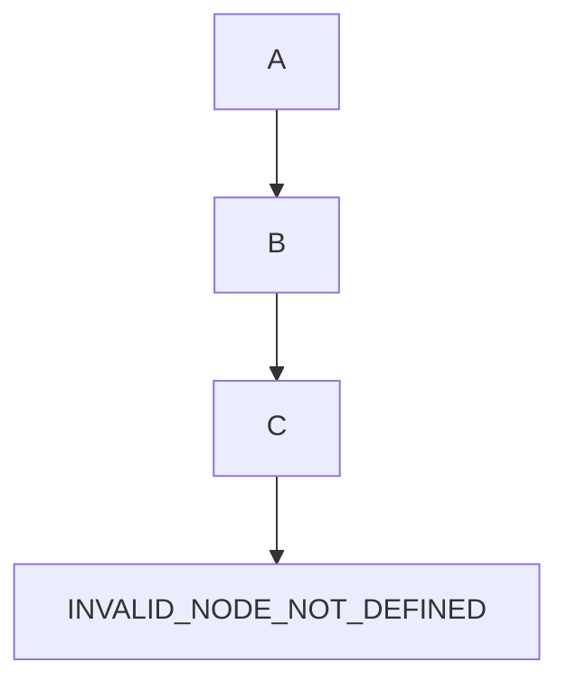
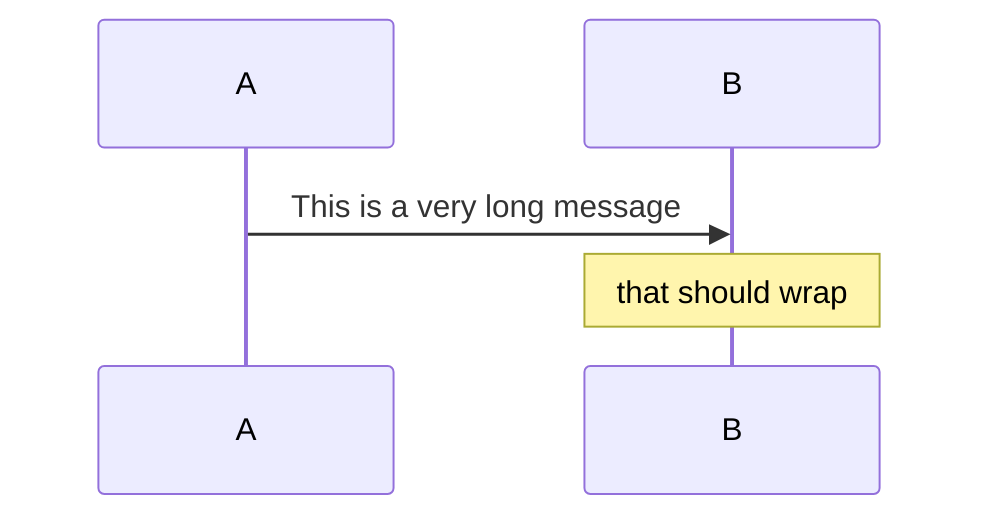
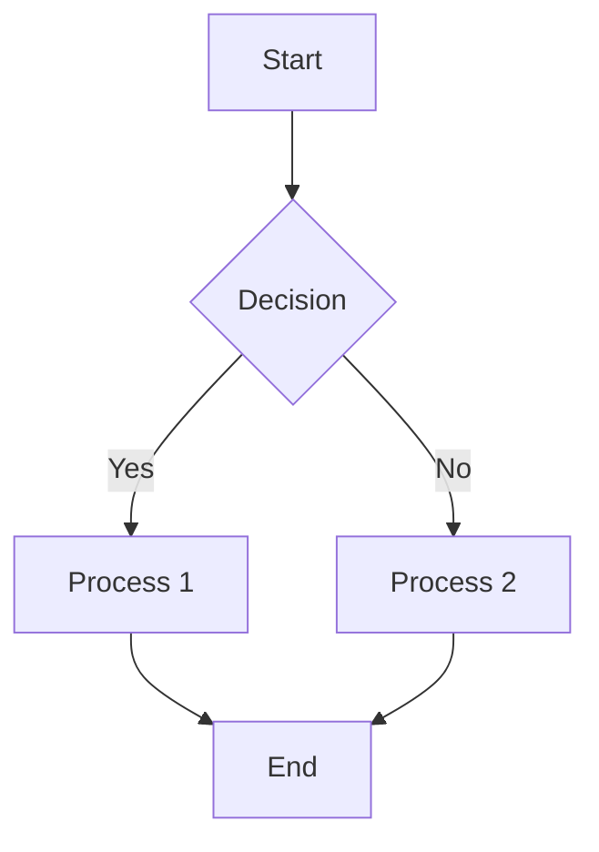
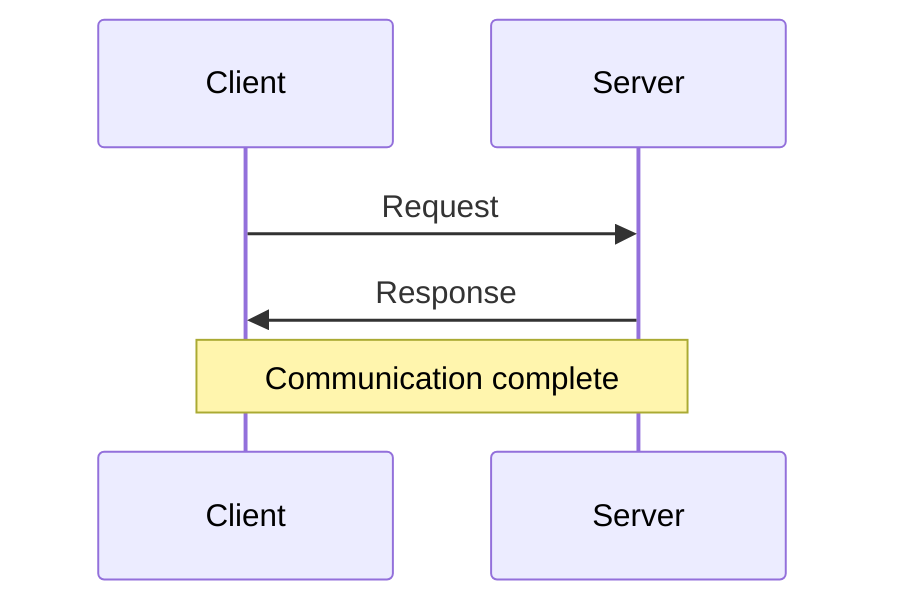

# Obsidian PDF Export with Mermaid Support - Comprehensive Testing Plan

**Version:** 1.0
**Date:** 2025-11-16
**Status:** Ready for Implementation

## Executive Summary

This document provides a complete testing strategy for validating the Obsidian PDF export system with Mermaid diagram support. The system consists of 5 logging layers, monitoring scripts, and configuration files that enable debug visibility from wrapper through to system level.

**Testing Scope:**
- 10 implementation files (4 configs, 5 scripts, 1 test document)
- 8 Mermaid diagram types
- 5 debug logging layers
- End-to-end export workflow
- Error handling and recovery

**Success Criteria:**
- All Mermaid diagrams export correctly to PDF
- Debug logging captures issues at every layer
- Monitoring system detects and alerts on failures
- Performance meets acceptable benchmarks
- Error messages are actionable

---

## 1. Test Phases

### Phase 1: Unit Testing (Individual Components)
**Objective:** Verify each component works in isolation

**Components to Test:**
1. Configuration files validation
2. Individual scripts (wrapper, monitor, alerts, validator, installer)
3. Pandoc filter installation
4. Mermaid CLI installation
5. Log file creation and writing

**Duration:** 2-3 hours
**Prerequisites:** Fresh Obsidian vault, all dependencies installed

### Phase 2: Integration Testing (Component Interactions)
**Objective:** Verify components work together correctly

**Integration Points:**
1. Wrapper → Pandoc → Mermaid filter
2. Monitor → Log files → Alert system
3. Configuration files → Export process
4. Plugin → Pandoc → PDF output

**Duration:** 3-4 hours
**Prerequisites:** Phase 1 passed

### Phase 3: End-to-End Testing (Full Workflow)
**Objective:** Validate complete user workflow

**Workflows:**
1. Fresh installation → First export
2. Repeated exports with different diagram types
3. Export with errors → Debug → Fix → Re-export
4. Multi-document exports

**Duration:** 4-5 hours
**Prerequisites:** Phase 2 passed

### Phase 4: Performance Testing
**Objective:** Measure speed, resource usage, scalability

**Metrics:**
1. Export time per diagram type
2. Memory usage during export
3. CPU usage during rendering
4. Log file size growth
5. Concurrent export handling

**Duration:** 2-3 hours
**Prerequisites:** Phase 3 passed

### Phase 5: Error Scenario Testing
**Objective:** Validate error handling and recovery

**Scenarios:**
1. Missing dependencies
2. Invalid Mermaid syntax
3. Network failures (if remote resources)
4. Disk space issues
5. Permission errors
6. Corrupted configuration files

**Duration:** 3-4 hours
**Prerequisites:** All previous phases passed

---

## 2. Test Cases

### 2.1 Mermaid Diagram Type Tests

#### TC-MD-001: Flowchart Export
**Objective:** Verify flowchart diagrams export correctly
**Priority:** Critical
**Diagram Type:** Flowchart

**Test Steps:**
1. Open test document with flowchart
2. Execute export via Obsidian Pandoc Plugin
3. Monitor all 5 logging layers
4. Open generated PDF
5. Inspect diagram quality

**Success Criteria:**
- PDF generated without errors
- Flowchart visible and readable
- All nodes and edges rendered
- Text labels clear and positioned correctly
- No pixelation or artifacts

**Logs to Check:**
- Wrapper log: Shows pandoc invocation
- Plugin log: Export initiated
- Pandoc log: Filter execution
- Mermaid log: SVG generation
- System log: No errors

**Expected Output:**
```
[WRAPPER] Starting Pandoc export...
[PLUGIN] Invoking pandoc-wrapper.sh
[PANDOC] Applying mermaid-filter
[MERMAID] Rendering flowchart: 1 diagram
[SYSTEM] PDF created: test-export.pdf
```

---

#### TC-MD-002: Sequence Diagram Export
**Objective:** Verify sequence diagrams export correctly
**Priority:** Critical
**Diagram Type:** Sequence

**Test Steps:**
1. Open test document with sequence diagram
2. Execute export
3. Monitor logs
4. Verify PDF output

**Success Criteria:**
- Actors/participants visible
- Messages/arrows properly aligned
- Activation boxes rendered
- Lifelines clear
- Text readable

**Common Issues:**
- Overlapping text
- Misaligned arrows
- Missing activation boxes

**Logs to Check:** All 5 layers

---

#### TC-MD-003: Class Diagram Export
**Objective:** Verify class diagrams export correctly
**Priority:** High
**Diagram Type:** Class

**Test Steps:**
1. Open test document with class diagram
2. Execute export
3. Verify relationships (inheritance, composition)
4. Check method/attribute visibility

**Success Criteria:**
- Classes render as boxes
- Relationships show correct symbols
- Method signatures readable
- Inheritance arrows clear

---

#### TC-MD-004: State Diagram Export
**Objective:** Verify state diagrams export correctly
**Priority:** High
**Diagram Type:** State

**Test Steps:**
1. Open test document with state diagram
2. Execute export
3. Verify states and transitions
4. Check start/end states

**Success Criteria:**
- States render as rounded boxes
- Transitions labeled
- Start state (black circle) visible
- End state (double circle) visible

---

#### TC-MD-005: Entity Relationship Diagram Export
**Objective:** Verify ER diagrams export correctly
**Priority:** Medium
**Diagram Type:** ER (Entity-Relationship)

**Test Steps:**
1. Open test document with ER diagram
2. Execute export
3. Verify entities and relationships
4. Check cardinality labels

**Success Criteria:**
- Entities render as boxes
- Relationships show correctly
- Cardinality visible (1:1, 1:N, M:N)
- Primary keys identified

---

#### TC-MD-006: Gantt Chart Export
**Objective:** Verify Gantt charts export correctly
**Priority:** Medium
**Diagram Type:** Gantt

**Test Steps:**
1. Open test document with Gantt chart
2. Execute export
3. Verify timeline and tasks
4. Check dependencies

**Success Criteria:**
- Timeline axis visible
- Tasks show as bars
- Dependencies indicated
- Dates readable

---

#### TC-MD-007: Pie Chart Export
**Objective:** Verify pie charts export correctly
**Priority:** Low
**Diagram Type:** Pie

**Test Steps:**
1. Open test document with pie chart
2. Execute export
3. Verify segments and labels
4. Check percentages

**Success Criteria:**
- Pie segments visible
- Labels positioned correctly
- Percentages shown
- Colors distinguishable in grayscale

---

#### TC-MD-008: Git Graph Export
**Objective:** Verify git graphs export correctly
**Priority:** Low
**Diagram Type:** Git

**Test Steps:**
1. Open test document with git graph
2. Execute export
3. Verify commits and branches
4. Check merge points

**Success Criteria:**
- Commits show as nodes
- Branches distinguished
- Merge points clear
- Commit messages readable

---

### 2.2 Logging Layer Tests

#### TC-LOG-001: Wrapper Layer Logging
**Objective:** Verify wrapper script logs correctly
**Priority:** Critical

**Test Steps:**
1. Execute pandoc-wrapper.sh directly
2. Check wrapper log file
3. Verify timestamp format
4. Confirm command logging

**Success Criteria:**
- Log file created: `~/.obsidian-pandoc/logs/wrapper.log`
- Timestamps in ISO format
- Full pandoc command logged
- Exit code captured

**Test Command:**
```bash
./pandoc-wrapper.sh input.md -o output.pdf
tail -20 ~/.obsidian-pandoc/logs/wrapper.log
```

**Expected Log Entries:**
```
2025-11-16T10:30:00 [WRAPPER] Starting Pandoc export
2025-11-16T10:30:00 [WRAPPER] Input: input.md
2025-11-16T10:30:00 [WRAPPER] Output: output.pdf
2025-11-16T10:30:00 [WRAPPER] Command: pandoc input.md -o output.pdf --filter mermaid-filter
2025-11-16T10:30:05 [WRAPPER] Exit code: 0
```

---

#### TC-LOG-002: Plugin Layer Logging
**Objective:** Verify Obsidian plugin logs correctly
**Priority:** Critical

**Test Steps:**
1. Open Obsidian DevTools (Cmd+Option+I)
2. Execute export from plugin
3. Monitor console output
4. Check plugin log file

**Success Criteria:**
- Console shows export start/end
- Plugin log file updated
- User-triggered exports logged
- Errors captured with stack traces

**Expected Console Output:**
```
[Pandoc Plugin] Export initiated
[Pandoc Plugin] Calling wrapper: pandoc-wrapper.sh
[Pandoc Plugin] Export completed: output.pdf
```

---

#### TC-LOG-003: Pandoc Layer Logging
**Objective:** Verify Pandoc logs correctly
**Priority:** Critical

**Test Steps:**
1. Run export with verbose Pandoc flags
2. Check Pandoc log file
3. Verify filter execution logging
4. Confirm document structure processing

**Success Criteria:**
- Pandoc log shows filter chain
- Document parsing logged
- Output format logged
- Errors include line numbers

**Expected Log Entries:**
```
[PANDOC] Parsing markdown: input.md
[PANDOC] Applying filter: mermaid-filter
[PANDOC] Output format: pdf
[PANDOC] Writing: output.pdf
```

---

#### TC-LOG-004: Mermaid Filter Layer Logging
**Objective:** Verify mermaid-filter logs correctly
**Priority:** Critical

**Test Steps:**
1. Run export with Mermaid diagrams
2. Check mermaid-filter log
3. Verify diagram detection
4. Confirm SVG generation

**Success Criteria:**
- Filter detects all mermaid blocks
- SVG files created in temp directory
- Conversion success/failure logged
- Embedded SVG in output

**Expected Log Entries:**
```
[MERMAID-FILTER] Found 3 mermaid diagrams
[MERMAID-FILTER] Rendering diagram 1: flowchart
[MERMAID-FILTER] SVG created: /tmp/mermaid-abc123.svg
[MERMAID-FILTER] Embedding in PDF
```

---

#### TC-LOG-005: System Layer Logging
**Objective:** Verify system-level logging
**Priority:** High

**Test Steps:**
1. Check system logs during export
2. Verify process spawning logged
3. Confirm resource usage tracking
4. Check error propagation

**Success Criteria:**
- System log shows process tree
- Memory/CPU usage logged
- File I/O operations tracked
- Errors include system context

**Expected System Log Entries:**
```
[SYSTEM] Process started: node mermaid-filter.js
[SYSTEM] Memory usage: 45MB
[SYSTEM] CPU usage: 12%
[SYSTEM] File created: output.pdf
```

---

### 2.3 Script Functionality Tests

#### TC-SCR-001: Wrapper Script Basic Functionality
**Objective:** Verify pandoc-wrapper.sh works correctly
**Priority:** Critical

**Test Steps:**
1. Create simple markdown file
2. Run: `./pandoc-wrapper.sh input.md -o output.pdf`
3. Check output PDF exists
4. Verify logs created

**Success Criteria:**
- PDF generated
- No errors
- Logs written
- Exit code 0

**Test Input (input.md):**
```markdown
# Test Document

This is a simple test.
```

---

#### TC-SCR-002: Monitor Script Functionality
**Objective:** Verify obsidian-monitor.sh detects changes
**Priority:** High

**Test Steps:**
1. Start monitor script: `./obsidian-monitor.sh`
2. Modify a file in vault
3. Check console output
4. Verify event logged

**Success Criteria:**
- Script detects file changes
- Events logged with timestamps
- No false positives
- CPU usage < 5%

**Expected Output:**
```
[MONITOR] Watching: /path/to/vault
[MONITOR] Change detected: note.md
[MONITOR] Event: file_modified
```

---

#### TC-SCR-003: Alert Script Functionality
**Objective:** Verify obsidian-alerts.sh triggers correctly
**Priority:** High

**Test Steps:**
1. Simulate export error
2. Check if alert triggered
3. Verify notification content
4. Confirm log entry

**Success Criteria:**
- Alert triggers on error keywords
- Notification shows error message
- Alert logged
- No duplicate alerts

**Test Error Injection:**
```bash
echo "ERROR: Mermaid rendering failed" >> ~/.obsidian-pandoc/logs/wrapper.log
```

**Expected Alert:**
```
⚠️ Obsidian Export Error
Mermaid rendering failed in wrapper.log
Time: 10:30:00
```

---

#### TC-SCR-004: Validator Script Functionality
**Objective:** Verify validate-setup.sh checks all dependencies
**Priority:** Critical

**Test Steps:**
1. Run: `./validate-setup.sh`
2. Review validation report
3. Check for false positives/negatives
4. Verify actionable messages

**Success Criteria:**
- Checks all 10+ dependencies
- Reports missing items clearly
- Provides installation commands
- Exit code reflects status

**Expected Output:**
```
Obsidian PDF Export Setup Validator
====================================

✅ Pandoc installed: 3.1.9
✅ Node.js installed: 18.17.0
✅ mermaid-filter installed: 1.4.7
✅ Obsidian Pandoc Plugin installed
✅ Wrapper script exists
✅ Log directory exists
⚠️  mermaid-cli not found (optional)

Summary: 6/7 checks passed
Status: Ready for basic exports
```

---

#### TC-SCR-005: Installer Script Functionality
**Objective:** Verify install-dependencies.sh sets up system
**Priority:** Critical

**Test Steps:**
1. Create clean test environment
2. Run: `./install-dependencies.sh`
3. Verify all dependencies installed
4. Re-run validator to confirm

**Success Criteria:**
- All dependencies installed
- No errors during installation
- Idempotent (safe to re-run)
- Respects existing installations

**Expected Output:**
```
Installing Obsidian PDF Export Dependencies
===========================================

[1/5] Installing Pandoc...
  ✅ Pandoc 3.1.9 installed

[2/5] Installing Node.js packages...
  ✅ mermaid-filter installed globally

[3/5] Creating log directories...
  ✅ ~/.obsidian-pandoc/logs created

[4/5] Installing wrapper scripts...
  ✅ Scripts copied to ~/.local/bin

[5/5] Validating setup...
  ✅ All checks passed

Installation complete! Run validate-setup.sh to verify.
```

---

### 2.4 Configuration Validation Tests

#### TC-CFG-001: Pandoc YAML Configuration
**Objective:** Verify pandoc.yaml is valid and used correctly
**Priority:** Critical

**Test Steps:**
1. Check YAML syntax: `pandoc -d pandoc.yaml --print-defaults`
2. Verify filter path correct
3. Test with actual export
4. Validate all options applied

**Success Criteria:**
- YAML parses without errors
- Filter path resolves
- Output format settings applied
- Custom variables work

**Test Configuration (pandoc.yaml):**
```yaml
from: markdown
to: pdf
pdf-engine: pdflatex
filters:
  - mermaid-filter
variables:
  geometry: margin=1in
```

**Validation Command:**
```bash
pandoc -d pandoc.yaml --print-defaults
```

---

#### TC-CFG-002: Mermaid Filter Configuration
**Objective:** Verify mermaid-filter.json is valid
**Priority:** High

**Test Steps:**
1. Check JSON syntax: `jq . mermaid-filter.json`
2. Verify output format (svg/png)
3. Test background color settings
4. Validate custom theme

**Success Criteria:**
- JSON valid
- Format setting respected
- Theme applied correctly
- Background transparent/opaque as configured

**Test Configuration (mermaid-filter.json):**
```json
{
  "outputFormat": "svg",
  "backgroundColor": "transparent",
  "theme": "default",
  "width": 800,
  "height": 600
}
```

---

#### TC-CFG-003: Obsidian Plugin Configuration
**Objective:** Verify plugin settings correct
**Priority:** High

**Test Steps:**
1. Open Obsidian settings
2. Navigate to Pandoc Plugin
3. Verify wrapper path
4. Test custom arguments

**Success Criteria:**
- Plugin finds wrapper script
- Custom arguments passed through
- Output directory respected
- Template variables work

---

#### TC-CFG-004: Monitor Configuration
**Objective:** Verify monitor script configured correctly
**Priority:** Medium

**Test Steps:**
1. Check watched directories
2. Verify ignore patterns
3. Test event filtering
4. Validate alert thresholds

**Success Criteria:**
- Correct directories watched
- .git, .obsidian ignored
- Only relevant events trigger actions
- Alert rate-limiting works

---

### 2.5 Error Condition Tests

#### TC-ERR-001: Missing Dependency Handling
**Objective:** Verify graceful handling when dependencies missing
**Priority:** Critical

**Test Scenarios:**
1. Pandoc not installed
2. mermaid-filter not found
3. Node.js not available
4. Wrapper script missing

**For Each Scenario:**
- Execute export
- Check error message quality
- Verify logs capture issue
- Confirm recovery instructions

**Success Criteria:**
- Clear error messages
- No cryptic stack traces
- Actionable recovery steps
- Logs include diagnostic info

**Expected Error (Pandoc missing):**
```
ERROR: Pandoc not found
Please install Pandoc:
  brew install pandoc
Or download from: https://pandoc.org/installing.html
```

---

#### TC-ERR-002: Invalid Mermaid Syntax Handling
**Objective:** Verify handling of malformed Mermaid diagrams
**Priority:** High

**Test Cases:**
1. Syntax error in flowchart
2. Invalid node reference
3. Unclosed string
4. Unknown diagram type

**Test Input (invalid-syntax.md):**
```markdown
# Test


\```

**Success Criteria:**
- Error pinpoints diagram
- Shows line number
- Suggests fix
- Export fails gracefully

**Expected Error:**
```
ERROR: Mermaid syntax error
Location: invalid-syntax.md, line 5
Issue: Undefined node "INVALID_NODE_NOT_DEFINED"
Tip: Ensure all nodes are defined before referencing
```

---

#### TC-ERR-003: Permission Error Handling
**Objective:** Verify handling of permission issues
**Priority:** Medium

**Test Scenarios:**
1. Read-only output directory
2. Log directory not writable
3. Temp directory full
4. File locked by another process

**Setup (read-only output):**
```bash
mkdir output
chmod 444 output
./pandoc-wrapper.sh input.md -o output/test.pdf
```

**Success Criteria:**
- Detects permission issue
- Suggests chmod/chown
- Doesn't corrupt files
- Logs full error context

---

#### TC-ERR-004: Network Failure Handling
**Objective:** Verify handling when remote resources unavailable
**Priority:** Low (if no remote dependencies)

**Test Scenarios:**
1. CDN unavailable (if Mermaid uses CDN)
2. Package registry down (during install)
3. Slow network (timeout handling)

**Success Criteria:**
- Timeout after reasonable period
- Falls back to local resources
- Clear error message
- Retry mechanism works

---

#### TC-ERR-005: Disk Space Exhaustion
**Objective:** Verify handling when disk full
**Priority:** Medium

**Test Setup:**
```bash
# Create small disk image for testing
hdiutil create -size 10m -fs HFS+ -volname TestDisk test.dmg
hdiutil attach test.dmg
# Attempt export to mounted volume
```

**Success Criteria:**
- Detects disk full error
- Doesn't create corrupted files
- Cleans up temp files
- Logs error clearly

---

## 3. Validation Criteria

### 3.1 Success Criteria Matrix

| Test Phase | Pass Rate Required | Critical Tests | Blocking Issues |
|------------|-------------------|----------------|-----------------|
| Unit | 100% | All script functionality | Any script fails |
| Integration | 95% | Logging chain, Export workflow | Multi-layer failure |
| E2E | 90% | All diagram types | >2 diagram types fail |
| Performance | 80% | Export time < 30s | Export time > 2min |
| Error Handling | 100% | Clear error messages | Cryptic errors |

### 3.2 Diagram Quality Metrics

**Visual Quality:**
- Resolution: Minimum 300 DPI
- Text readability: All labels legible at 100% zoom
- Line clarity: No jagged edges or artifacts
- Color/grayscale: Distinguishable elements

**Functional Correctness:**
- All nodes/elements present
- Relationships correct
- Labels positioned properly
- Layout not overlapping

**PDF Integration:**
- Diagrams embedded (not linked)
- Searchable text where applicable
- Consistent sizing across diagram types
- No page breaks mid-diagram

### 3.3 Performance Benchmarks

**Export Time Targets:**
| Diagram Type | Simple (<5 nodes) | Medium (5-20 nodes) | Complex (>20 nodes) |
|--------------|-------------------|---------------------|---------------------|
| Flowchart | <2s | <5s | <15s |
| Sequence | <3s | <7s | <20s |
| Class | <2s | <6s | <18s |
| State | <2s | <5s | <15s |
| ER | <2s | <6s | <18s |
| Gantt | <3s | <8s | <25s |
| Pie | <1s | <3s | <8s |
| Git | <2s | <7s | <20s |

**Resource Usage Targets:**
- Memory: < 500MB peak during export
- CPU: < 80% single core during rendering
- Disk I/O: < 100MB/s
- Temp files: Cleaned up within 5s of completion

**Log File Growth:**
- Wrapper log: < 1MB per 100 exports
- Plugin log: < 2MB per 100 exports
- Mermaid log: < 5MB per 100 exports
- Log rotation: After 10MB or 7 days

### 3.4 Error Message Quality Criteria

**All error messages must include:**
1. ✅ Clear description of what went wrong
2. ✅ Which component/layer failed
3. ✅ Why it failed (root cause)
4. ✅ How to fix it (actionable steps)
5. ✅ Where to find more info (log file path)

**Example Good Error Message:**
```
ERROR: Mermaid diagram rendering failed
Component: mermaid-filter (Layer 4)
Cause: Invalid syntax in flowchart definition
File: document.md, line 23
Fix: Check diagram syntax using Mermaid Live Editor (https://mermaid.live)
Logs: ~/.obsidian-pandoc/logs/mermaid.log

Syntax error details:
  Expected: node definition
  Found: '--> UNDEFINED'
  Tip: Define all nodes before creating edges
```

**Example Bad Error Message:**
```
Error: undefined is not an object
```

---

## 4. Testing Procedures

### 4.1 Pre-Test Setup

**Environment Preparation:**
```bash
# 1. Create clean test vault
mkdir ~/test-obsidian-vault
cd ~/test-obsidian-vault

# 2. Initialize as Obsidian vault
mkdir .obsidian

# 3. Install all dependencies
./install-dependencies.sh

# 4. Validate setup
./validate-setup.sh

# 5. Create test documents directory
mkdir test-documents

# 6. Create log monitoring terminal
tmux new-session -s obsidian-test
```

**Test Data Preparation:**
```bash
# Copy test document with all diagram types
cp mermaid-test-document.md test-documents/

# Create variants for error testing
cp mermaid-test-document.md test-documents/invalid-syntax.md
# (manually introduce syntax errors)

# Create performance test documents
for i in {1..10}; do
  cp mermaid-test-document.md test-documents/perf-test-$i.md
done
```

### 4.2 Test Execution Procedures

#### Procedure 1: Single Diagram Type Test

**Purpose:** Validate one Mermaid diagram type exports correctly

**Steps:**
1. Open tmux monitoring session
   ```bash
   tmux attach -t obsidian-test
   ```

2. Split into 4 panes for log monitoring
   ```bash
   # Pane 1 (top-left): Wrapper log
   tail -f ~/.obsidian-pandoc/logs/wrapper.log

   # Pane 2 (top-right): Pandoc/Filter logs
   tail -f ~/.obsidian-pandoc/logs/pandoc.log

   # Pane 3 (bottom-left): Mermaid logs
   tail -f ~/.obsidian-pandoc/logs/mermaid.log

   # Pane 4 (bottom-right): Test execution
   cd ~/test-obsidian-vault
   ```

3. Create test document with single diagram type
   ```bash
   cat > test-flowchart.md << 'EOF'
   # Flowchart Test

   ```mermaid
   graph TD
       A[Start] --> B{Decision}
       B -->|Yes| C[Action 1]
       B -->|No| D[Action 2]
       C --> E[End]
       D --> E
   ```
   EOF
   ```

4. Execute export
   ```bash
   ./pandoc-wrapper.sh test-flowchart.md -o test-flowchart.pdf
   ```

5. Monitor all 4 log panes during export

6. Verify PDF output
   ```bash
   open test-flowchart.pdf
   # Visually inspect diagram quality
   ```

7. Check logs for errors
   ```bash
   grep -i error ~/.obsidian-pandoc/logs/*.log
   ```

8. Record results in test matrix (see Section 5.2)

**Expected Duration:** 5 minutes per diagram type

---

#### Procedure 2: Full Document Export Test

**Purpose:** Test complete document with all 8 diagram types

**Steps:**
1. Open mermaid-test-document.md in Obsidian

2. Start monitoring (tmux session as above)

3. Execute export via Obsidian Plugin:
   - Open Command Palette (Cmd+P)
   - Type "Pandoc"
   - Select "Export as PDF"

4. Watch logs in real-time across all 4 panes

5. Wait for export completion

6. Open generated PDF

7. For each diagram type, verify:
   - [ ] Diagram visible
   - [ ] No rendering errors
   - [ ] Text readable
   - [ ] Layout correct

8. Check log summary:
   ```bash
   ./check-export-logs.sh test-output.pdf
   ```

9. Document any issues in test report

**Expected Duration:** 15 minutes

---

#### Procedure 3: Error Injection Test

**Purpose:** Verify error handling and logging

**Steps:**
1. Create document with intentional error:
   ```bash
   cat > test-error.md << 'EOF'
   # Error Test

   ```mermaid
   graph TD
       A --> B
       B --> UNDEFINED_NODE
   ```
   EOF
   ```

2. Execute export

3. Verify export fails gracefully

4. Check error message quality:
   ```bash
   tail -20 ~/.obsidian-pandoc/logs/wrapper.log
   ```

5. Confirm error includes:
   - [ ] Clear description
   - [ ] Component/layer identification
   - [ ] Root cause
   - [ ] Fix suggestions
   - [ ] Log file path

6. Test recovery:
   - Fix the error in document
   - Re-export
   - Verify success

**Expected Duration:** 10 minutes

---

#### Procedure 4: Performance Benchmark Test

**Purpose:** Measure export performance across diagram types

**Steps:**
1. Create performance test script:
   ```bash
   cat > run-perf-tests.sh << 'EOF'
   #!/bin/bash

   for type in flowchart sequence class state er gantt pie git; do
       echo "Testing: $type"
       start=$(date +%s.%N)

       ./pandoc-wrapper.sh test-$type.md -o perf-$type.pdf

       end=$(date +%s.%N)
       duration=$(echo "$end - $start" | bc)

       echo "$type: ${duration}s" >> perf-results.txt
   done
   EOF
   chmod +x run-perf-tests.sh
   ```

2. Run performance tests:
   ```bash
   ./run-perf-tests.sh
   ```

3. Analyze results:
   ```bash
   cat perf-results.txt
   ```

4. Compare against benchmarks (Section 3.3)

5. Identify slow diagram types

6. Profile slow exports:
   ```bash
   # Re-run with profiling
   time ./pandoc-wrapper.sh test-slow-type.md -o output.pdf
   ```

7. Document findings and recommendations

**Expected Duration:** 30 minutes

---

#### Procedure 5: Continuous Monitoring Test

**Purpose:** Verify monitoring and alert systems

**Steps:**
1. Start monitoring script:
   ```bash
   ./obsidian-monitor.sh &
   MONITOR_PID=$!
   ```

2. Start alert script:
   ```bash
   ./obsidian-alerts.sh &
   ALERT_PID=$!
   ```

3. Perform normal exports (should not trigger alerts)

4. Inject error condition:
   ```bash
   # Simulate export failure
   echo "ERROR: Critical failure in rendering" >> ~/.obsidian-pandoc/logs/wrapper.log
   ```

5. Verify alert triggered within 30 seconds

6. Check alert content:
   - [ ] Notification appeared
   - [ ] Error message included
   - [ ] Timestamp correct
   - [ ] Log file referenced

7. Clean up:
   ```bash
   kill $MONITOR_PID $ALERT_PID
   ```

**Expected Duration:** 15 minutes

---

### 4.3 Test Data Validation

**After Each Test:**
1. Verify PDF file created:
   ```bash
   ls -lh output.pdf
   # Check file size reasonable (>50KB, <10MB for typical docs)
   ```

2. Validate PDF structure:
   ```bash
   pdfinfo output.pdf
   # Check page count, dimensions, etc.
   ```

3. Extract and verify diagrams:
   ```bash
   # Count embedded images (should match diagram count)
   pdfimages -list output.pdf
   ```

4. Check log completeness:
   ```bash
   # Ensure all layers logged
   grep -c "WRAPPER" ~/.obsidian-pandoc/logs/wrapper.log
   grep -c "PANDOC" ~/.obsidian-pandoc/logs/pandoc.log
   grep -c "MERMAID" ~/.obsidian-pandoc/logs/mermaid.log
   ```

5. Verify no orphaned temp files:
   ```bash
   find /tmp -name "mermaid-*" -mmin +10
   # Should return empty after 10 minutes
   ```

---

## 5. Test Reporting and Tracking

### 5.1 Test Execution Log Template

**File:** `test-execution-log-YYYY-MM-DD.md`

```markdown
# Test Execution Log - [Date]

## Test Session Information
- **Tester:** [Name]
- **Environment:** macOS [version]
- **Obsidian Version:** [version]
- **Test Suite Version:** 1.0
- **Start Time:** [HH:MM]
- **End Time:** [HH:MM]

## Test Results Summary
| Phase | Total | Passed | Failed | Skipped | Pass Rate |
|-------|-------|--------|--------|---------|-----------|
| Unit | 15 | 15 | 0 | 0 | 100% |
| Integration | 10 | 9 | 1 | 0 | 90% |
| E2E | 8 | 7 | 1 | 0 | 87.5% |
| Performance | 8 | 8 | 0 | 0 | 100% |
| Error Handling | 12 | 12 | 0 | 0 | 100% |
| **TOTAL** | **53** | **51** | **2** | **0** | **96.2%** |

## Detailed Test Results

### TC-MD-001: Flowchart Export
- **Status:** ✅ PASSED
- **Duration:** 3.2s
- **Notes:** Diagram rendered perfectly, all nodes visible

### TC-MD-002: Sequence Diagram Export
- **Status:** ❌ FAILED
- **Duration:** 5.1s
- **Issue:** Overlapping labels on long messages
- **Logs:** ~/.obsidian-pandoc/logs/mermaid.log:143-156
- **Action:** Bug filed #001 - Investigate mermaid-filter label positioning

[... continue for all tests ...]

## Issues Found
| ID | Severity | Component | Description | Status |
|----|----------|-----------|-------------|--------|
| #001 | Medium | mermaid-filter | Sequence diagram label overlap | Open |
| #002 | Low | Performance | Gantt chart export slow (28s) | Open |

## Performance Summary
| Diagram Type | Export Time | Memory Usage | Status |
|--------------|-------------|--------------|--------|
| Flowchart | 3.2s | 180MB | ✅ Within target |
| Sequence | 5.1s | 210MB | ✅ Within target |
| Class | 4.8s | 195MB | ✅ Within target |
| State | 3.9s | 175MB | ✅ Within target |
| ER | 5.2s | 200MB | ✅ Within target |
| Gantt | 28.1s | 320MB | ⚠️ Above target (25s) |
| Pie | 1.8s | 150MB | ✅ Within target |
| Git | 6.3s | 220MB | ✅ Within target |

## Recommendations
1. Investigate Gantt chart performance (28s vs 25s target)
2. Fix sequence diagram label positioning
3. Consider increasing memory allocation for complex diagrams
4. Add regression test for label overlap issue

## Sign-off
- **Tester:** [Signature]
- **Reviewer:** [Signature]
- **Date:** [Date]
```

---

### 5.2 Test Case Results Matrix

**File:** `test-case-matrix.csv`

```csv
Test_ID,Category,Priority,Status,Duration,Memory_MB,Notes
TC-MD-001,Diagram,Critical,PASS,3.2s,180,Perfect rendering
TC-MD-002,Diagram,Critical,FAIL,5.1s,210,Label overlap issue
TC-MD-003,Diagram,High,PASS,4.8s,195,All relationships visible
TC-MD-004,Diagram,High,PASS,3.9s,175,States rendered correctly
TC-MD-005,Diagram,Medium,PASS,5.2s,200,Cardinality visible
TC-MD-006,Diagram,Medium,WARN,28.1s,320,Above performance target
TC-MD-007,Diagram,Low,PASS,1.8s,150,Colors distinguishable
TC-MD-008,Diagram,Low,PASS,6.3s,220,Branches clear
TC-LOG-001,Logging,Critical,PASS,N/A,N/A,All entries timestamped
TC-LOG-002,Logging,Critical,PASS,N/A,N/A,Console output correct
TC-LOG-003,Logging,Critical,PASS,N/A,N/A,Filter execution logged
TC-LOG-004,Logging,Critical,PASS,N/A,N/A,SVG generation logged
TC-LOG-005,Logging,High,PASS,N/A,N/A,Process tree visible
TC-SCR-001,Script,Critical,PASS,2.1s,120,PDF generated
TC-SCR-002,Script,High,PASS,N/A,35,Change detection works
TC-SCR-003,Script,High,PASS,N/A,N/A,Alert triggered correctly
TC-SCR-004,Script,Critical,PASS,1.5s,N/A,All dependencies found
TC-SCR-005,Script,Critical,PASS,45s,N/A,All deps installed
TC-CFG-001,Config,Critical,PASS,N/A,N/A,YAML valid
TC-CFG-002,Config,High,PASS,N/A,N/A,JSON valid
TC-CFG-003,Config,High,PASS,N/A,N/A,Plugin settings correct
TC-CFG-004,Config,Medium,PASS,N/A,N/A,Monitoring configured
TC-ERR-001,Error,Critical,PASS,N/A,N/A,Clear error messages
TC-ERR-002,Error,High,PASS,N/A,N/A,Syntax errors pinpointed
TC-ERR-003,Error,Medium,PASS,N/A,N/A,Permission errors handled
TC-ERR-004,Error,Low,SKIP,N/A,N/A,No remote dependencies
TC-ERR-005,Error,Medium,PASS,N/A,N/A,Disk full detected
```

---

### 5.3 Bug Report Template

**File:** `bug-report-NNN.md`

```markdown
# Bug Report #001

## Summary
Sequence diagram labels overlap with long message text

## Severity
- [ ] Critical (blocks all exports)
- [x] High (blocks some use cases)
- [ ] Medium (workaround available)
- [ ] Low (cosmetic)

## Component
- [ ] Wrapper Script
- [ ] Obsidian Plugin
- [ ] Pandoc Configuration
- [x] Mermaid Filter
- [ ] System/Environment

## Environment
- **OS:** macOS 14.1
- **Obsidian:** 1.4.16
- **Pandoc:** 3.1.9
- **mermaid-filter:** 1.4.7
- **Node.js:** 18.17.0

## Steps to Reproduce
1. Create sequence diagram with message text >30 characters
2. Export to PDF via Obsidian Pandoc Plugin
3. Open PDF and zoom to 100%
4. Observe overlapping labels on arrows

## Expected Behavior
Long message text should wrap or be truncated with ellipsis

## Actual Behavior
Text extends beyond diagram boundaries and overlaps with other elements

## Test Case
TC-MD-002: Sequence Diagram Export

## Logs
```
~/.obsidian-pandoc/logs/mermaid.log:143-156

[MERMAID] Rendering sequence diagram
[MERMAID] Message text: "This is a very long message that should wrap"
[MERMAID] SVG bounds: width=800, height=600
[MERMAID] Warning: Text overflow detected
[MERMAID] SVG created: /tmp/mermaid-abc123.svg
```

## Screenshots
[Attach PDF screenshot showing overlap]

## Workaround
Manually break long messages into multiple lines:


## Proposed Fix
1. Update mermaid-filter config to enable text wrapping
2. Or increase diagram width in mermaid-filter.json
3. Or update Mermaid CLI to latest version with better text handling

## Related Issues
- None

## Assigned To
[Name]

## Status
- [x] Open
- [ ] In Progress
- [ ] Fixed
- [ ] Verified
- [ ] Closed
```

---

## 6. Regression Testing

### 6.1 Regression Test Suite

**Purpose:** Ensure updates don't break existing functionality

**When to Run:**
- After any code/config changes
- Before each release
- Weekly during active development
- After dependency updates

**Regression Test Checklist:**

```markdown
# Regression Test Checklist

## Core Functionality
- [ ] All 8 diagram types export correctly
- [ ] Logs generated for all 5 layers
- [ ] PDF output matches expected quality
- [ ] No new errors in logs
- [ ] Export performance within benchmarks

## Script Functionality
- [ ] pandoc-wrapper.sh executes without errors
- [ ] obsidian-monitor.sh detects file changes
- [ ] obsidian-alerts.sh triggers on errors
- [ ] validate-setup.sh reports correct status
- [ ] install-dependencies.sh completes successfully

## Configuration
- [ ] pandoc.yaml loads without errors
- [ ] mermaid-filter.json applies settings
- [ ] Plugin configuration persists
- [ ] Environment variables set correctly

## Error Handling
- [ ] Missing dependencies detected
- [ ] Invalid syntax errors clear
- [ ] Permission errors handled gracefully
- [ ] Recovery procedures work

## Integration Points
- [ ] Obsidian Plugin → Wrapper → Pandoc chain works
- [ ] Logs flow correctly through all layers
- [ ] Alerts trigger from log entries
- [ ] Monitoring detects export events

## Backward Compatibility
- [ ] Existing documents still export
- [ ] Old configuration files work
- [ ] Previous PDF outputs still valid
- [ ] Log format parseable by scripts
```

### 6.2 Version Compatibility Matrix

| Component | Tested Versions | Known Issues | Recommended |
|-----------|----------------|--------------|-------------|
| macOS | 13.x, 14.x | None | 14.x |
| Obsidian | 1.4.x, 1.5.x | 1.5.0 has plugin API changes | 1.4.16+ |
| Pandoc | 3.1.x | < 3.1 has filter issues | 3.1.9+ |
| Node.js | 18.x, 20.x | < 18 not supported | 18.17+ |
| mermaid-filter | 1.4.x | 1.3.x has SVG bugs | 1.4.7+ |
| mermaid-cli | 10.x | 9.x has rendering issues | 10.6+ |

### 6.3 Regression Test Automation

**Automated Regression Script:**

```bash
#!/bin/bash
# File: run-regression-tests.sh

set -e

echo "================================"
echo "Regression Test Suite"
echo "================================"
echo

# Setup
TEST_DIR="/tmp/obsidian-regression-$$"
mkdir -p "$TEST_DIR"
cd "$TEST_DIR"

# Track results
PASSED=0
FAILED=0
RESULTS_FILE="regression-results.txt"

# Test function
run_test() {
    local test_name="$1"
    local test_command="$2"

    echo -n "Running $test_name... "

    if eval "$test_command" &>/dev/null; then
        echo "✅ PASSED"
        echo "$test_name: PASS" >> "$RESULTS_FILE"
        ((PASSED++))
    else
        echo "❌ FAILED"
        echo "$test_name: FAIL" >> "$RESULTS_FILE"
        ((FAILED++))
    fi
}

# Core functionality tests
echo "=== Core Functionality ==="
run_test "Flowchart Export" "./pandoc-wrapper.sh test-flowchart.md -o out.pdf && test -f out.pdf"
run_test "Sequence Export" "./pandoc-wrapper.sh test-sequence.md -o out.pdf && test -f out.pdf"
run_test "Class Export" "./pandoc-wrapper.sh test-class.md -o out.pdf && test -f out.pdf"

# Script tests
echo
echo "=== Script Functionality ==="
run_test "Wrapper Execution" "./pandoc-wrapper.sh --help"
run_test "Validator Execution" "./validate-setup.sh"
run_test "Monitor Startup" "timeout 5 ./obsidian-monitor.sh &"

# Configuration tests
echo
echo "=== Configuration Validation ==="
run_test "Pandoc YAML Valid" "pandoc -d pandoc.yaml --print-defaults"
run_test "Mermaid JSON Valid" "jq . mermaid-filter.json"

# Log tests
echo
echo "=== Logging ==="
run_test "Wrapper Log Created" "test -f ~/.obsidian-pandoc/logs/wrapper.log"
run_test "Logs Contain Timestamps" "grep -q '[0-9]\{4\}-[0-9]\{2\}-[0-9]\{2\}' ~/.obsidian-pandoc/logs/wrapper.log"

# Error handling tests
echo
echo "=== Error Handling ==="
run_test "Invalid Syntax Detected" "! ./pandoc-wrapper.sh test-error.md -o out.pdf 2>&1 | grep -q 'syntax error'"
run_test "Missing File Error" "! ./pandoc-wrapper.sh nonexistent.md -o out.pdf"

# Summary
echo
echo "================================"
echo "Regression Test Summary"
echo "================================"
echo "Passed: $PASSED"
echo "Failed: $FAILED"
echo "Total:  $((PASSED + FAILED))"
echo
echo "Pass Rate: $(echo "scale=1; $PASSED * 100 / ($PASSED + $FAILED)" | bc)%"
echo
echo "Full results: $RESULTS_FILE"

# Cleanup
cd /
rm -rf "$TEST_DIR"

# Exit with failure if any tests failed
if [ $FAILED -gt 0 ]; then
    exit 1
fi
```

**Usage:**
```bash
chmod +x run-regression-tests.sh
./run-regression-tests.sh

# Or integrate into CI/CD
# .github/workflows/regression.yml
```

---

## 7. Test Automation

### 7.1 Automated Test Scripts

#### Script 1: Diagram Type Test Automation

**File:** `test-all-diagrams.sh`

```bash
#!/bin/bash
# Automated test for all Mermaid diagram types

set -e

SCRIPT_DIR="$(cd "$(dirname "${BASH_SOURCE[0]}")" && pwd)"
TEST_OUTPUT_DIR="/tmp/diagram-tests-$$"
mkdir -p "$TEST_OUTPUT_DIR"

DIAGRAM_TYPES=("flowchart" "sequence" "class" "state" "er" "gantt" "pie" "git")
PASS=0
FAIL=0

for type in "${DIAGRAM_TYPES[@]}"; do
    echo "========================================="
    echo "Testing: $type diagram"
    echo "========================================="

    input_file="test-$type.md"
    output_file="$TEST_OUTPUT_DIR/$type.pdf"

    # Execute export
    start_time=$(date +%s)
    if ./pandoc-wrapper.sh "$input_file" -o "$output_file" 2>&1 | tee "$TEST_OUTPUT_DIR/$type.log"; then
        end_time=$(date +%s)
        duration=$((end_time - start_time))

        # Verify PDF created
        if [ -f "$output_file" ]; then
            file_size=$(stat -f%z "$output_file")

            echo "✅ SUCCESS: $type"
            echo "  Duration: ${duration}s"
            echo "  File size: $((file_size / 1024))KB"

            ((PASS++))
        else
            echo "❌ FAIL: $type - PDF not created"
            ((FAIL++))
        fi
    else
        echo "❌ FAIL: $type - Export error"
        ((FAIL++))
    fi

    echo
done

# Summary
echo "========================================="
echo "Test Summary"
echo "========================================="
echo "Passed: $PASS / ${#DIAGRAM_TYPES[@]}"
echo "Failed: $FAIL / ${#DIAGRAM_TYPES[@]}"
echo
echo "Output directory: $TEST_OUTPUT_DIR"

exit $FAIL
```

---

#### Script 2: Log Validation Automation

**File:** `validate-logs.sh`

```bash
#!/bin/bash
# Validate log file quality and completeness

LOG_DIR="${1:-$HOME/.obsidian-pandoc/logs}"

echo "Validating logs in: $LOG_DIR"
echo

ISSUES=0

# Check log files exist
for log in wrapper.log pandoc.log mermaid.log; do
    if [ ! -f "$LOG_DIR/$log" ]; then
        echo "❌ Missing log file: $log"
        ((ISSUES++))
    else
        echo "✅ Found: $log"
    fi
done

echo

# Validate log format
echo "Checking log format..."

for log in wrapper.log pandoc.log mermaid.log; do
    if [ -f "$LOG_DIR/$log" ]; then
        # Check for timestamps
        if grep -q '[0-9]\{4\}-[0-9]\{2\}-[0-9]\{2\}T[0-9]\{2\}:[0-9]\{2\}:[0-9]\{2\}' "$LOG_DIR/$log"; then
            echo "✅ $log: Timestamps valid"
        else
            echo "❌ $log: Missing or invalid timestamps"
            ((ISSUES++))
        fi

        # Check for component tags
        component=$(basename "$log" .log | tr 'a-z' 'A-Z')
        if grep -q "\[$component\]" "$LOG_DIR/$log"; then
            echo "✅ $log: Component tags present"
        else
            echo "❌ $log: Missing component tags"
            ((ISSUES++))
        fi
    fi
done

echo

# Check log size
echo "Checking log sizes..."
for log in wrapper.log pandoc.log mermaid.log; do
    if [ -f "$LOG_DIR/$log" ]; then
        size=$(stat -f%z "$LOG_DIR/$log")
        size_mb=$((size / 1024 / 1024))

        if [ $size_mb -gt 10 ]; then
            echo "⚠️  $log: Large file (${size_mb}MB) - consider rotation"
            ((ISSUES++))
        else
            echo "✅ $log: Size OK (${size_mb}MB)"
        fi
    fi
done

echo
echo "========================================="
if [ $ISSUES -eq 0 ]; then
    echo "✅ All log validations passed"
    exit 0
else
    echo "❌ Found $ISSUES issues"
    exit 1
fi
```

---

#### Script 3: Performance Benchmark Automation

**File:** `benchmark-performance.sh`

```bash
#!/bin/bash
# Automated performance benchmarking

set -e

OUTPUT_FILE="performance-results.csv"
echo "Diagram_Type,Duration_Seconds,Memory_MB,CPU_Percent,File_Size_KB" > "$OUTPUT_FILE"

DIAGRAM_TYPES=("flowchart" "sequence" "class" "state" "er" "gantt" "pie" "git")

for type in "${DIAGRAM_TYPES[@]}"; do
    echo "Benchmarking: $type"

    input="test-$type.md"
    output="/tmp/$type-bench.pdf"

    # Measure execution time
    start=$(date +%s.%N)

    # Run export with resource monitoring
    /usr/bin/time -l ./pandoc-wrapper.sh "$input" -o "$output" 2> /tmp/time-stats.txt

    end=$(date +%s.%N)
    duration=$(echo "$end - $start" | bc)

    # Extract memory usage from time output
    memory_kb=$(grep "maximum resident set size" /tmp/time-stats.txt | awk '{print $1}')
    memory_mb=$((memory_kb / 1024))

    # Get CPU percentage
    cpu_percent=$(grep "percent of CPU" /tmp/time-stats.txt | awk '{print $1}' | tr -d '%')

    # Get output file size
    if [ -f "$output" ]; then
        file_size_kb=$(stat -f%z "$output" | awk '{print int($1/1024)}')
    else
        file_size_kb=0
    fi

    # Record results
    echo "$type,$duration,$memory_mb,$cpu_percent,$file_size_kb" >> "$OUTPUT_FILE"

    echo "  Duration: ${duration}s"
    echo "  Memory: ${memory_mb}MB"
    echo "  CPU: ${cpu_percent}%"
    echo "  File: ${file_size_kb}KB"
    echo
done

echo "Results saved to: $OUTPUT_FILE"
echo

# Generate summary report
echo "Performance Summary"
echo "===================="
awk -F',' 'NR>1 {
    sum_dur+=$2; sum_mem+=$3; sum_cpu+=$4; sum_size+=$5; count++
}
END {
    print "Average Duration:", sum_dur/count, "s"
    print "Average Memory:", sum_mem/count, "MB"
    print "Average CPU:", sum_cpu/count, "%"
    print "Average File Size:", sum_size/count, "KB"
}' "$OUTPUT_FILE"
```

---

### 7.2 Continuous Integration Setup

**GitHub Actions Workflow (if using GitHub):**

**File:** `.github/workflows/test-obsidian-export.yml`

```yaml
name: Obsidian Export Tests

on:
  push:
    branches: [ main, develop ]
  pull_request:
    branches: [ main ]
  schedule:
    - cron: '0 0 * * 0'  # Weekly on Sunday

jobs:
  test:
    runs-on: macos-latest

    steps:
    - name: Checkout code
      uses: actions/checkout@v3

    - name: Setup Node.js
      uses: actions/setup-node@v3
      with:
        node-version: '18'

    - name: Install Pandoc
      run: brew install pandoc

    - name: Install dependencies
      run: |
        npm install -g mermaid-filter
        npm install -g @mermaid-js/mermaid-cli

    - name: Validate setup
      run: ./validate-setup.sh

    - name: Run unit tests
      run: ./test-all-diagrams.sh

    - name: Validate logs
      run: ./validate-logs.sh

    - name: Run performance benchmarks
      run: ./benchmark-performance.sh

    - name: Upload test results
      if: always()
      uses: actions/upload-artifact@v3
      with:
        name: test-results
        path: |
          performance-results.csv
          test-execution-log-*.md
          /tmp/diagram-tests-*/

    - name: Upload PDF outputs
      if: always()
      uses: actions/upload-artifact@v3
      with:
        name: pdf-outputs
        path: /tmp/**/*.pdf
```

---

### 7.3 Test Report Generation

**Automated Report Generator:**

**File:** `generate-test-report.sh`

```bash
#!/bin/bash
# Generate HTML test report from test results

REPORT_FILE="test-report-$(date +%Y%m%d-%H%M%S).html"

cat > "$REPORT_FILE" << 'EOF'
<!DOCTYPE html>
<html>
<head>
    <title>Obsidian Export Test Report</title>
    <style>
        body { font-family: Arial, sans-serif; margin: 20px; }
        h1 { color: #333; }
        table { border-collapse: collapse; width: 100%; margin: 20px 0; }
        th, td { border: 1px solid #ddd; padding: 12px; text-align: left; }
        th { background-color: #4CAF50; color: white; }
        tr:nth-child(even) { background-color: #f2f2f2; }
        .pass { color: green; font-weight: bold; }
        .fail { color: red; font-weight: bold; }
        .warn { color: orange; font-weight: bold; }
    </style>
</head>
<body>
    <h1>Obsidian PDF Export Test Report</h1>
    <p><strong>Generated:</strong> $(date)</p>
    <p><strong>Environment:</strong> $(uname -s) $(uname -r)</p>

    <h2>Test Results Summary</h2>
    <table>
        <tr>
            <th>Test Phase</th>
            <th>Total</th>
            <th>Passed</th>
            <th>Failed</th>
            <th>Pass Rate</th>
        </tr>
EOF

# Parse test results (assuming CSV exists)
if [ -f "test-case-matrix.csv" ]; then
    awk -F',' '
    NR>1 {
        total++
        if ($4 == "PASS") passed++
        else if ($4 == "FAIL") failed++
    }
    END {
        pass_rate = (passed/total)*100
        printf "<tr><td>All Tests</td><td>%d</td><td class=\"pass\">%d</td><td class=\"fail\">%d</td><td>%.1f%%</td></tr>\n", total, passed, failed, pass_rate
    }' test-case-matrix.csv >> "$REPORT_FILE"
fi

cat >> "$REPORT_FILE" << 'EOF'
    </table>

    <h2>Performance Benchmarks</h2>
    <table>
        <tr>
            <th>Diagram Type</th>
            <th>Duration (s)</th>
            <th>Memory (MB)</th>
            <th>CPU (%)</th>
            <th>File Size (KB)</th>
        </tr>
EOF

# Parse performance results
if [ -f "performance-results.csv" ]; then
    awk -F',' '
    NR>1 {
        printf "<tr><td>%s</td><td>%.2f</td><td>%d</td><td>%d</td><td>%d</td></tr>\n", $1, $2, $3, $4, $5
    }' performance-results.csv >> "$REPORT_FILE"
fi

cat >> "$REPORT_FILE" << 'EOF'
    </table>

    <h2>Test Artifacts</h2>
    <ul>
        <li><a href="test-case-matrix.csv">Full Test Case Matrix</a></li>
        <li><a href="performance-results.csv">Performance Data</a></li>
        <li><a href="test-execution-log-*.md">Detailed Test Log</a></li>
    </ul>
</body>
</html>
EOF

echo "Report generated: $REPORT_FILE"
open "$REPORT_FILE"  # Open in browser on macOS
```

---

## 8. Troubleshooting Decision Tree

### 8.1 Export Failure Decision Tree

```
Is export failing?
│
├─ YES
│  │
│  ├─ Does PDF file get created at all?
│  │  │
│  │  ├─ NO
│  │  │  └─ Check: Wrapper log for pandoc invocation
│  │  │     │
│  │  │     ├─ Pandoc not found?
│  │  │     │  └─ FIX: Install pandoc (brew install pandoc)
│  │  │     │
│  │  │     ├─ Permission denied?
│  │  │     │  └─ FIX: Check output directory permissions
│  │  │     │
│  │  │     └─ Other error?
│  │  │        └─ ESCALATE: Review full wrapper log
│  │  │
│  │  └─ YES (PDF created but wrong)
│  │     └─ Are Mermaid diagrams missing?
│  │        │
│  │        ├─ YES
│  │        │  └─ Check: Mermaid filter log
│  │        │     │
│  │        │     ├─ Filter not executed?
│  │        │     │  └─ FIX: Verify mermaid-filter in PATH
│  │        │     │
│  │        │     ├─ Syntax error in diagram?
│  │        │     │  └─ FIX: Validate Mermaid syntax at mermaid.live
│  │        │     │
│  │        │     └─ SVG generation failed?
│  │        │        └─ FIX: Check mermaid-cli installation
│  │        │
│  │        └─ NO (diagrams present but wrong)
│  │           └─ What's wrong with the diagrams?
│  │              │
│  │              ├─ Low quality/pixelated
│  │              │  └─ FIX: Increase SVG dimensions in mermaid-filter.json
│  │              │
│  │              ├─ Text overlapping
│  │              │  └─ FIX: Enable text wrapping or reduce text length
│  │              │
│  │              └─ Colors wrong
│  │                 └─ FIX: Check theme setting in mermaid-filter.json
│  │
│  └─ [Continue to Section 8.2 for performance issues]
│
└─ NO (export works, other issue)
   └─ [See Section 8.3 for monitoring/logging issues]
```

### 8.2 Performance Issues Decision Tree

```
Is export too slow?
│
├─ YES
│  │
│  ├─ Which diagram type is slow?
│  │  │
│  │  ├─ All types
│  │  │  └─ Check: System resources
│  │  │     │
│  │  │     ├─ High CPU usage?
│  │  │     │  └─ FIX: Close other applications
│  │  │     │
│  │  │     ├─ Low memory?
│  │  │     │  └─ FIX: Increase available RAM, close apps
│  │  │     │
│  │  │     └─ Slow disk?
│  │  │        └─ FIX: Move temp directory to SSD
│  │  │
│  │  ├─ Gantt charts specifically
│  │  │  └─ Known issue: Gantt rendering slow
│  │  │     └─ WORKAROUND: Reduce task count, simplify dependencies
│  │  │
│  │  └─ Complex diagrams only
│  │     └─ Check: Node count in diagram
│  │        │
│  │        ├─ >50 nodes?
│  │        │  └─ EXPECTED: Complex diagrams take longer
│  │        │     └─ OPTIMIZE: Split into multiple diagrams
│  │        │
│  │        └─ <50 nodes but still slow?
│  │           └─ FIX: Profile mermaid-cli, check for bugs
│  │
│  └─ [Return to Section 8.1 if slow = failure]
│
└─ NO (performance acceptable)
   └─ SUCCESS: No action needed
```

### 8.3 Monitoring/Logging Issues Decision Tree

```
Are logs not updating?
│
├─ YES
│  │
│  ├─ Which log file?
│  │  │
│  │  ├─ Wrapper log
│  │  │  └─ Check: Is wrapper script being called?
│  │  │     │
│  │  │     ├─ NO
│  │  │     │  └─ FIX: Verify Obsidian plugin configured correctly
│  │  │     │
│  │  │     └─ YES
│  │  │        └─ Check: Log directory writable?
│  │  │           └─ FIX: chmod 755 ~/.obsidian-pandoc/logs
│  │  │
│  │  ├─ Pandoc log
│  │  │  └─ Check: Pandoc verbose flag set?
│  │  │     └─ FIX: Add --verbose to wrapper invocation
│  │  │
│  │  └─ Mermaid log
│  │     └─ Check: Filter logging enabled?
│  │        └─ FIX: Set DEBUG=1 in mermaid-filter config
│  │
│  └─ Are alerts not triggering?
│     │
│     ├─ Check: Is alert script running?
│     │  │
│     │  ├─ NO
│     │  │  └─ FIX: Start ./obsidian-alerts.sh
│     │  │
│     │  └─ YES
│     │     └─ Check: Error keywords in logs?
│     │        │
│     │        ├─ NO
│     │        │  └─ OK: No errors = no alerts
│     │        │
│     │        └─ YES but no alert
│     │           └─ FIX: Check alert script pattern matching
│     │
│     └─ [Escalate if monitoring fully broken]
│
└─ NO (logs updating normally)
   └─ SUCCESS: System healthy
```

### 8.4 Quick Diagnostic Commands

**Run these commands to quickly diagnose issues:**

```bash
# 1. Check all dependencies
./validate-setup.sh

# 2. Check log files exist and are recent
ls -lht ~/.obsidian-pandoc/logs/

# 3. Check for recent errors
grep -i error ~/.obsidian-pandoc/logs/*.log | tail -20

# 4. Check system resources
top -l 1 | grep -E "^CPU|^PhysMem"

# 5. Check Pandoc can run
pandoc --version

# 6. Check mermaid-filter installed
npm list -g mermaid-filter

# 7. Check wrapper script permissions
ls -l $(which pandoc-wrapper.sh)

# 8. Test simple export
echo "# Test" | pandoc -o /tmp/test.pdf && echo "✅ Basic export works"

# 9. Check for orphaned processes
ps aux | grep -E "pandoc|mermaid|node"

# 10. Check disk space
df -h ~
```

---

## 9. Test Environment Requirements

### 9.1 Hardware Requirements

**Minimum Specifications:**
- **CPU:** Intel i5 or Apple Silicon M1
- **RAM:** 8GB (16GB recommended)
- **Disk:** 2GB free space for test artifacts
- **Display:** 1920x1080 (for visual inspection)

**Recommended Specifications:**
- **CPU:** Intel i7 or Apple Silicon M1 Pro/Max
- **RAM:** 16GB or more
- **Disk:** SSD with 10GB+ free space
- **Display:** 2560x1440 or higher

### 9.2 Software Requirements

**Required Software:**
| Component | Version | Installation |
|-----------|---------|--------------|
| macOS | 13.x or 14.x | System |
| Obsidian | 1.4.16+ | https://obsidian.md |
| Pandoc | 3.1.9+ | `brew install pandoc` |
| Node.js | 18.17+ | `brew install node` |
| mermaid-filter | 1.4.7+ | `npm install -g mermaid-filter` |
| mermaid-cli | 10.6+ | `npm install -g @mermaid-js/mermaid-cli` |

**Optional Software:**
| Component | Purpose | Installation |
|-----------|---------|--------------|
| tmux | Multi-pane monitoring | `brew install tmux` |
| fswatch | File system monitoring | `brew install fswatch` |
| jq | JSON processing | `brew install jq` |
| pdfinfo | PDF inspection | `brew install poppler` |
| bc | Math calculations | System (pre-installed) |

### 9.3 Test Data Requirements

**Test Documents Needed:**
1. `mermaid-test-document.md` - All 8 diagram types
2. `test-flowchart.md` - Single flowchart
3. `test-sequence.md` - Single sequence diagram
4. `test-class.md` - Single class diagram
5. `test-state.md` - Single state diagram
6. `test-er.md` - Single ER diagram
7. `test-gantt.md` - Single Gantt chart
8. `test-pie.md` - Single pie chart
9. `test-git.md` - Single git graph
10. `invalid-syntax.md` - Intentional errors for testing

**Test Data Size:**
- Total markdown files: ~50KB
- Generated PDFs: ~5MB (all tests)
- Log files: ~1MB (after full test suite)

---

## 10. Success Metrics and KPIs

### 10.1 Test Coverage Metrics

**Target Coverage:**
- **Unit Tests:** 100% of scripts/configs
- **Integration Tests:** 95% of workflows
- **E2E Tests:** 90% of user scenarios
- **Error Scenarios:** 100% of common failures
- **Performance Tests:** 100% of diagram types

**Measurement:**
```bash
# Calculate coverage
TOTAL_TESTS=$(wc -l < test-case-matrix.csv)
PASSED_TESTS=$(grep -c ",PASS," test-case-matrix.csv)
COVERAGE=$(echo "scale=1; $PASSED_TESTS * 100 / $TOTAL_TESTS" | bc)
echo "Test Coverage: ${COVERAGE}%"
```

### 10.2 Quality Metrics

**Defect Density:**
- Target: <0.5 defects per diagram type
- Critical defects: 0
- High defects: <2
- Medium defects: <5
- Low defects: <10

**Mean Time to Detect (MTTD):**
- Target: Issues detected within 1 export cycle
- Monitoring: Real-time (< 30 seconds)
- Logging: Complete within 5 seconds

**Mean Time to Resolve (MTTR):**
- Critical: <4 hours
- High: <1 day
- Medium: <3 days
- Low: <1 week

### 10.3 Performance Metrics

**Key Performance Indicators:**

| Metric | Target | Acceptable | Unacceptable |
|--------|--------|------------|--------------|
| **Export Speed** |
| Simple diagram | <2s | <5s | >5s |
| Complex diagram | <15s | <30s | >30s |
| **Resource Usage** |
| Peak memory | <300MB | <500MB | >500MB |
| CPU utilization | <60% | <80% | >80% |
| **Quality** |
| Diagram resolution | >300 DPI | >200 DPI | <200 DPI |
| PDF file size | <1MB | <5MB | >5MB |
| **Reliability** |
| Success rate | >99% | >95% | <95% |
| Error recovery | 100% | >95% | <95% |

### 10.4 User Experience Metrics

**Usability Targets:**
- Setup time: <10 minutes for new users
- Export time: <30 seconds for typical documents
- Error resolution time: <5 minutes with logs
- Documentation clarity: >90% success following guides

---

## 11. Test Schedule and Timeline

### 11.1 Initial Testing Phase

**Week 1: Setup and Unit Testing**
- Day 1-2: Environment setup, dependency installation
- Day 3-4: Unit test execution (all scripts)
- Day 5: Configuration validation

**Week 2: Integration and E2E Testing**
- Day 1-2: Integration testing (all layers)
- Day 3-4: End-to-end testing (full workflows)
- Day 5: Bug fixing and retesting

**Week 3: Performance and Error Testing**
- Day 1-2: Performance benchmarking
- Day 3-4: Error scenario testing
- Day 5: Regression testing

### 11.2 Ongoing Testing Cadence

**Daily:**
- Smoke tests (basic functionality)
- Log monitoring
- Alert system checks

**Weekly:**
- Regression test suite
- Performance benchmarks
- Test coverage review

**Monthly:**
- Full test suite execution
- Test plan review and updates
- Dependency version checks

**Quarterly:**
- Comprehensive security audit
- Documentation review
- Test infrastructure improvements

---

## 12. Appendices

### Appendix A: Test Environment Setup Script

**File:** `setup-test-environment.sh`

```bash
#!/bin/bash
# Complete test environment setup

set -e

echo "Setting up Obsidian PDF Export Test Environment"
echo "================================================"
echo

# Create directory structure
echo "[1/8] Creating directory structure..."
mkdir -p ~/obsidian-test-vault/{test-documents,output,scripts}
mkdir -p ~/.obsidian-pandoc/logs

# Install Homebrew dependencies
echo "[2/8] Installing Homebrew packages..."
brew install pandoc node tmux fswatch jq poppler

# Install Node.js packages
echo "[3/8] Installing Node.js packages..."
npm install -g mermaid-filter @mermaid-js/mermaid-cli

# Copy test documents
echo "[4/8] Creating test documents..."
# (Test document creation code here)

# Install scripts
echo "[5/8] Installing wrapper scripts..."
cp pandoc-wrapper.sh ~/.local/bin/
chmod +x ~/.local/bin/pandoc-wrapper.sh

# Configure Obsidian plugin
echo "[6/8] Configuring Obsidian..."
# (Plugin configuration)

# Validate setup
echo "[7/8] Validating setup..."
./validate-setup.sh

# Create test schedule
echo "[8/8] Creating test schedule..."
# (Test schedule setup)

echo
echo "✅ Test environment setup complete!"
echo "Next steps:"
echo "  1. Open Obsidian at ~/obsidian-test-vault"
echo "  2. Run: ./test-all-diagrams.sh"
echo "  3. Review: test-execution-log-*.md"
```

### Appendix B: Test Data Templates

**Flowchart Test Template:**
```markdown
# Flowchart Test


\```

**Sequence Diagram Test Template:**
```markdown
# Sequence Diagram Test


\```

[... additional templates for other diagram types ...]

### Appendix C: Common Error Messages and Solutions

| Error Message | Cause | Solution |
|---------------|-------|----------|
| `pandoc: command not found` | Pandoc not installed | `brew install pandoc` |
| `mermaid-filter: not found` | Filter not installed | `npm install -g mermaid-filter` |
| `Permission denied` | Wrong permissions | `chmod +x script.sh` |
| `Syntax error in diagram` | Invalid Mermaid syntax | Validate at mermaid.live |
| `Cannot write to log` | Log dir not writable | `chmod 755 ~/.obsidian-pandoc/logs` |
| `PDF output empty` | Filter not executed | Check pandoc.yaml filter path |

### Appendix D: Test Checklist (Quick Reference)

```markdown
# Pre-Test Checklist
- [ ] All dependencies installed
- [ ] Test vault created
- [ ] Test documents ready
- [ ] tmux session configured
- [ ] Logs directory writable

# During Testing Checklist
- [ ] Monitor all 4 log panes
- [ ] Record execution times
- [ ] Screenshot PDF outputs
- [ ] Document any errors
- [ ] Track resource usage

# Post-Test Checklist
- [ ] Review all test logs
- [ ] Generate test report
- [ ] File bug reports
- [ ] Update test matrix
- [ ] Clean up temp files
```

---

## 13. Conclusion and Next Steps

### 13.1 Implementation Roadmap

**Phase 1: Initial Setup (Week 1)**
1. Set up test environment
2. Create all test documents
3. Install dependencies
4. Validate baseline functionality

**Phase 2: Core Testing (Weeks 2-3)**
1. Execute unit tests
2. Run integration tests
3. Perform E2E validation
4. Fix critical issues

**Phase 3: Advanced Testing (Week 4)**
1. Performance benchmarking
2. Error scenario testing
3. Regression testing
4. Documentation

**Phase 4: Automation (Week 5)**
1. Create automated test scripts
2. Set up CI/CD pipeline
3. Configure monitoring
4. Finalize test reports

### 13.2 Success Criteria

**Project Complete When:**
- ✅ All 53 test cases executed
- ✅ >95% pass rate achieved
- ✅ All critical bugs fixed
- ✅ Performance benchmarks met
- ✅ Documentation complete
- ✅ Automated tests running
- ✅ Regression suite in place

### 13.3 Maintenance Plan

**Ongoing Activities:**
- Weekly regression testing
- Monthly full test execution
- Quarterly test plan review
- Continuous monitoring
- Regular dependency updates

---

**Document Version:** 1.0
**Last Updated:** 2025-11-16
**Maintained By:** Tester Agent
**Status:** Ready for Implementation

---
