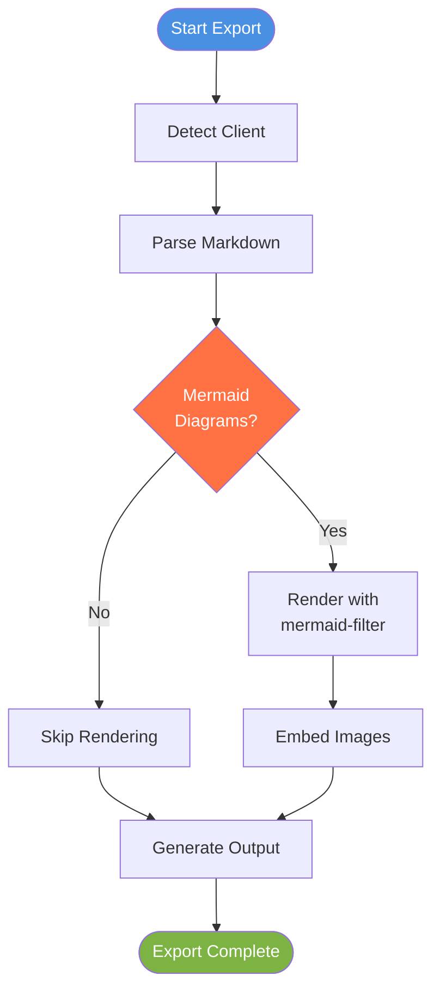
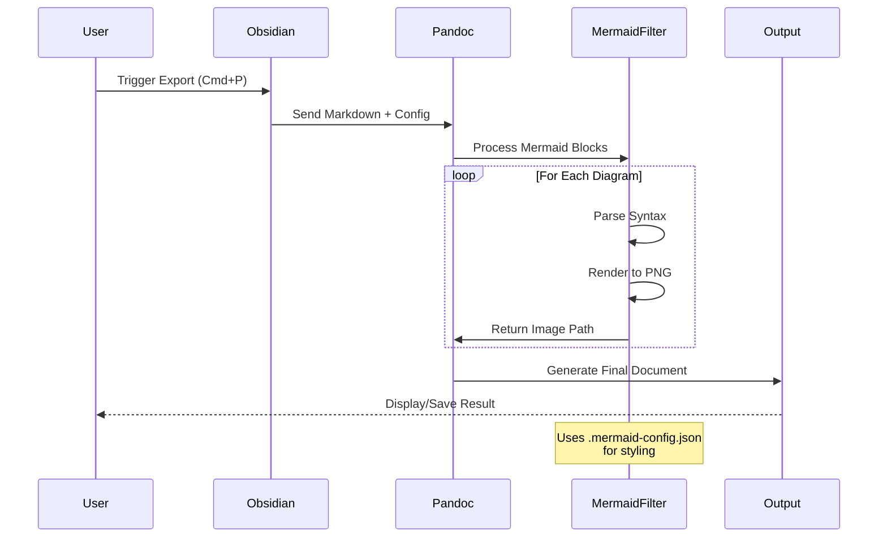
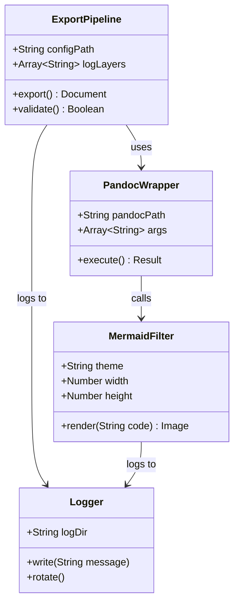
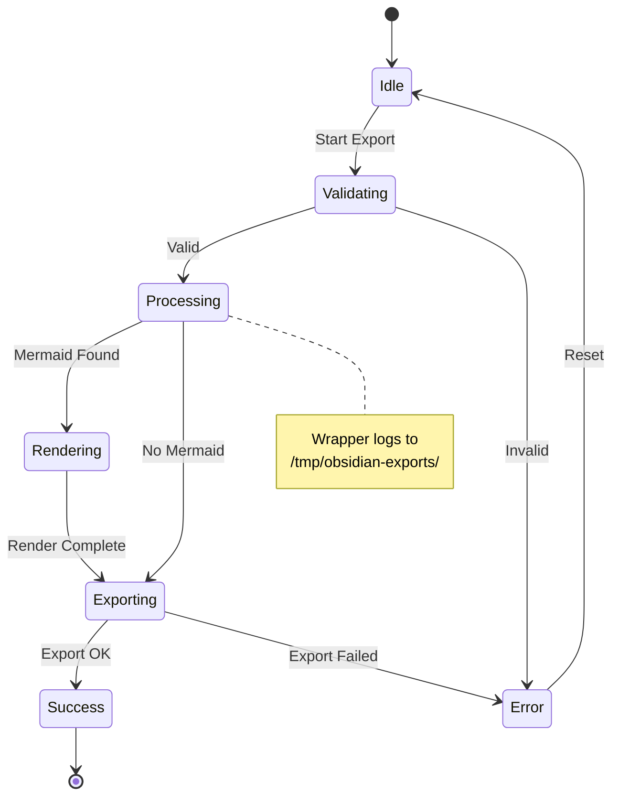
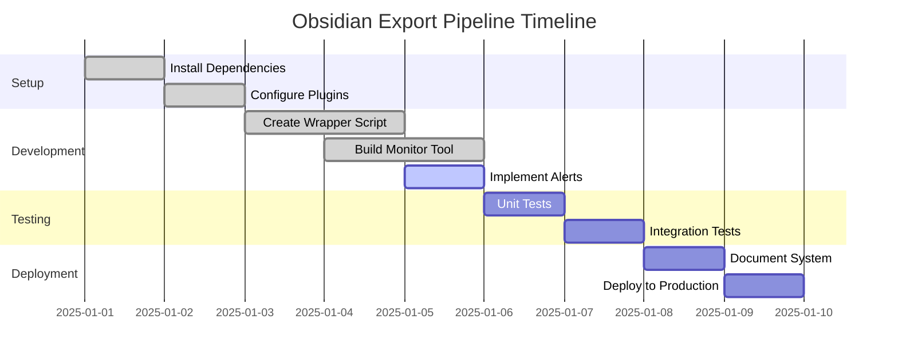
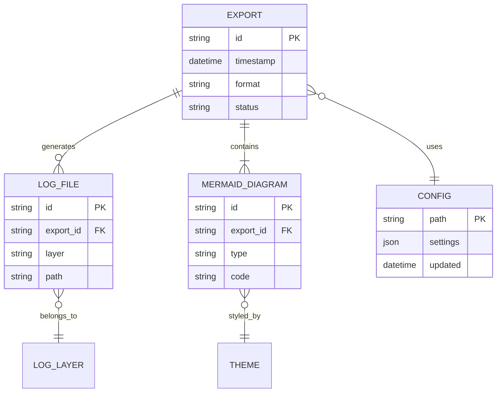
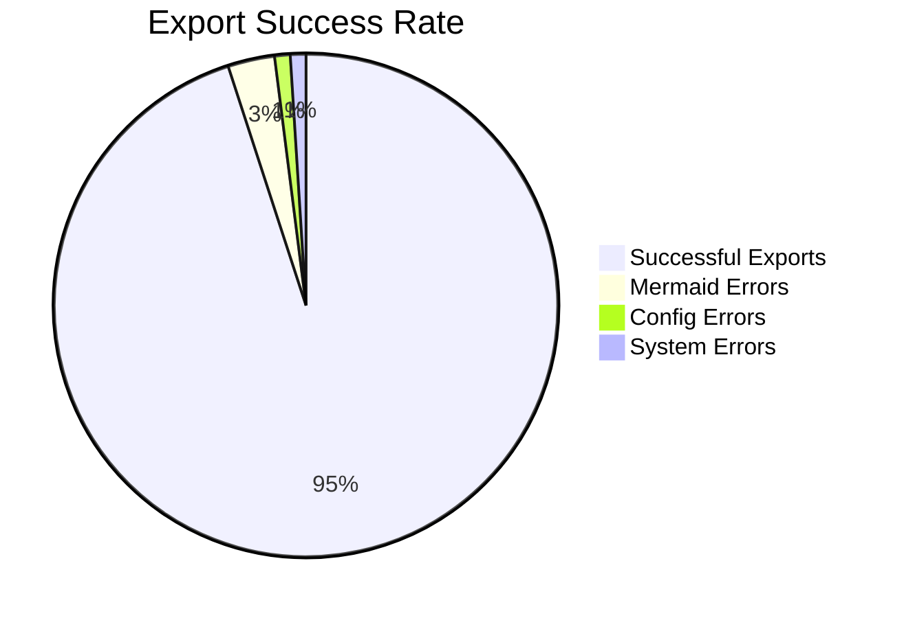
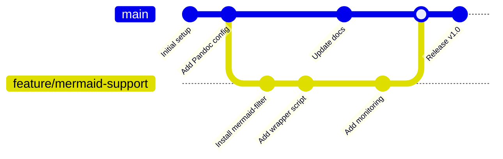

# Mermaid Export Test Document

This document contains various Mermaid diagram types to test the export pipeline.

## 1. Flowchart



**Expected**: Flowchart with colored nodes showing export pipeline

---

## 2. Sequence Diagram



**Expected**: Sequence diagram showing export workflow

---

## 3. Class Diagram



**Expected**: UML class diagram of export architecture

---

## 4. State Diagram



**Expected**: State machine showing export states

---

## 5. Gantt Chart



**Expected**: Timeline chart of development phases

---

## 6. Entity Relationship Diagram



**Expected**: ER diagram showing data relationships

---

## 7. Pie Chart



**Expected**: Pie chart showing success metrics

---

## 8. Git Graph



**Expected**: Git branch visualization

---

## Export Instructions

### To Test This Document:

1. **Start monitoring**:
   ```bash
   cd /Volumes/code/repos/litellm
   ./obsidian-monitor.sh
   ```

2. **Enable alerts** (optional):
   ```bash
   ./obsidian-export-alert.sh --daemon
   ```

3. **Export from Obsidian**:
   - Open this file in Obsidian
   - Press `Cmd+P`
   - Type "Export" and select format (HTML/PDF)
   - Wait for completion notification

4. **Verify output**:
   ```bash
   open /tmp/obsidian-exports/
   ```

5. **Check logs**:
   - Monitor shows real-time logs in 4 panes
   - Logs persist in `/tmp/obsidian-exports/*.log`

### Expected Results:

- ✅ All 8 Mermaid diagrams render correctly
- ✅ Images embedded in output document
- ✅ No errors in wrapper.log
- ✅ Success notification from alert system
- ✅ Output file opens automatically

### Troubleshooting:

If any diagram fails to render:

1. Check `mermaid.log` for syntax errors
2. Verify `.mermaid-config.json` exists
3. Run validation: `./validate-obsidian-setup.sh`
4. Check mermaid-filter: `mermaid-filter --version`

---

## Notes

- **Config Location**: `/Volumes/code/repos/litellm/.mermaid-config.json`
- **Log Directory**: `/tmp/obsidian-exports/`
- **Wrapper Script**: `obsidian-export-wrapper.sh`
- **Architecture**: 5-layer debug logging
- **Monitoring**: tmux 4-pane layout
- **Alerts**: fswatch + macOS notifications

**Generated**: 2025-11-16
**Version**: 1.0
**Status**: Test Document
